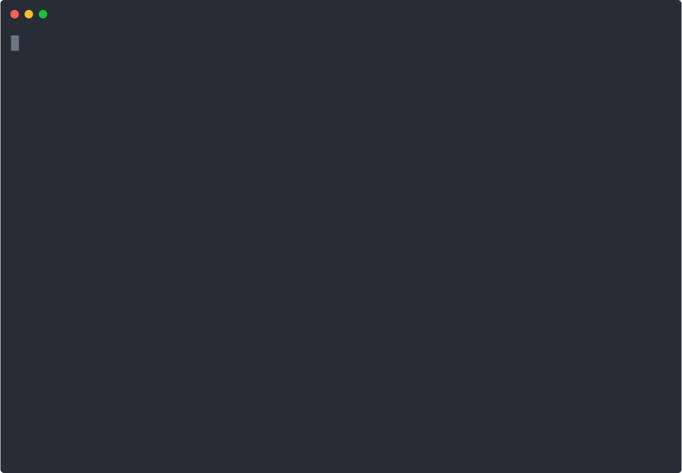
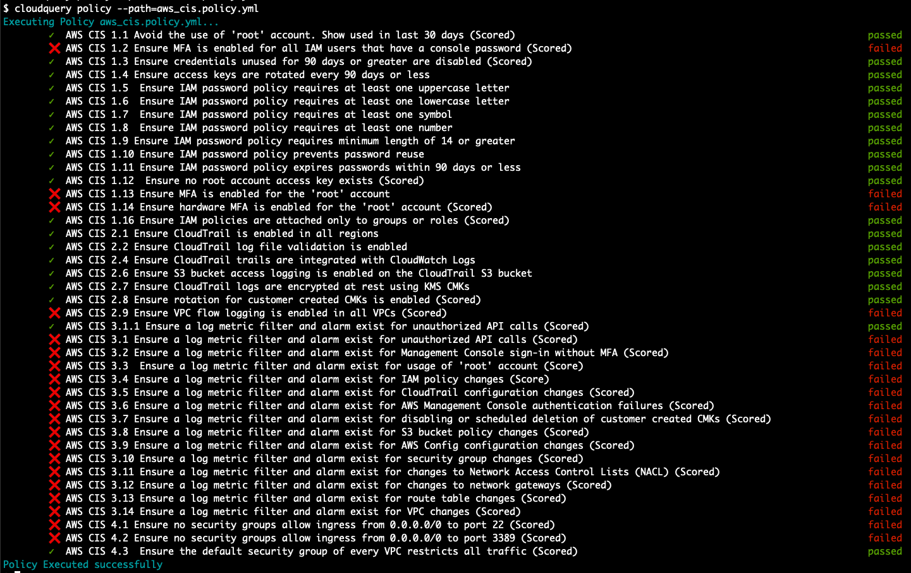
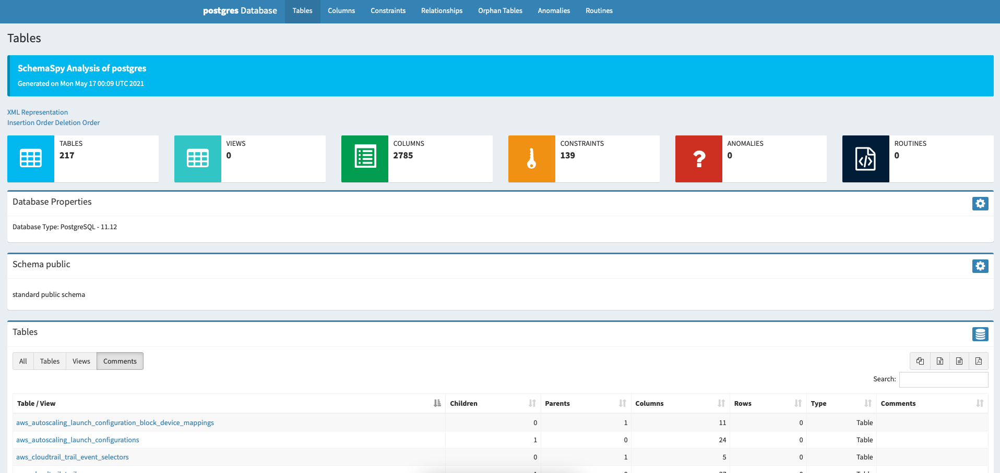

<p align="center">
  <a href="https://cloudquery.io">
    
  </a>
</p>

[](release)
[][license]
[](docs)
[](schemaspy)
[](goreport)
[](githubprs)
[](goreference)
[](githubdownloads)
[](twitter)
[](githubstars)

[release]: https://github.com/cloudquery/cloudquery/releases
[license]: https://github.com/cloudquery/cloudquery/blob/main/LICENSE
[docs]: https://docs.cloudquery.io
[schemaspy]: https://schema.cloudquery.io
[goreport]: https://goreportcard.com/report/github.com/cloudquery/cloudquery
[githubprs]: https://github.com/cloudquery/cloudquery/pulls
[goreference]: https://pkg.go.dev/github.com/cloudquery/cloudquery
[githubdownloads]: https://github.com/bridgecrewio/yor/releases
[twitter]: https://twitter.com/cloudqueryio
[githubstars]: https://github.com/cloudquery/cloudquery/stargazers

cloudquery transforms your cloud infrastructure into queryable SQL or Graphs for easy monitoring, governance, and security.

<p align="center">
  <a href="https://cloudquery.io">
    
  </a>
</p>

## Table of contents

- [What is cloudquery and why use it?](#what-is-cloudquery-and-why-use-it)
- [Supported providers (Actively expanding)](#supported-providers-actively-expanding)
- [Installing cloudquery](#installing-cloudquery)
  - [Binary](#binary)
  - [Homebrew](#homebrew)
  - [Docker](#docker)
  - [Compile from source](#compile-from-source)
- [Quick Start](#quick-start)
  - [Running cloudquery](#running-cloudquery)
  - [Querying the data from cloudquery results using `psql` shell](#querying-the-data-from-cloudquery-results-using-psql-shell)
  - [Running policy packs](#running-policy-packs)
- [Providers Authentication](#providers-authentication)
  - [AWS](#aws)
  - [Azure](#azure)
  - [GCP](#gcp)
  - [Okta](#okta)
  - [Bring your own](#bring-your-own)
- [Common example queries](#common-example-queries)
  - [Find GCP buckets with public-facing read permissions](#find-gcp-buckets-with-public-facing-read-permissions)
  - [Find all public facing AWS load balancers](#find-all-public-facing-aws-load-balancers)
  - [Find all unencrypted RDS instances](#find-all-unencrypted-rds-instances)
  - [Find all unencrypted AWS buckets](#find-all-unencrypted-aws-buckets)
- [Running cloudquery on AWS (Lambda, Terraform)](#running-cloudquery-on-aws-lambda-terraform)
- [Resources](#resources)
- [License](#license)
- [Contribution](#contribution)

## What is cloudquery and why use it?

cloudquery pulls, normalize, exposes, and monitors your cloud infrastructure and SaaS apps as SQL database. This abstracts various scattered APIs enabling you to define security, governance, cost, and compliance policies with SQL.

* cloudquery can be easily extended to more resources and SaaS providers (open an [Issue](https://github.com/cloudquery/cloudquery/issues)). 
* cloudquery comes with built-in policy packs such as [AWS CIS](#running-policy-packs) (more is coming!).

> Think about cloudquery as a compliance-as-code tool inspired by tools like [osquery](https://github.com/osquery/osquery) and [terraform](https://github.com/hashicorp/terraform), cool right?


## Supported providers (Actively expanding)

Currently cloudquery supports multiple provides including

* [AWS](https://github.com/cloudquery/cq-provider-aws)
* [Azure](https://github.com/cloudquery/cq-provider-azure)
* [GCP](https://github.com/cloudquery/cq-provider-gcp)
* [Okta](https://github.com/cloudquery/cq-provider-okta)
* [Many others](https://github.com/cloudquery/cq-provider-sdk)

Check out [https://hub.cloudquery.io](https://hub.cloudquery.io) for more details about the providers.

> If you want us to add a new provider or resource please open an [Issue](https://github.com/cloudquery/cloudquery/issues).

## Installing cloudquery

### Binary

* You can download the precompiled binary from [releases](https://github.com/cloudquery/cloudquery/releases), or using CLI

```shell script
export OS=Darwin # Possible values: Linux,Windows,Darwin
curl -L https://github.com/cloudquery/cloudquery/releases/latest/download/cloudquery_${OS}_x86_64 -o cloudquery
chmod a+x cloudquery
./cloudquery --help

# If you want to download a specific version and not the latest use the following endpoint
export VERSION=v0.13.6 # specifiy a version, refer to releases https://github.com/cloudquery/cloudquery/releases
curl -L https://github.com/cloudquery/cloudquery/releases/download/${VERSION}/cloudquery_${OS}_x86_64 -o cloudquery
```

### Homebrew

* You can use homebrew on macOS to install cloudquery

```shell script
brew install cloudquery/tap/cloudquery
# After initial install you can upgrade the version via:
brew upgrade cloudquery
```

### Docker

```shell script
docker pull ghcr.io/cloudquery/cloudquery:latest

# If you want to download a specific version and not the latest use the following format (refer to releases for tags)
docker pull ghcr.io/cloudquery/cloudquery:0.13.6
docker pull ghcr.io/cloudquery/cloudquery:0.13
```

### Compile from source

```shell script
git clone https://github.com/cloudquery/cloudquery.git
cd cloudquery
# Make sure you have installed go and its required dependencies
go build .
./cloudquery # --help to see all options
```

## Quick Start

### Running cloudquery

* First generate a `config.yml` file that will describe which resources you want cloudquery to pull, normalize and transform resources to the specified SQL database by running the following command
 
```shell script
cloudquery init aws # choose one or more from [aws azure gcp okta]
# cloudquery init gcp azure # This will generate a config containing gcp and azure providers
# cloudquery init --help # Show all possible auto-generated configs and flags
```

* Once your `config.yml` is generated run the following command to fetch the resources from the provider

```shell script
# you can spawn a local postgresql with docker
# docker run -p 5432:5432 -e POSTGRES_PASSWORD=pass -d postgres
cloudquery fetch --dsn "host=localhost user=postgres password=pass DB.name=postgres port=5432"
# cloudquery fetch --help # Show all possible fetch flags
```

* Log in to the Postgres database using `psql -h localhost -p 5432 -U postgres -d postgres`

```shell script
postgres=# \dt
                                    List of relations
 Schema |                            Name                             | Type  |  Owner   
--------+-------------------------------------------------------------+-------+----------
 public | aws_autoscaling_launch_configuration_block_device_mapping   | table | postgres
 public | aws_autoscaling_launch_configurations                       | table | postgres
```

### Querying the data from cloudquery results using `psql` shell

* List AWS EC2 images

```sql
SELECT * FROM aws_ec2_images;
```

* Find all public facing AWS load balancers

```sql
SELECT * FROM aws_elbv2_load_balancers WHERE scheme = 'internet-facing';
```

### Running policy packs

> cloudquery comes with some ready-to-use compliance policy pack (a curated list of queries for achieving the compliance) which you can use as-is or modify to fit your use case.

* Currently, cloudquery support [AWS CIS](https://d0.awsstatic.com/whitepapers/compliance/AWS_CIS_Foundations_Benchmark.pdf) policy pack (it is under active development, so it doesn't cover the whole spec yet).

* To run AWS CIS pack enter the following commands (make sure you fetched all the resources beforehand by the `fetch` command)

```shell script
./cloudquery policy --path=<PATH_TO_POLICY_FILE> --output=<PATH_TO_OUTPUT_POLICY_RESULT> --dsn "host=localhost user=postgres password=pass DB.name=postgres port=5432"
```



* You can also create your own policy file, for example

```yaml
views:
  - name: "my_custom_view"
    query: >
        CREATE VIEW my_custom_view AS ...
queries:
  - name: "Find thing that violates policy"
    query: >
        SELECT account_id, arn FROM ...
```

> The `policy` command uses the policy file path `./policy.yml` by default, but this can be overridden via the `--path` flag, or the `CQ_POLICY_PATH` environment variable

* Full documentation, resources, and SQL schema definitions are available [here](https://docs.cloudquery.io)



## Providers Authentication

### AWS 

* You should be authenticated with an AWS account with correct permission with either option (see full [documentation](https://docs.aws.amazon.com/sdk-for-java/v1/developer-guide/credentials.html))

  * You can specify using AWS access key `AWS_ACCESS_KEY_ID`, and secret key `AWS_SECRET_ACCESS_KEY` environment variables
  * Also, you can use the awscli configured credentials from `~/.aws/credentials` created via `aws configure`
  * You can use `AWS_PROFILE` environment variable to specify the AWS profile you wanted to use for cloudquery when you have multiple profiles

* Multi-account AWS support is available by using an account which can [AssumeRole](https://docs.aws.amazon.com/STS/latest/APIReference/API_AssumeRole.html) to other accounts

* In your `config.hcl` you need to specify `role_arns` if you want to query multiple accounts in the following way

```hcl
accounts "<YOUR ACCOUNT ID>"{
 // Optional. Role ARN we want to assume when accessing this account
 role_arn = "<YOUR_ROLE_ARN>"
}
```

* Refer to [https://github.com/cloudquery/cq-provider-aws](https://github.com/cloudquery/cq-provider-aws) for more details
 
### Azure

You should set the following environment variables `AZURE_CLIENT_ID`, `AZURE_CLIENT_SECRET`, `AZURE_TENANT_ID` which you can generate via `az ad sp create-for-rbac --sdk-auth`. See full details at [environment based authentication for sdk](https://docs.microsoft.com/en-us/azure/developer/go/azure-sdk-authorization#use-environment-based-authentication)

* Refer to [https://github.com/cloudquery/cq-provider-azure](https://github.com/cloudquery/cq-provider-azure) for more details

### GCP

You should be authenticated with a GCP that has correct permissions for the data you want to pull. You should set `GOOGLE_APPLICATION_CREDENTIALS` to point to your downloaded credential file.

* Refer to [https://github.com/cloudquery/cq-provider-gcp](https://github.com/cloudquery/cq-provider-gcp) for more details

### Okta

You need to set the `OKTA_TOKEN` environment variable.

* Refer to [https://github.com/cloudquery/cq-provider-okta](https://github.com/cloudquery/cq-provider-okta) for more details

### Bring your own

You can leverage the cloudquery provider SDK, which enables building providers to query any service or custom in-house solutions with SQL

* Refer to [https://github.com/cloudquery/cq-provider-sdk](https://github.com/cloudquery/cq-provider-sdk) for more details

## Common example queries

The below are some example queries to perform basic operations like retrieving insecure buckets and information, identifying publicly exposed load balancers, and misconfigurations.

### Find GCP buckets with public-facing read permissions

```sql
SELECT gcp_storage_buckets.name
FROM gcp_storage_buckets
         JOIN gcp_storage_bucket_policy_bindings ON gcp_storage_bucket_policy_bindings.bucket_id = gcp_storage_buckets.id
         JOIN gcp_storage_bucket_policy_binding_members ON gcp_storage_bucket_policy_binding_members.bucket_policy_binding_id = gcp_storage_bucket_policy_bindings.id
WHERE gcp_storage_bucket_policy_binding_members.name = 'allUsers' AND gcp_storage_bucket_policy_bindings.role = 'roles/storage.objectViewer';
```

### Find all public facing AWS load balancers

```sql
SELECT * FROM aws_elbv2_load_balancers WHERE scheme = 'internet-facing';
```

### Find all unencrypted RDS instances

```sql
SELECT * from aws_rds_clusters where storage_encrypted = 0;
```

### Find all unencrypted AWS buckets

```sql
SELECT * from aws_s3_buckets
    JOIN aws_s3_bucket_encryption_rules ON aws_s3_buckets.id != aws_s3_bucket_encryption_rules.bucket_id;
```

> More examples and information are available [here](https://docs.cloudquery.io)

## Running cloudquery on AWS (Lambda, Terraform)

You can use the `Makefile` to build, deploy, and destroy the entire terraform infrastructure. The default execution configuration file can be found on: `./deploy/aws/terraform/tasks/us-east-1`

* You can define more tasks by adding cloudwatch periodic events

### For example

* The default configuration will execute the cloudquery every one day with the default configuration.

```terraform
resource "aws_cloudwatch_event_rule" "scan_schedule" {
  name = "Cloudquery-us-east-1-scan"
  description = "Run cloudquery everyday on us-east-1 resources"

  schedule_expression = "rate(1 day)"
}

resource "aws_cloudwatch_event_target" "sns" {
  rule      = aws_cloudwatch_event_rule.scan_schedule.name
  arn       = aws_lambda_function.cloudquery.arn
  input     = file("tasks/us-east-1/input.json")
}
```

* Make sure you have installed the terraform, refer to [https://learn.hashicorp.com/tutorials/terraform/install-cli](https://learn.hashicorp.com/tutorials/terraform/install-cli)

* Build cloudquery binary from the source

```shell script
make build
```

* Deploy cloudquery infrastructure to AWS using terraform

```shell script
make apply
```

> You can also use `init`, `plan`, and `destroy` to perform different operations with terraform, refer to [Terraform docs](https://www.terraform.io/docs/index.html) for more information.

## Resources

* cloudquery homepage: [https://cloudquery.io](https://cloudquery.io)
* Releases: [https://github.com/cloudquery/cloudquery/releases](https://github.com/cloudquery/cloudquery/releases)
* Documentation [https://docs.cloudquery.io](https://docs.cloudquery.io)
* Schema explorer (schemaspy): [https://schema.cloudquery.io/](https://schema.cloudquery.io/)
* Database Configuration: [https://docs.cloudquery.io/database-configuration](https://docs.cloudquery.io/database-configuration)

## License

By contributing to cloudquery you agree that your contributions will be licensed as defined on the [LICENSE](https://github.com/cloudquery/cloudquery/blob/main/LICENSE) file.

## Contribution

Feel free to open Pull-Request for small fixes and changes. For bigger changes and new providers please open an issue first to prevent double work and discuss relevant stuff.
