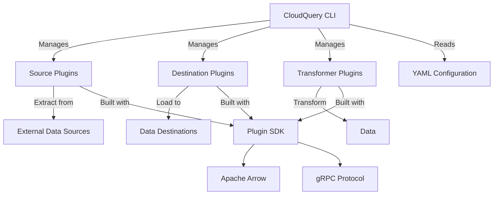
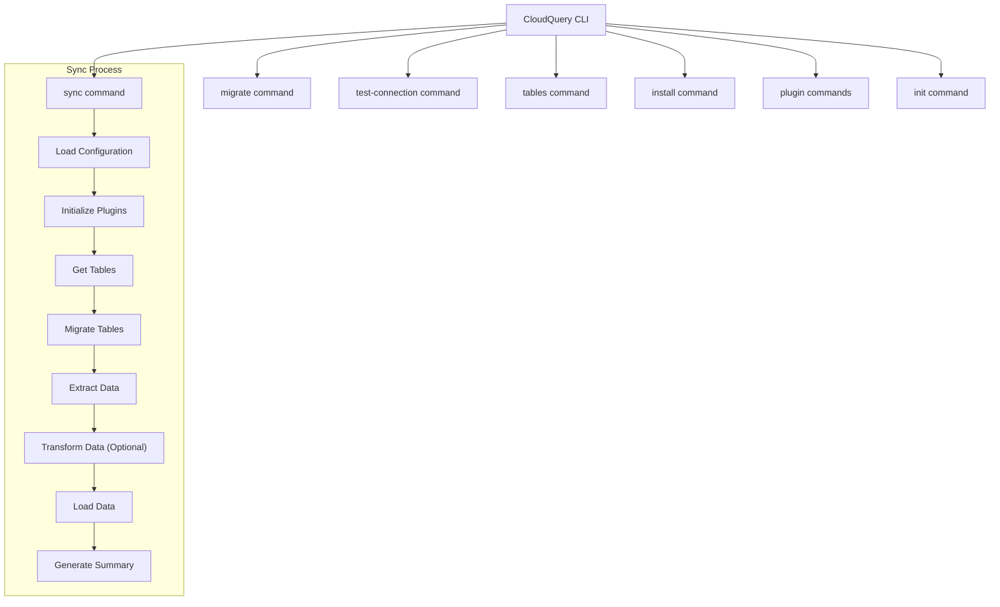
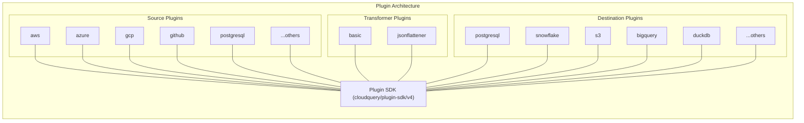
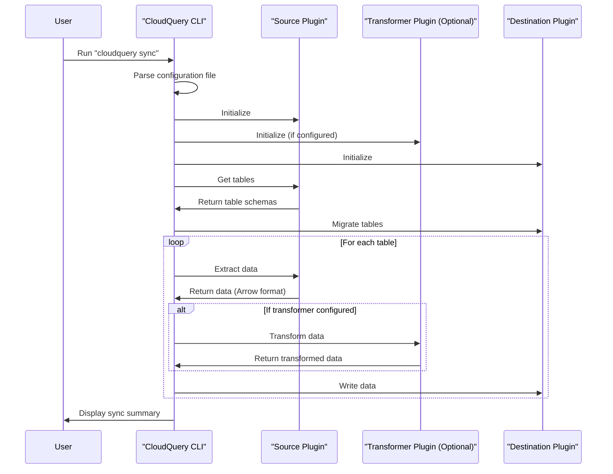
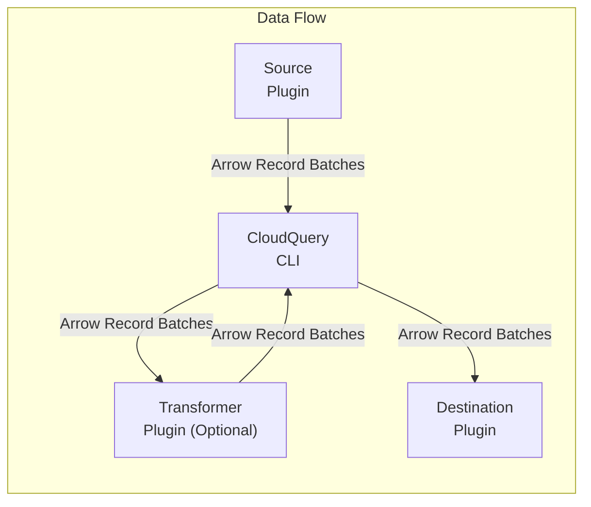

# Overview

Relevant source files

The following files were used as context for generating this wiki page:

- [.release-please-manifest.json](https://github.com/cloudquery/cloudquery/blob/5064c039/.release-please-manifest.json)
- [cli/CHANGELOG.md](https://github.com/cloudquery/cloudquery/blob/5064c039/cli/CHANGELOG.md)
- [cli/go.mod](https://github.com/cloudquery/cloudquery/blob/5064c039/cli/go.mod)
- [cli/go.sum](https://github.com/cloudquery/cloudquery/blob/5064c039/cli/go.sum)
- [plugins/destination/azblob/go.mod](https://github.com/cloudquery/cloudquery/blob/5064c039/plugins/destination/azblob/go.mod)
- [plugins/destination/azblob/go.sum](https://github.com/cloudquery/cloudquery/blob/5064c039/plugins/destination/azblob/go.sum)
- [plugins/destination/bigquery/CHANGELOG.md](https://github.com/cloudquery/cloudquery/blob/5064c039/plugins/destination/bigquery/CHANGELOG.md)
- [plugins/destination/clickhouse/go.mod](https://github.com/cloudquery/cloudquery/blob/5064c039/plugins/destination/clickhouse/go.mod)
- [plugins/destination/clickhouse/go.sum](https://github.com/cloudquery/cloudquery/blob/5064c039/plugins/destination/clickhouse/go.sum)
- [plugins/destination/duckdb/CHANGELOG.md](https://github.com/cloudquery/cloudquery/blob/5064c039/plugins/destination/duckdb/CHANGELOG.md)
- [plugins/destination/elasticsearch/go.mod](https://github.com/cloudquery/cloudquery/blob/5064c039/plugins/destination/elasticsearch/go.mod)
- [plugins/destination/elasticsearch/go.sum](https://github.com/cloudquery/cloudquery/blob/5064c039/plugins/destination/elasticsearch/go.sum)
- [plugins/destination/file/go.mod](https://github.com/cloudquery/cloudquery/blob/5064c039/plugins/destination/file/go.mod)
- [plugins/destination/file/go.sum](https://github.com/cloudquery/cloudquery/blob/5064c039/plugins/destination/file/go.sum)
- [plugins/destination/firehose/CHANGELOG.md](https://github.com/cloudquery/cloudquery/blob/5064c039/plugins/destination/firehose/CHANGELOG.md)
- [plugins/destination/gcs/go.mod](https://github.com/cloudquery/cloudquery/blob/5064c039/plugins/destination/gcs/go.mod)
- [plugins/destination/gcs/go.sum](https://github.com/cloudquery/cloudquery/blob/5064c039/plugins/destination/gcs/go.sum)
- [plugins/destination/gremlin/CHANGELOG.md](https://github.com/cloudquery/cloudquery/blob/5064c039/plugins/destination/gremlin/CHANGELOG.md)
- [plugins/destination/kafka/go.mod](https://github.com/cloudquery/cloudquery/blob/5064c039/plugins/destination/kafka/go.mod)
- [plugins/destination/kafka/go.sum](https://github.com/cloudquery/cloudquery/blob/5064c039/plugins/destination/kafka/go.sum)
- [plugins/destination/mysql/go.mod](https://github.com/cloudquery/cloudquery/blob/5064c039/plugins/destination/mysql/go.mod)
- [plugins/destination/mysql/go.sum](https://github.com/cloudquery/cloudquery/blob/5064c039/plugins/destination/mysql/go.sum)
- [plugins/destination/postgresql/CHANGELOG.md](https://github.com/cloudquery/cloudquery/blob/5064c039/plugins/destination/postgresql/CHANGELOG.md)
- [plugins/destination/s3/CHANGELOG.md](https://github.com/cloudquery/cloudquery/blob/5064c039/plugins/destination/s3/CHANGELOG.md)
- [plugins/destination/s3/go.mod](https://github.com/cloudquery/cloudquery/blob/5064c039/plugins/destination/s3/go.mod)
- [plugins/destination/s3/go.sum](https://github.com/cloudquery/cloudquery/blob/5064c039/plugins/destination/s3/go.sum)
- [plugins/destination/snowflake/CHANGELOG.md](https://github.com/cloudquery/cloudquery/blob/5064c039/plugins/destination/snowflake/CHANGELOG.md)
- [plugins/destination/sqlite/CHANGELOG.md](https://github.com/cloudquery/cloudquery/blob/5064c039/plugins/destination/sqlite/CHANGELOG.md)
- [plugins/source/test/go.mod](https://github.com/cloudquery/cloudquery/blob/5064c039/plugins/source/test/go.mod)
- [plugins/source/test/go.sum](https://github.com/cloudquery/cloudquery/blob/5064c039/plugins/source/test/go.sum)
- [scaffold/sourcetpl/templates/source/go.mod.tpl](https://github.com/cloudquery/cloudquery/blob/5064c039/scaffold/sourcetpl/templates/source/go.mod.tpl)

CloudQuery is an open-source data integration platform that enables users to extract data from various sources, transform it, and load it into different destinations for analytics, monitoring, and security purposes. This document provides a high-level overview of the CloudQuery architecture, its core components, and how they interact with each other.

## Core Architecture

CloudQuery is built on a modular plugin architecture with three key types of components:

1. **CLI** - The command-line interface that orchestrates the data synchronization process
2. **Plugins** - Independent modules for data extraction (sources), loading (destinations), and transformation
3. **Plugin SDK** - The foundation for developing plugins and handling communication

Sources: [.release-please-manifest.json:1-113](https://github.com/cloudquery/cloudquery/blob/5064c039/.release-please-manifest.json#L1-L113), [cli/go.mod:1-161](https://github.com/cloudquery/cloudquery/blob/5064c039/cli/go.mod#L1-L161)

## Command-Line Interface (CLI)

The CloudQuery CLI is the main entry point for users. It handles configuration, plugin management, and orchestrates the data flow between source and destination plugins.

### Key Commands

| Command | Description |
|---------|-------------|
| `sync` | Extracts data from sources and loads it into destinations |
| `migrate` | Creates or updates tables in destinations |
| `test-connection` | Tests connectivity to sources and destinations |
| `tables` | Lists available tables from sources |
| `install` | Installs plugins |
| `plugin` | Manages plugins (install, publish) |

Sources: [cli/CHANGELOG.md:1-450](https://github.com/cloudquery/cloudquery/blob/5064c039/cli/CHANGELOG.md#L1-L450)

## Plugin System

The plugin system is the foundation of CloudQuery's extensibility. Plugins are standalone executables that communicate with the CLI using a defined protocol.

### Source Plugins

Source plugins extract data from external services. CloudQuery offers plugins for major cloud providers, SaaS platforms, databases, and more.

Popular source plugins include:
- AWS, Azure, GCP (cloud providers)
- GitHub, GitLab (code repositories)
- PostgreSQL, MySQL (databases)
- Datadog, PagerDuty (monitoring)
- Many others (see [.release-please-manifest.json]())

### Destination Plugins

Destination plugins load data into target systems, allowing for flexible analytics and storage options.

Popular destination plugins include:
- PostgreSQL, MySQL, SQLite, DuckDB (databases)
- Snowflake, BigQuery (data warehouses)
- S3, GCS, Azure Blob (object storage)
- Neo4j, Gremlin (graph databases)

### Transformer Plugins

Transformer plugins modify or enrich data between extraction and loading.

Available transformer plugins:
- Basic transformer
- JSON flattener
- Test transformer

Sources: [plugins/destination/s3/go.mod:1-111](https://github.com/cloudquery/cloudquery/blob/5064c039/plugins/destination/s3/go.mod#L1-L111), [plugins/destination/postgresql/CHANGELOG.md:1-20](https://github.com/cloudquery/cloudquery/blob/5064c039/plugins/destination/postgresql/CHANGELOG.md#L1-L20), [plugins/destination/snowflake/CHANGELOG.md:1-20](https://github.com/cloudquery/cloudquery/blob/5064c039/plugins/destination/snowflake/CHANGELOG.md#L1-L20), [plugins/destination/duckdb/CHANGELOG.md:1-20](https://github.com/cloudquery/cloudquery/blob/5064c039/plugins/destination/duckdb/CHANGELOG.md#L1-L20)

## Data Flow Architecture

The core functionality of CloudQuery revolves around the sync process, which follows these steps:

1. **Configuration**: The CLI reads YAML configuration files that specify sources, destinations, and optional transformers
2. **Initialization**: Plugins are initialized with their respective configurations
3. **Schema Discovery**: Source plugins provide table schemas
4. **Migration**: Destination plugins create or update tables as needed
5. **Extraction**: Source plugins extract data from external systems
6. **Transformation**: (Optional) Data is transformed by transformer plugins
7. **Loading**: Destination plugins load data into target systems
8. **Summary**: The CLI generates a summary of the operation

Sources: [plugins/destination/s3/go.mod:1-111](https://github.com/cloudquery/cloudquery/blob/5064c039/plugins/destination/s3/go.mod#L1-L111), [plugins/destination/gcs/go.mod:1-205](https://github.com/cloudquery/cloudquery/blob/5064c039/plugins/destination/gcs/go.mod#L1-L205), [cli/go.mod:1-161](https://github.com/cloudquery/cloudquery/blob/5064c039/cli/go.mod#L1-L161)

## Apache Arrow Integration

CloudQuery uses Apache Arrow as the underlying data format for efficient data transfer between components. This provides:

- Type-safe data transfer
- Memory efficiency
- Fast serialization/deserialization
- Support for structured and semi-structured data

Sources: [cli/go.mod:6-7](https://github.com/cloudquery/cloudquery/blob/5064c039/cli/go.mod#L6-L7), [plugins/destination/s3/go.mod:6-7](https://github.com/cloudquery/cloudquery/blob/5064c039/plugins/destination/s3/go.mod#L6-L7)

## Recent Features and Improvements

CloudQuery is actively developed, with recent features including:

- Sharding support for parallel data extraction
- Time substitution in spec templates
- Transformer support in the migrate command
- Init command for easier setup
- Test connection improvements
- OTEL (OpenTelemetry) integration for metrics

Sources: [cli/CHANGELOG.md:1-100](https://github.com/cloudquery/cloudquery/blob/5064c039/cli/CHANGELOG.md#L1-L100)

## Summary

CloudQuery provides a flexible, extensible platform for data integration needs through its plugin-based architecture. The CLI orchestrates the process while plugins handle the specific tasks of data extraction, transformation, and loading. This modular design allows new sources and destinations to be added without modifying the core code.

For more details on:
- CLI commands and usage, see [CLI](#2)
- Plugin system details, see [Plugin System](#3)
- Configuration options, see [Configuration](#5)