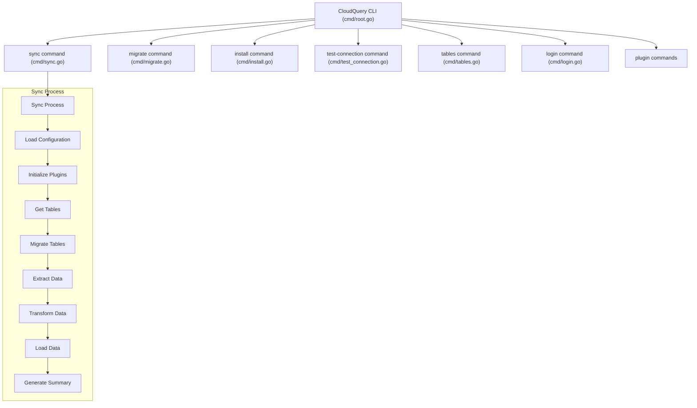
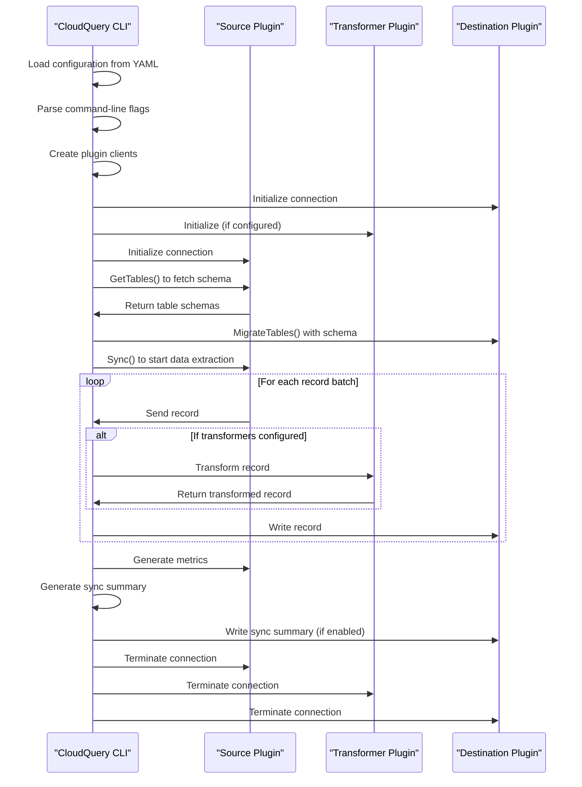
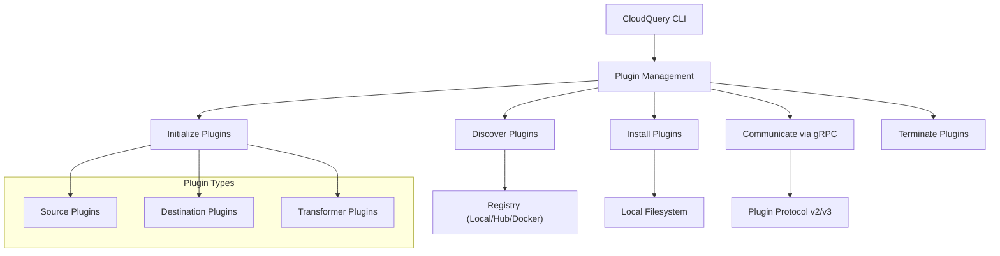

# CLI

<details>
<summary>Relevant source files</summary>

The following files were used as context for generating this wiki page:

- [cli/.golangci.yml](https://github.com/cloudquery/cloudquery/blob/5064c039/cli/.golangci.yml)
- [cli/cmd/addon_download.go](https://github.com/cloudquery/cloudquery/blob/5064c039/cli/cmd/addon_download.go)
- [cli/cmd/addon_download_test.go](https://github.com/cloudquery/cloudquery/blob/5064c039/cli/cmd/addon_download_test.go)
- [cli/cmd/addon_publish.go](https://github.com/cloudquery/cloudquery/blob/5064c039/cli/cmd/addon_publish.go)
- [cli/cmd/addon_publish_test.go](https://github.com/cloudquery/cloudquery/blob/5064c039/cli/cmd/addon_publish_test.go)
- [cli/cmd/analytics.go](https://github.com/cloudquery/cloudquery/blob/5064c039/cli/cmd/analytics.go)
- [cli/cmd/doc_test.go](https://github.com/cloudquery/cloudquery/blob/5064c039/cli/cmd/doc_test.go)
- [cli/cmd/errors.go](https://github.com/cloudquery/cloudquery/blob/5064c039/cli/cmd/errors.go)
- [cli/cmd/init.go](https://github.com/cloudquery/cloudquery/blob/5064c039/cli/cmd/init.go)
- [cli/cmd/init_test.go](https://github.com/cloudquery/cloudquery/blob/5064c039/cli/cmd/init_test.go)
- [cli/cmd/install.go](https://github.com/cloudquery/cloudquery/blob/5064c039/cli/cmd/install.go)
- [cli/cmd/install_test.go](https://github.com/cloudquery/cloudquery/blob/5064c039/cli/cmd/install_test.go)
- [cli/cmd/login.go](https://github.com/cloudquery/cloudquery/blob/5064c039/cli/cmd/login.go)
- [cli/cmd/logout.go](https://github.com/cloudquery/cloudquery/blob/5064c039/cli/cmd/logout.go)
- [cli/cmd/migrate.go](https://github.com/cloudquery/cloudquery/blob/5064c039/cli/cmd/migrate.go)
- [cli/cmd/migrate_v1.go](https://github.com/cloudquery/cloudquery/blob/5064c039/cli/cmd/migrate_v1.go)
- [cli/cmd/migrate_v2.go](https://github.com/cloudquery/cloudquery/blob/5064c039/cli/cmd/migrate_v2.go)
- [cli/cmd/migrate_v3.go](https://github.com/cloudquery/cloudquery/blob/5064c039/cli/cmd/migrate_v3.go)
- [cli/cmd/plugin_docs_download.go](https://github.com/cloudquery/cloudquery/blob/5064c039/cli/cmd/plugin_docs_download.go)
- [cli/cmd/plugin_docs_upload.go](https://github.com/cloudquery/cloudquery/blob/5064c039/cli/cmd/plugin_docs_upload.go)
- [cli/cmd/plugin_publish.go](https://github.com/cloudquery/cloudquery/blob/5064c039/cli/cmd/plugin_publish.go)
- [cli/cmd/plugin_publish_test.go](https://github.com/cloudquery/cloudquery/blob/5064c039/cli/cmd/plugin_publish_test.go)
- [cli/cmd/plugin_uiassets_upload.go](https://github.com/cloudquery/cloudquery/blob/5064c039/cli/cmd/plugin_uiassets_upload.go)
- [cli/cmd/root.go](https://github.com/cloudquery/cloudquery/blob/5064c039/cli/cmd/root.go)
- [cli/cmd/summary.go](https://github.com/cloudquery/cloudquery/blob/5064c039/cli/cmd/summary.go)
- [cli/cmd/switch.go](https://github.com/cloudquery/cloudquery/blob/5064c039/cli/cmd/switch.go)
- [cli/cmd/switch_test.go](https://github.com/cloudquery/cloudquery/blob/5064c039/cli/cmd/switch_test.go)
- [cli/cmd/sync.go](https://github.com/cloudquery/cloudquery/blob/5064c039/cli/cmd/sync.go)
- [cli/cmd/sync_test.go](https://github.com/cloudquery/cloudquery/blob/5064c039/cli/cmd/sync_test.go)
- [cli/cmd/sync_v1.go](https://github.com/cloudquery/cloudquery/blob/5064c039/cli/cmd/sync_v1.go)
- [cli/cmd/sync_v2.go](https://github.com/cloudquery/cloudquery/blob/5064c039/cli/cmd/sync_v2.go)
- [cli/cmd/sync_v3.go](https://github.com/cloudquery/cloudquery/blob/5064c039/cli/cmd/sync_v3.go)
- [cli/cmd/tables.go](https://github.com/cloudquery/cloudquery/blob/5064c039/cli/cmd/tables.go)
- [cli/cmd/test_connection.go](https://github.com/cloudquery/cloudquery/blob/5064c039/cli/cmd/test_connection.go)
- [cli/cmd/test_connection_test.go](https://github.com/cloudquery/cloudquery/blob/5064c039/cli/cmd/test_connection_test.go)
- [cli/cmd/testdata/addon-v1/manifest-embedded-message.json](https://github.com/cloudquery/cloudquery/blob/5064c039/cli/cmd/testdata/addon-v1/manifest-embedded-message.json)
- [cli/cmd/testdata/addon-v1/manifest.json](https://github.com/cloudquery/cloudquery/blob/5064c039/cli/cmd/testdata/addon-v1/manifest.json)
- [cli/cmd/testdata/destination-errors.yml](https://github.com/cloudquery/cloudquery/blob/5064c039/cli/cmd/testdata/destination-errors.yml)
- [cli/cmd/testdata/destination-exits.yml](https://github.com/cloudquery/cloudquery/blob/5064c039/cli/cmd/testdata/destination-exits.yml)
- [cli/cmd/testdata/init/aws_example.md](https://github.com/cloudquery/cloudquery/blob/5064c039/cli/cmd/testdata/init/aws_example.md)
- [cli/cmd/testdata/init/postgresql_example.md](https://github.com/cloudquery/cloudquery/blob/5064c039/cli/cmd/testdata/init/postgresql_example.md)
- [cli/cmd/testdata/source-errors.yml](https://github.com/cloudquery/cloudquery/blob/5064c039/cli/cmd/testdata/source-errors.yml)
- [cli/cmd/testdata/source-exits.yml](https://github.com/cloudquery/cloudquery/blob/5064c039/cli/cmd/testdata/source-exits.yml)
- [cli/cmd/testdata/source-with-env.yml](https://github.com/cloudquery/cloudquery/blob/5064c039/cli/cmd/testdata/source-with-env.yml)
- [cli/cmd/testdata/transformation.yml](https://github.com/cloudquery/cloudquery/blob/5064c039/cli/cmd/testdata/transformation.yml)
- [cli/cmd/testdata/transformer-errors.yml](https://github.com/cloudquery/cloudquery/blob/5064c039/cli/cmd/testdata/transformer-errors.yml)
- [cli/cmd/testdata/transformer-exits.yml](https://github.com/cloudquery/cloudquery/blob/5064c039/cli/cmd/testdata/transformer-exits.yml)
- [cli/cmd/testdata/transformer-succeeds.yml](https://github.com/cloudquery/cloudquery/blob/5064c039/cli/cmd/testdata/transformer-succeeds.yml)
- [cli/cmd/testdata/ui-build/index.html](https://github.com/cloudquery/cloudquery/blob/5064c039/cli/cmd/testdata/ui-build/index.html)
- [cli/cmd/testdata/ui-build/static/style.css](https://github.com/cloudquery/cloudquery/blob/5064c039/cli/cmd/testdata/ui-build/static/style.css)
- [cli/cmd/testdata/with-sync-group-id.yml](https://github.com/cloudquery/cloudquery/blob/5064c039/cli/cmd/testdata/with-sync-group-id.yml)
- [cli/cmd/validate_config.go](https://github.com/cloudquery/cloudquery/blob/5064c039/cli/cmd/validate_config.go)
- [cli/go.mod](https://github.com/cloudquery/cloudquery/blob/5064c039/cli/go.mod)
- [cli/go.sum](https://github.com/cloudquery/cloudquery/blob/5064c039/cli/go.sum)
- [cli/internal/analytics/client.go](https://github.com/cloudquery/cloudquery/blob/5064c039/cli/internal/analytics/client.go)
- [cli/internal/api/client.go](https://github.com/cloudquery/cloudquery/blob/5064c039/cli/internal/api/client.go)
- [cli/internal/auth/logout.go](https://github.com/cloudquery/cloudquery/blob/5064c039/cli/internal/auth/logout.go)
- [cli/internal/auth/team.go](https://github.com/cloudquery/cloudquery/blob/5064c039/cli/internal/auth/team.go)
- [cli/internal/auth/token.go](https://github.com/cloudquery/cloudquery/blob/5064c039/cli/internal/auth/token.go)
- [cli/internal/env/env.go](https://github.com/cloudquery/cloudquery/blob/5064c039/cli/internal/env/env.go)
- [cli/internal/hub/util.go](https://github.com/cloudquery/cloudquery/blob/5064c039/cli/internal/hub/util.go)
- [cli/internal/otel/receiver.go](https://github.com/cloudquery/cloudquery/blob/5064c039/cli/internal/otel/receiver.go)
- [cli/internal/publish/addons.go](https://github.com/cloudquery/cloudquery/blob/5064c039/cli/internal/publish/addons.go)
- [cli/internal/publish/images/images.go](https://github.com/cloudquery/cloudquery/blob/5064c039/cli/internal/publish/images/images.go)
- [cli/internal/publish/images/images_test.go](https://github.com/cloudquery/cloudquery/blob/5064c039/cli/internal/publish/images/images_test.go)
- [cli/internal/publish/images/testdata/content-type/octetstream.svg](https://github.com/cloudquery/cloudquery/blob/5064c039/cli/internal/publish/images/testdata/content-type/octetstream.svg)
- [cli/internal/publish/images/testdata/content-type/png.png](https://github.com/cloudquery/cloudquery/blob/5064c039/cli/internal/publish/images/testdata/content-type/png.png)
- [cli/internal/publish/images/testdata/content-type/textplain.svg](https://github.com/cloudquery/cloudquery/blob/5064c039/cli/internal/publish/images/testdata/content-type/textplain.svg)
- [cli/internal/publish/plugins.go](https://github.com/cloudquery/cloudquery/blob/5064c039/cli/internal/publish/plugins.go)
- [cli/internal/publish/pluginui.go](https://github.com/cloudquery/cloudquery/blob/5064c039/cli/internal/publish/pluginui.go)
- [cli/internal/team/team.go](https://github.com/cloudquery/cloudquery/blob/5064c039/cli/internal/team/team.go)
- [plugins/.golangci.yml](https://github.com/cloudquery/cloudquery/blob/5064c039/plugins/.golangci.yml)
- [plugins/destination/clickhouse/go.mod](https://github.com/cloudquery/cloudquery/blob/5064c039/plugins/destination/clickhouse/go.mod)
- [plugins/destination/clickhouse/go.sum](https://github.com/cloudquery/cloudquery/blob/5064c039/plugins/destination/clickhouse/go.sum)
- [plugins/destination/clickhouse/typeconv/arrow/values/unwrap.go](https://github.com/cloudquery/cloudquery/blob/5064c039/plugins/destination/clickhouse/typeconv/arrow/values/unwrap.go)
- [plugins/destination/elasticsearch/go.mod](https://github.com/cloudquery/cloudquery/blob/5064c039/plugins/destination/elasticsearch/go.mod)
- [plugins/destination/elasticsearch/go.sum](https://github.com/cloudquery/cloudquery/blob/5064c039/plugins/destination/elasticsearch/go.sum)
- [plugins/destination/mongodb/client/uint64.go](https://github.com/cloudquery/cloudquery/blob/5064c039/plugins/destination/mongodb/client/uint64.go)
- [plugins/destination/mysql/go.mod](https://github.com/cloudquery/cloudquery/blob/5064c039/plugins/destination/mysql/go.mod)
- [plugins/destination/mysql/go.sum](https://github.com/cloudquery/cloudquery/blob/5064c039/plugins/destination/mysql/go.sum)
- [plugins/source/test/go.mod](https://github.com/cloudquery/cloudquery/blob/5064c039/plugins/source/test/go.mod)
- [plugins/source/test/go.sum](https://github.com/cloudquery/cloudquery/blob/5064c039/plugins/source/test/go.sum)
- [scaffold/sourcetpl/templates/source/go.mod.tpl](https://github.com/cloudquery/cloudquery/blob/5064c039/scaffold/sourcetpl/templates/source/go.mod.tpl)
- [scripts/lint.sh](https://github.com/cloudquery/cloudquery/blob/5064c039/scripts/lint.sh)

</details>


The CloudQuery CLI is the command-line interface tool that orchestrates the data integration process between source and destination plugins in the CloudQuery ecosystem. It manages plugin discovery, initialization, configuration, and coordinates the data flow between different components of the system.

## Overview

The CloudQuery CLI provides a unified interface for extracting data from various sources, transforming it, and loading it into different destinations. It handles:

- Plugin management (discovery, installation, initialization)
- Data synchronization between sources and destinations
- Schema migration for destinations
- Connection testing for troubleshooting
- Authentication with CloudQuery services

Sources: [cli/cmd/root.go](https://github.com/cloudquery/cloudquery/blob/5064c039/cli/cmd/root.go), [cli/go.mod](https://github.com/cloudquery/cloudquery/blob/5064c039/cli/go.mod)

## Architecture

### Command Structure

The CLI follows a command-based architecture with well-defined operations for different aspects of data integration.



Sources: [cli/cmd/root.go](https://github.com/cloudquery/cloudquery/blob/5064c039/cli/cmd/root.go), [cli/cmd/sync.go](https://github.com/cloudquery/cloudquery/blob/5064c039/cli/cmd/sync.go), [cli/cmd/migrate.go](https://github.com/cloudquery/cloudquery/blob/5064c039/cli/cmd/migrate.go), [cli/cmd/test_connection.go](https://github.com/cloudquery/cloudquery/blob/5064c039/cli/cmd/test_connection.go), [cli/cmd/tables.go](https://github.com/cloudquery/cloudquery/blob/5064c039/cli/cmd/tables.go), [cli/cmd/login.go](https://github.com/cloudquery/cloudquery/blob/5064c039/cli/cmd/login.go)

### Plugin Interaction Flow

The CLI interacts with plugins through a well-defined flow, handling initialization, data transfer, and cleanup.



Sources: [cli/cmd/sync_v3.go:111-651](https://github.com/cloudquery/cloudquery/blob/5064c039/cli/cmd/sync_v3.go#L111-L651), [cli/cmd/sync.go:125-448](https://github.com/cloudquery/cloudquery/blob/5064c039/cli/cmd/sync.go#L125-L448)

## Core Commands

### Sync Command

The `sync` command is the primary method for extracting data from sources and loading it into destinations.

```
cloudquery sync [files or directories] [flags]
```

Available flags:
- `--no-migrate`: Disable auto-migration before sync
- `--license`: Set offline license file
- `--summary-location`: Sync summary file location
- `--tables-metrics-location`: Tables metrics file location
- `--shard`: Allows splitting the sync process into multiple shards
- `--cq-columns-not-null`: Force CloudQuery internal columns to be NOT NULL

The sync command supports multiple plugin protocol versions (v2 and v3) internally, allowing backward compatibility with older plugins.

Sources: [cli/cmd/sync.go:33-51](https://github.com/cloudquery/cloudquery/blob/5064c039/cli/cmd/sync.go#L33-L51), [cli/cmd/sync_v3.go](https://github.com/cloudquery/cloudquery/blob/5064c039/cli/cmd/sync_v3.go), [cli/cmd/sync_v2.go](https://github.com/cloudquery/cloudquery/blob/5064c039/cli/cmd/sync_v2.go)

### Migrate Command

The `migrate` command updates the schema of destination plugins based on the latest schema from source plugins without syncing data.

```
cloudquery migrate [files or directories] [flags]
```

This is useful when you want to prepare your destination schema before running a full sync.

Sources: [cli/cmd/migrate.go:25-36](https://github.com/cloudquery/cloudquery/blob/5064c039/cli/cmd/migrate.go#L25-L36), [cli/cmd/migrate_v3.go](https://github.com/cloudquery/cloudquery/blob/5064c039/cli/cmd/migrate_v3.go)

### Test Connection Command

The `test-connection` command verifies connectivity to source and destination plugins, helping diagnose configuration issues.

```
cloudquery test-connection [files or directories] [flags]
```

Sources: [cli/cmd/test_connection.go](https://github.com/cloudquery/cloudquery/blob/5064c039/cli/cmd/test_connection.go)

### Tables Command

The `tables` command lists available tables from source plugins, which helps with exploration and configuration.

```
cloudquery tables [source plugin spec file] [flags]
```

Sources: [cli/cmd/tables.go](https://github.com/cloudquery/cloudquery/blob/5064c039/cli/cmd/tables.go)

### Login Command

The `login` command authenticates with CloudQuery services, enabling access to paid features and CloudQuery Hub.

```
cloudquery login [flags]
```

Sources: [cli/cmd/login.go](https://github.com/cloudquery/cloudquery/blob/5064c039/cli/cmd/login.go)

## Plugin Management

The CLI manages plugins using the `managedplugin` package, handling the entire plugin lifecycle:



The CLI supports multiple plugin registry types:
- Local: Uses plugins installed locally
- CloudQuery Hub: Downloads plugins from CloudQuery Hub
- Docker: Pulls and runs plugins from Docker registries

Sources: [cli/cmd/sync.go:187-337](https://github.com/cloudquery/cloudquery/blob/5064c039/cli/cmd/sync.go#L187-L337)

## Analytics and Telemetry

The CLI includes optional analytics and telemetry for product improvement. Key features:

- Anonymous usage tracking (can be disabled)
- Error reporting (can be disabled)
- Sync metrics collection
- Performance metrics

Sources: [cli/internal/analytics/client.go](https://github.com/cloudquery/cloudquery/blob/5064c039/cli/internal/analytics/client.go)

## Configuration Format

The CLI reads configuration from YAML files that define sources, destinations, and transformers. The configuration format is hierarchical:

```
kind: source
spec:
  name: source_name
  path: source_path
  registry: hub|local|docker
  version: "version_string"
  tables: [list_of_tables]
  destinations: [list_of_destinations]
  # Source-specific configuration
---
kind: destination 
spec:
  name: destination_name
  path: destination_path
  registry: hub|local|docker
  version: "version_string"
  # Destination-specific configuration
```

Sources: [cli/cmd/sync.go:155-165](https://github.com/cloudquery/cloudquery/blob/5064c039/cli/cmd/sync.go#L155-L165)

## Version Compatibility

The CLI handles compatibility between different plugin protocol versions (v2 and v3) by detecting the supported versions and selecting the appropriate implementation. This ensures backward compatibility with older plugins while supporting newer features in recent versions.

Sources: [cli/cmd/sync.go:59-88](https://github.com/cloudquery/cloudquery/blob/5064c039/cli/cmd/sync.go#L59-L88)

## Related Resources

For more information about specific components:
- For information about Plugin System, see [Plugin System](#3)
- For information about Source Plugins, see [Source Plugins](#3.1)
- For information about Destination Plugins, see [Destination Plugins](#3.2)