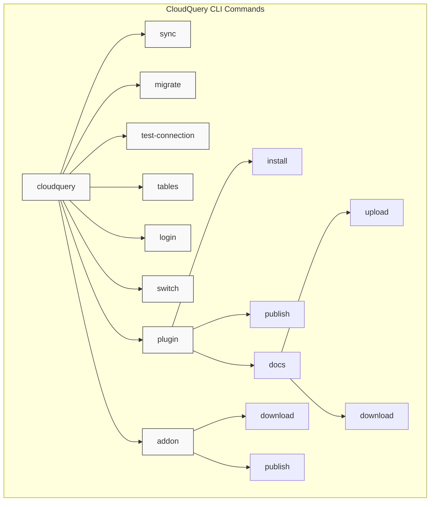
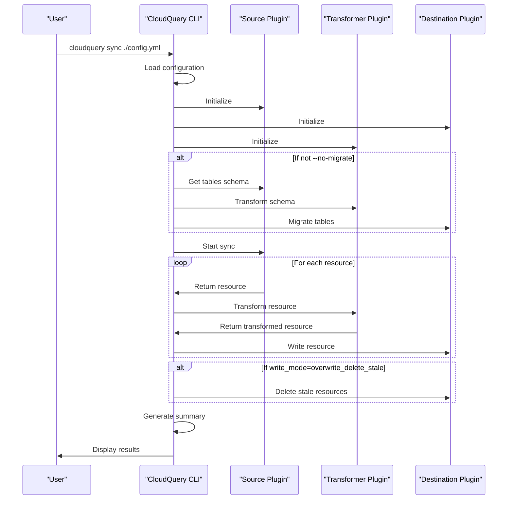
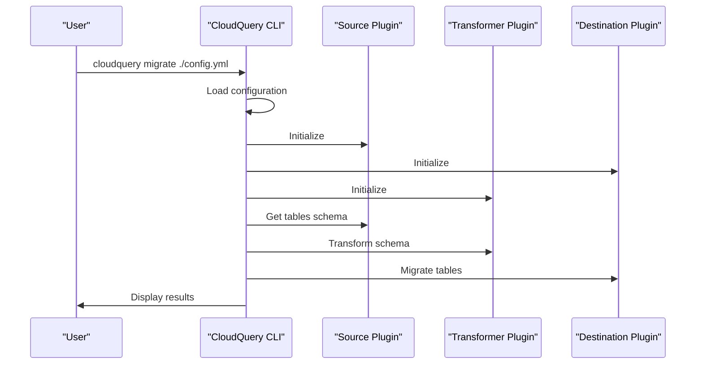
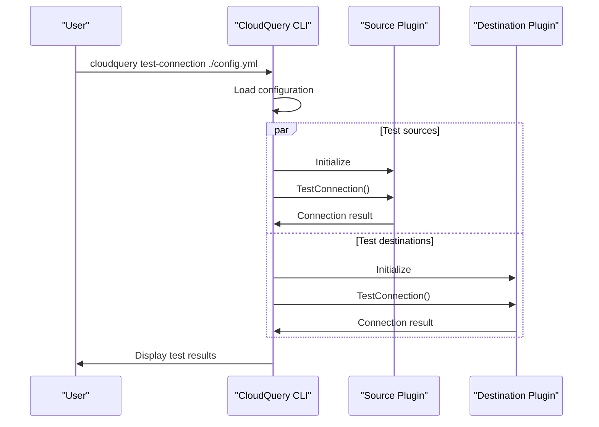
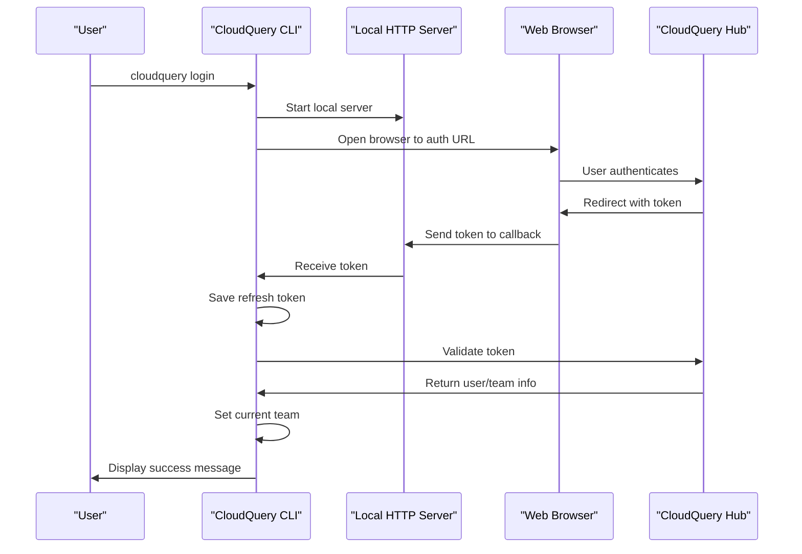
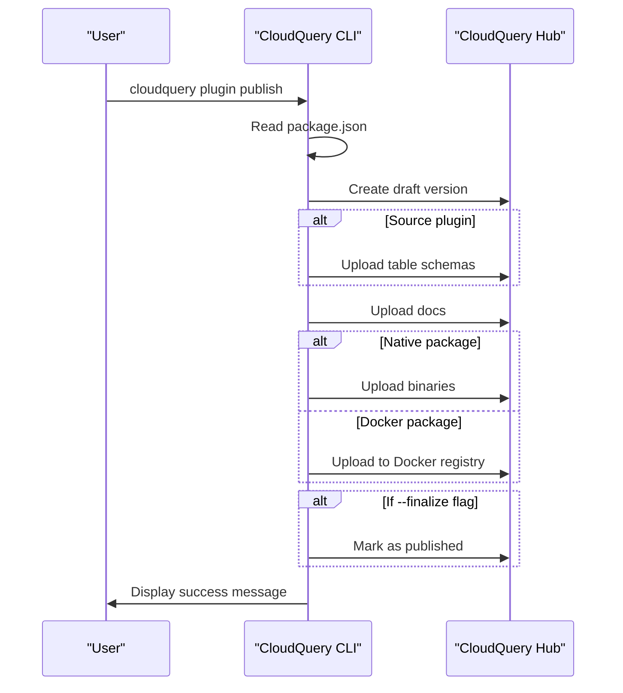
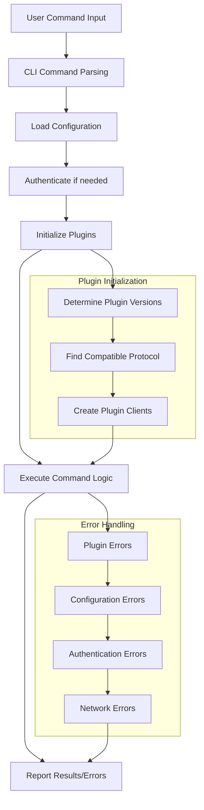
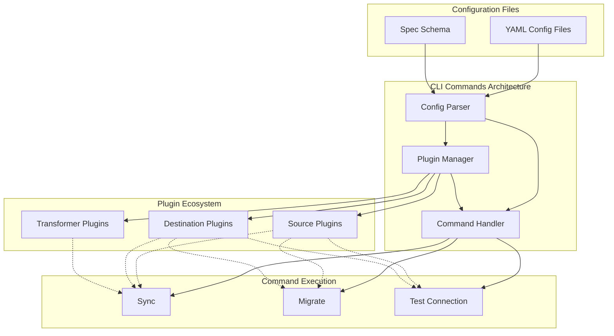

# Commands

<details>
<summary>Relevant source files</summary>

The following files were used as context for generating this wiki page:

- [cli/.golangci.yml](https://github.com/cloudquery/cloudquery/blob/5064c039/cli/.golangci.yml)
- [cli/cmd/addon_download.go](https://github.com/cloudquery/cloudquery/blob/5064c039/cli/cmd/addon_download.go)
- [cli/cmd/addon_download_test.go](https://github.com/cloudquery/cloudquery/blob/5064c039/cli/cmd/addon_download_test.go)
- [cli/cmd/addon_publish.go](https://github.com/cloudquery/cloudquery/blob/5064c039/cli/cmd/addon_publish.go)
- [cli/cmd/addon_publish_test.go](https://github.com/cloudquery/cloudquery/blob/5064c039/cli/cmd/addon_publish_test.go)
- [cli/cmd/analytics.go](https://github.com/cloudquery/cloudquery/blob/5064c039/cli/cmd/analytics.go)
- [cli/cmd/errors.go](https://github.com/cloudquery/cloudquery/blob/5064c039/cli/cmd/errors.go)
- [cli/cmd/init.go](https://github.com/cloudquery/cloudquery/blob/5064c039/cli/cmd/init.go)
- [cli/cmd/init_test.go](https://github.com/cloudquery/cloudquery/blob/5064c039/cli/cmd/init_test.go)
- [cli/cmd/install.go](https://github.com/cloudquery/cloudquery/blob/5064c039/cli/cmd/install.go)
- [cli/cmd/login.go](https://github.com/cloudquery/cloudquery/blob/5064c039/cli/cmd/login.go)
- [cli/cmd/logout.go](https://github.com/cloudquery/cloudquery/blob/5064c039/cli/cmd/logout.go)
- [cli/cmd/migrate.go](https://github.com/cloudquery/cloudquery/blob/5064c039/cli/cmd/migrate.go)
- [cli/cmd/migrate_v1.go](https://github.com/cloudquery/cloudquery/blob/5064c039/cli/cmd/migrate_v1.go)
- [cli/cmd/migrate_v2.go](https://github.com/cloudquery/cloudquery/blob/5064c039/cli/cmd/migrate_v2.go)
- [cli/cmd/migrate_v3.go](https://github.com/cloudquery/cloudquery/blob/5064c039/cli/cmd/migrate_v3.go)
- [cli/cmd/plugin_docs_download.go](https://github.com/cloudquery/cloudquery/blob/5064c039/cli/cmd/plugin_docs_download.go)
- [cli/cmd/plugin_docs_upload.go](https://github.com/cloudquery/cloudquery/blob/5064c039/cli/cmd/plugin_docs_upload.go)
- [cli/cmd/plugin_publish.go](https://github.com/cloudquery/cloudquery/blob/5064c039/cli/cmd/plugin_publish.go)
- [cli/cmd/plugin_publish_test.go](https://github.com/cloudquery/cloudquery/blob/5064c039/cli/cmd/plugin_publish_test.go)
- [cli/cmd/plugin_uiassets_upload.go](https://github.com/cloudquery/cloudquery/blob/5064c039/cli/cmd/plugin_uiassets_upload.go)
- [cli/cmd/summary.go](https://github.com/cloudquery/cloudquery/blob/5064c039/cli/cmd/summary.go)
- [cli/cmd/switch.go](https://github.com/cloudquery/cloudquery/blob/5064c039/cli/cmd/switch.go)
- [cli/cmd/switch_test.go](https://github.com/cloudquery/cloudquery/blob/5064c039/cli/cmd/switch_test.go)
- [cli/cmd/sync.go](https://github.com/cloudquery/cloudquery/blob/5064c039/cli/cmd/sync.go)
- [cli/cmd/sync_test.go](https://github.com/cloudquery/cloudquery/blob/5064c039/cli/cmd/sync_test.go)
- [cli/cmd/sync_v1.go](https://github.com/cloudquery/cloudquery/blob/5064c039/cli/cmd/sync_v1.go)
- [cli/cmd/sync_v2.go](https://github.com/cloudquery/cloudquery/blob/5064c039/cli/cmd/sync_v2.go)
- [cli/cmd/sync_v3.go](https://github.com/cloudquery/cloudquery/blob/5064c039/cli/cmd/sync_v3.go)
- [cli/cmd/tables.go](https://github.com/cloudquery/cloudquery/blob/5064c039/cli/cmd/tables.go)
- [cli/cmd/test_connection.go](https://github.com/cloudquery/cloudquery/blob/5064c039/cli/cmd/test_connection.go)
- [cli/cmd/test_connection_test.go](https://github.com/cloudquery/cloudquery/blob/5064c039/cli/cmd/test_connection_test.go)
- [cli/cmd/testdata/addon-v1/manifest-embedded-message.json](https://github.com/cloudquery/cloudquery/blob/5064c039/cli/cmd/testdata/addon-v1/manifest-embedded-message.json)
- [cli/cmd/testdata/addon-v1/manifest.json](https://github.com/cloudquery/cloudquery/blob/5064c039/cli/cmd/testdata/addon-v1/manifest.json)
- [cli/cmd/testdata/cloudflare-tables-with-spec-filter.yml](https://github.com/cloudquery/cloudquery/blob/5064c039/cli/cmd/testdata/cloudflare-tables-with-spec-filter.yml)
- [cli/cmd/testdata/destination-errors.yml](https://github.com/cloudquery/cloudquery/blob/5064c039/cli/cmd/testdata/destination-errors.yml)
- [cli/cmd/testdata/destination-exits.yml](https://github.com/cloudquery/cloudquery/blob/5064c039/cli/cmd/testdata/destination-exits.yml)
- [cli/cmd/testdata/init/aws_example.md](https://github.com/cloudquery/cloudquery/blob/5064c039/cli/cmd/testdata/init/aws_example.md)
- [cli/cmd/testdata/init/postgresql_example.md](https://github.com/cloudquery/cloudquery/blob/5064c039/cli/cmd/testdata/init/postgresql_example.md)
- [cli/cmd/testdata/source-errors.yml](https://github.com/cloudquery/cloudquery/blob/5064c039/cli/cmd/testdata/source-errors.yml)
- [cli/cmd/testdata/source-exits.yml](https://github.com/cloudquery/cloudquery/blob/5064c039/cli/cmd/testdata/source-exits.yml)
- [cli/cmd/testdata/source-with-env.yml](https://github.com/cloudquery/cloudquery/blob/5064c039/cli/cmd/testdata/source-with-env.yml)
- [cli/cmd/testdata/test-connection-bad-connection.yml](https://github.com/cloudquery/cloudquery/blob/5064c039/cli/cmd/testdata/test-connection-bad-connection.yml)
- [cli/cmd/testdata/transformation.yml](https://github.com/cloudquery/cloudquery/blob/5064c039/cli/cmd/testdata/transformation.yml)
- [cli/cmd/testdata/transformer-errors.yml](https://github.com/cloudquery/cloudquery/blob/5064c039/cli/cmd/testdata/transformer-errors.yml)
- [cli/cmd/testdata/transformer-exits.yml](https://github.com/cloudquery/cloudquery/blob/5064c039/cli/cmd/testdata/transformer-exits.yml)
- [cli/cmd/testdata/transformer-succeeds.yml](https://github.com/cloudquery/cloudquery/blob/5064c039/cli/cmd/testdata/transformer-succeeds.yml)
- [cli/cmd/testdata/ui-build/index.html](https://github.com/cloudquery/cloudquery/blob/5064c039/cli/cmd/testdata/ui-build/index.html)
- [cli/cmd/testdata/ui-build/static/style.css](https://github.com/cloudquery/cloudquery/blob/5064c039/cli/cmd/testdata/ui-build/static/style.css)
- [cli/cmd/testdata/validate-config-error.yml](https://github.com/cloudquery/cloudquery/blob/5064c039/cli/cmd/testdata/validate-config-error.yml)
- [cli/cmd/testdata/with-destination-summary-with-sync-group-id-and-shard.yml](https://github.com/cloudquery/cloudquery/blob/5064c039/cli/cmd/testdata/with-destination-summary-with-sync-group-id-and-shard.yml)
- [cli/cmd/testdata/with-destination-summary.yml](https://github.com/cloudquery/cloudquery/blob/5064c039/cli/cmd/testdata/with-destination-summary.yml)
- [cli/cmd/testdata/with-sync-group-id.yml](https://github.com/cloudquery/cloudquery/blob/5064c039/cli/cmd/testdata/with-sync-group-id.yml)
- [cli/cmd/validate_config.go](https://github.com/cloudquery/cloudquery/blob/5064c039/cli/cmd/validate_config.go)
- [cli/internal/api/client.go](https://github.com/cloudquery/cloudquery/blob/5064c039/cli/internal/api/client.go)
- [cli/internal/auth/logout.go](https://github.com/cloudquery/cloudquery/blob/5064c039/cli/internal/auth/logout.go)
- [cli/internal/auth/team.go](https://github.com/cloudquery/cloudquery/blob/5064c039/cli/internal/auth/team.go)
- [cli/internal/auth/token.go](https://github.com/cloudquery/cloudquery/blob/5064c039/cli/internal/auth/token.go)
- [cli/internal/hub/util.go](https://github.com/cloudquery/cloudquery/blob/5064c039/cli/internal/hub/util.go)
- [cli/internal/publish/addons.go](https://github.com/cloudquery/cloudquery/blob/5064c039/cli/internal/publish/addons.go)
- [cli/internal/publish/images/images.go](https://github.com/cloudquery/cloudquery/blob/5064c039/cli/internal/publish/images/images.go)
- [cli/internal/publish/images/images_test.go](https://github.com/cloudquery/cloudquery/blob/5064c039/cli/internal/publish/images/images_test.go)
- [cli/internal/publish/images/testdata/content-type/octetstream.svg](https://github.com/cloudquery/cloudquery/blob/5064c039/cli/internal/publish/images/testdata/content-type/octetstream.svg)
- [cli/internal/publish/images/testdata/content-type/png.png](https://github.com/cloudquery/cloudquery/blob/5064c039/cli/internal/publish/images/testdata/content-type/png.png)
- [cli/internal/publish/images/testdata/content-type/textplain.svg](https://github.com/cloudquery/cloudquery/blob/5064c039/cli/internal/publish/images/testdata/content-type/textplain.svg)
- [cli/internal/publish/plugins.go](https://github.com/cloudquery/cloudquery/blob/5064c039/cli/internal/publish/plugins.go)
- [cli/internal/publish/pluginui.go](https://github.com/cloudquery/cloudquery/blob/5064c039/cli/internal/publish/pluginui.go)
- [cli/internal/team/team.go](https://github.com/cloudquery/cloudquery/blob/5064c039/cli/internal/team/team.go)
- [plugins/.golangci.yml](https://github.com/cloudquery/cloudquery/blob/5064c039/plugins/.golangci.yml)
- [plugins/destination/clickhouse/typeconv/arrow/values/unwrap.go](https://github.com/cloudquery/cloudquery/blob/5064c039/plugins/destination/clickhouse/typeconv/arrow/values/unwrap.go)
- [plugins/destination/mongodb/client/uint64.go](https://github.com/cloudquery/cloudquery/blob/5064c039/plugins/destination/mongodb/client/uint64.go)
- [scripts/lint.sh](https://github.com/cloudquery/cloudquery/blob/5064c039/scripts/lint.sh)

</details>


This page documents the CloudQuery command-line interface (CLI) commands, their purposes, and usage patterns. CloudQuery CLI provides commands for data synchronization, schema migration, plugin management, addon management, authentication, and more.

## Command Overview

CloudQuery CLI offers a comprehensive set of commands organized into logical categories. Let's first understand the overall command structure:



Sources:
- [cli/cmd/sync.go](https://github.com/cloudquery/cloudquery/blob/5064c039/cli/cmd/sync.go)
- [cli/cmd/migrate.go](https://github.com/cloudquery/cloudquery/blob/5064c039/cli/cmd/migrate.go)
- [cli/cmd/test_connection.go](https://github.com/cloudquery/cloudquery/blob/5064c039/cli/cmd/test_connection.go)
- [cli/cmd/tables.go](https://github.com/cloudquery/cloudquery/blob/5064c039/cli/cmd/tables.go)
- [cli/cmd/login.go](https://github.com/cloudquery/cloudquery/blob/5064c039/cli/cmd/login.go)
- [cli/cmd/switch.go](https://github.com/cloudquery/cloudquery/blob/5064c039/cli/cmd/switch.go)

## Data Synchronization Commands

These commands form the core functionality of CloudQuery, handling the extraction, transformation, and loading of data.

### sync

The `sync` command extracts data from source plugins and loads it into destination plugins.

**Usage:**
```
cloudquery sync [files or directories] [flags]
```

**Example:**
```
# Sync resources from configuration in a directory
cloudquery sync ./directory

# Sync resources from directories and files
cloudquery sync ./directory ./aws.yml ./pg.yml

# Log tables metrics to a file
cloudquery sync ./directory ./aws.yml ./pg.yml --tables-metrics-location metrics.txt

# Shard the sync process into 4 shards and run the first shard
cloudquery sync spec.yml --shard 1/4
```

**Flags:**
| Flag | Description |
|------|-------------|
| `--no-migrate` | Disable auto-migration before sync |
| `--license` | Set offline license file |
| `--summary-location` | Specify sync summary file location |
| `--tables-metrics-location` | Tables metrics file location |
| `--shard` | Split sync process into multiple shards (format: `num/total`) |

**Sync Flow:**



Sources:
- [cli/cmd/sync.go:31-51](https://github.com/cloudquery/cloudquery/blob/5064c039/cli/cmd/sync.go#L31-L51)
- [cli/cmd/sync.go:125-487](https://github.com/cloudquery/cloudquery/blob/5064c039/cli/cmd/sync.go#L125-L487)
- [cli/cmd/sync_v3.go:111-693](https://github.com/cloudquery/cloudquery/blob/5064c039/cli/cmd/sync_v3.go#L111-L693)

### migrate

The `migrate` command updates the schema of destination plugins based on the latest changes in source plugins without performing a sync.

**Usage:**
```
cloudquery migrate [files or directories] [flags]
```

**Example:**
```
# Run migration for plugins specified in directory
cloudquery migrate ./directory

# Run migration for plugins specified in directory and config files
cloudquery migrate ./directory ./aws.yml ./pg.yml
```

**Flags:**
| Flag | Description |
|------|-------------|
| `--license` | Set offline license file |

**Migration Flow:**



Sources:
- [cli/cmd/migrate.go:16-235](https://github.com/cloudquery/cloudquery/blob/5064c039/cli/cmd/migrate.go#L16-L235)
- [cli/cmd/migrate_v3.go:15-173](https://github.com/cloudquery/cloudquery/blob/5064c039/cli/cmd/migrate_v3.go#L15-L173)

### test-connection

The `test-connection` command tests connections to source and destination plugins to verify that they can connect to their respective services.

**Usage:**
```
cloudquery test-connection [files or directories] [flags]
```

**Example:**
```
# Test plugin connections to sources and/or destinations
cloudquery test-connection ./directory

# Test plugin connections from directories and files
cloudquery test-connection ./directory ./aws.yml ./pg.yml
```

**Connection Test Flow:**



Sources:
- [cli/cmd/test_connection.go:28-392](https://github.com/cloudquery/cloudquery/blob/5064c039/cli/cmd/test_connection.go#L28-L392)

## Documentation Commands

These commands help generate documentation about the available resources in CloudQuery.

### tables

The `tables` command generates documentation for all supported tables of source plugins specified in the configuration.

**Usage:**
```
cloudquery tables [files or directories] [flags]
```

**Example:**
```
# Generate documentation for all supported tables in JSON format
cloudquery tables ./directory

# Generate documentation in markdown format
cloudquery tables ./directory --format markdown

# Specify an output directory
cloudquery tables ./directory --output-dir ./docs

# Include only tables referenced in the spec
cloudquery tables ./directory --filter spec
```

**Flags:**
| Flag | Description |
|------|-------------|
| `--output-dir` | Base output directory for generated files (default: `cq-docs`) |
| `--format` | Output format: `json` or `markdown` (default: `json`) |
| `--filter` | Filter tables: `all` or `spec` (default: `all`) |

Sources:
- [cli/cmd/tables.go:16-143](https://github.com/cloudquery/cloudquery/blob/5064c039/cli/cmd/tables.go#L16-L143)

## Authentication and Team Management

These commands handle authentication with CloudQuery Hub and team management.

### login

The `login` command authenticates to CloudQuery Hub, which is required to download plugins from the Hub.

**Usage:**
```
cloudquery login [flags]
```

**Example:**
```
# Log in to CloudQuery Hub
cloudquery login

# Log in to a specific team
cloudquery login --team my-team
```

**Flags:**
| Flag | Description |
|------|-------------|
| `--team`, `-t` | Team to login to |

**Login Flow:**



Sources:
- [cli/cmd/login.go:31-205](https://github.com/cloudquery/cloudquery/blob/5064c039/cli/cmd/login.go#L31-L205)
- [cli/internal/auth/team.go:15-84](https://github.com/cloudquery/cloudquery/blob/5064c039/cli/internal/auth/team.go#L15-L84)

### switch

The `switch` command switches between CloudQuery teams.

**Usage:**
```
cloudquery switch [team-name] [flags]
```

**Example:**
```
# Switch to a different team
cloudquery switch my-team
```

Sources:
- [cli/cmd/switch.go:15-105](https://github.com/cloudquery/cloudquery/blob/5064c039/cli/cmd/switch.go#L15-L105)
- [cli/internal/team/team.go:11-83](https://github.com/cloudquery/cloudquery/blob/5064c039/cli/internal/team/team.go#L11-L83)

## Plugin Management Commands

These commands handle the installation and publishing of CloudQuery plugins.

### plugin install

The `plugin install` command installs required plugins from a configuration without executing them.

**Usage:**
```
cloudquery plugin install [files or directories] [flags]
```

**Example:**
```
# Install required plugins specified in directory
cloudquery plugin install ./directory

# Install required plugins specified in directory and config files
cloudquery plugin install ./directory ./aws.yml ./pg.yml
```

Sources:
- [cli/cmd/install.go:16-162](https://github.com/cloudquery/cloudquery/blob/5064c039/cli/cmd/install.go#L16-L162)

### plugin publish

The `plugin publish` command publishes a plugin to CloudQuery Hub from a local distribution directory.

**Usage:**
```
cloudquery plugin publish [-D dist] [flags]
```

**Example:**
```
# Publish a plugin version from a local dist directory
cloudquery plugin publish
```

**Flags:**
| Flag | Description |
|------|-------------|
| `--dist-dir`, `-D` | Path to the dist directory (default: `dist`) |
| `--ui-dir`, `-U` | Path to the built plugin UI directory |
| `--finalize`, `-f` | Finalize the plugin version after publishing |

**Publish Flow:**



Sources:
- [cli/cmd/plugin_publish.go:21-185](https://github.com/cloudquery/cloudquery/blob/5064c039/cli/cmd/plugin_publish.go#L21-L185)
- [cli/internal/publish/plugins.go:35-1012](https://github.com/cloudquery/cloudquery/blob/5064c039/cli/internal/publish/plugins.go#L35-L1012)

### plugin docs upload

The `plugin docs upload` command uploads documentation for a plugin version to CloudQuery Hub.

**Usage:**
```
cloudquery plugin docs upload [-D docs] [--sync] <team_name>/<plugin_kind>/<plugin_name>@<version> [flags]
```

**Example:**
```
# Upload plugin docs to CloudQuery Hub
cloudquery plugin docs upload test-team/source/test-plugin@v1.0.0
```

**Flags:**
| Flag | Description |
|------|-------------|
| `--docs-dir`, `-D` | Path to the docs directory (default: `docs`) |
| `--sync` | Synchronize docs with CloudQuery Hub |

Sources:
- [cli/cmd/plugin_docs_upload.go:18-94](https://github.com/cloudquery/cloudquery/blob/5064c039/cli/cmd/plugin_docs_upload.go#L18-L94)

### plugin docs download

The `plugin docs download` command downloads documentation for a plugin version from CloudQuery Hub.

**Usage:**
```
cloudquery plugin docs download [-D docs] <team_name>/<plugin_kind>/<plugin_name>@<version> [flags]
```

**Example:**
```
# Download plugin docs from CloudQuery Hub
cloudquery plugin docs download test-team/source/test-plugin@v1.0.0
```

**Flags:**
| Flag | Description |
|------|-------------|
| `--docs-dir`, `-D` | Path to save docs to (default: `docs`) |

Sources:
- [cli/cmd/plugin_docs_download.go:21-92](https://github.com/cloudquery/cloudquery/blob/5064c039/cli/cmd/plugin_docs_download.go#L21-L92)

## Addon Management Commands

These commands handle the downloading and publishing of CloudQuery addons.

### addon download

The `addon download` command downloads an addon from CloudQuery Hub to the local filesystem.

**Usage:**
```
cloudquery addon download addon-team/addon-type/addon-name@v1.0.0 [-t directory] [flags]
```

**Example:**
```
# Download an addon to local disk
cloudquery addon download cloudquery/transformation/aws-compliance-premium@v1.9.0
```

**Flags:**
| Flag | Description |
|------|-------------|
| `--target`, `-t` | Download to specified directory (default: `.`) |

Sources:
- [cli/cmd/addon_download.go:21-124](https://github.com/cloudquery/cloudquery/blob/5064c039/cli/cmd/addon_download.go#L21-L124)
- [cli/internal/publish/addons.go:21-94](https://github.com/cloudquery/cloudquery/blob/5064c039/cli/internal/publish/addons.go#L21-L94)

### addon publish

The `addon publish` command publishes an addon to CloudQuery Hub from a local manifest file.

**Usage:**
```
cloudquery addon publish manifest.json v1.0.0 [--finalize] [flags]
```

**Example:**
```
# Publish an addon version from a manifest file
cloudquery addon publish /path/to/manifest.json v1.0.0
```

**Flags:**
| Flag | Description |
|------|-------------|
| `--finalize`, `-f` | Finalize the addon version after publishing |

Sources:
- [cli/cmd/addon_publish.go:21-128](https://github.com/cloudquery/cloudquery/blob/5064c039/cli/cmd/addon_publish.go#L21-L128)
- [cli/internal/publish/addons.go:96-196](https://github.com/cloudquery/cloudquery/blob/5064c039/cli/internal/publish/addons.go#L96-L196)

## Command Execution Model

All CloudQuery CLI commands follow a consistent execution pattern that ensures plugin compatibility and proper error handling.



Sources:
- [cli/cmd/sync.go:125-487](https://github.com/cloudquery/cloudquery/blob/5064c039/cli/cmd/sync.go#L125-L487)
- [cli/cmd/migrate.go:40-235](https://github.com/cloudquery/cloudquery/blob/5064c039/cli/cmd/migrate.go#L40-L235)
- [cli/cmd/test_connection.go:130-307](https://github.com/cloudquery/cloudquery/blob/5064c039/cli/cmd/test_connection.go#L130-L307)

## Common Flags and Options

Most CloudQuery commands share some common flags:

| Flag | Description | Commands |
|------|-------------|----------|
| `--cq-dir` | CloudQuery directory for storing plugins (env: `CQ_DIR`) | All commands |
| `--log-console` | Output logs to console instead of file | All commands |
| `--log-file` | Path to log file (default: `cloudquery.log`) | All commands |
| `--disable-sentry` | Disable sending crash reports to Sentry | All commands |
| `--license` | Path to license file | sync, migrate |
| `--no-migrate` | Skip migration step | sync |

Sources:
- [cli/cmd/root.go:33-65](https://github.com/cloudquery/cloudquery/blob/5064c039/cli/cmd/root.go#L33-L65)
- [cli/cmd/sync.go:42-48](https://github.com/cloudquery/cloudquery/blob/5064c039/cli/cmd/sync.go#L42-L48)
- [cli/cmd/migrate.go:34-36](https://github.com/cloudquery/cloudquery/blob/5064c039/cli/cmd/migrate.go#L34-L36)

## Configuration-Based Command Architecture

CloudQuery CLI uses a configuration-based architecture where commands operate on YAML configuration files. This architecture allows for a consistent approach to handling different plugins and operations.



Sources:
- [cli/cmd/sync.go:155-202](https://github.com/cloudquery/cloudquery/blob/5064c039/cli/cmd/sync.go#L155-L202)
- [cli/cmd/sync_v3.go:111-173](https://github.com/cloudquery/cloudquery/blob/5064c039/cli/cmd/sync_v3.go#L111-L173)
- [cli/internal/specs/v0/source.go](https://github.com/cloudquery/cloudquery/blob/5064c039/cli/internal/specs/v0/source.go)