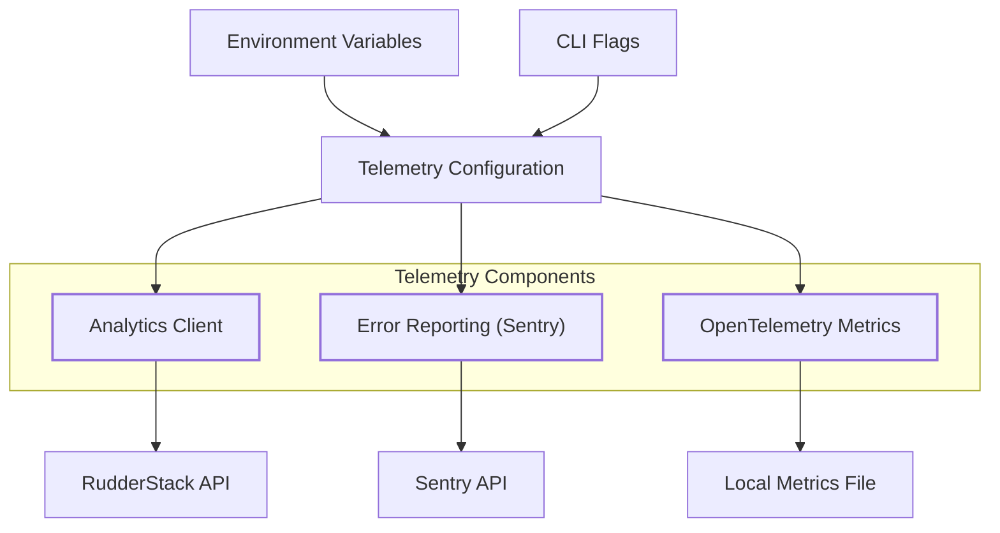
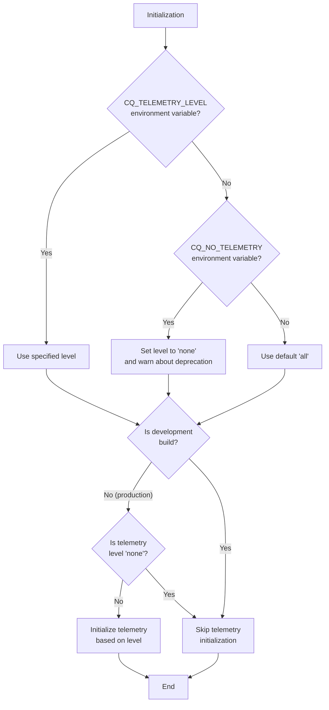
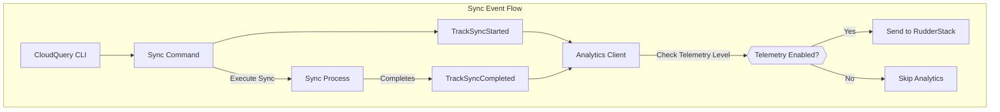

# Analytics and Telemetry

<details>
<summary>Relevant source files</summary>

The following files were used as context for generating this wiki page:

- [cli/cmd/doc_test.go](https://github.com/cloudquery/cloudquery/blob/5064c039/cli/cmd/doc_test.go)
- [cli/cmd/install_test.go](https://github.com/cloudquery/cloudquery/blob/5064c039/cli/cmd/install_test.go)
- [cli/cmd/root.go](https://github.com/cloudquery/cloudquery/blob/5064c039/cli/cmd/root.go)
- [cli/internal/analytics/client.go](https://github.com/cloudquery/cloudquery/blob/5064c039/cli/internal/analytics/client.go)
- [cli/internal/env/env.go](https://github.com/cloudquery/cloudquery/blob/5064c039/cli/internal/env/env.go)
- [cli/internal/otel/receiver.go](https://github.com/cloudquery/cloudquery/blob/5064c039/cli/internal/otel/receiver.go)

</details>


This document explains how CloudQuery collects and manages telemetry and analytics data. It describes the telemetry system architecture, configuration options, what data is collected, and privacy considerations.

## Overview

CloudQuery's analytics and telemetry system collects usage data to help improve the platform. This system is designed to be transparent and configurable, allowing users to control what data is shared.



Sources: [cli/internal/analytics/client.go:1-337](https://github.com/cloudquery/cloudquery/blob/5064c039/cli/internal/analytics/client.go#L1-L337), [cli/cmd/root.go:1-221](https://github.com/cloudquery/cloudquery/blob/5064c039/cli/cmd/root.go#L1-L221), [cli/internal/otel/receiver.go:1-311](https://github.com/cloudquery/cloudquery/blob/5064c039/cli/internal/otel/receiver.go#L1-L311)

## Telemetry Configuration

CloudQuery provides multiple ways to configure telemetry, with granular control over what data is collected.

### Telemetry Levels

The telemetry system supports four levels of data collection:

| Level   | Description                                           | Analytics | Error Reporting |
|---------|-------------------------------------------------------|-----------|-----------------|
| `none`  | Disables all telemetry data collection                | Disabled  | Disabled        |
| `errors`| Only collects error information (via Sentry)          | Disabled  | Enabled         |
| `stats` | Collects usage statistics (via RudderStack)           | Enabled   | Disabled        |
| `all`   | Collects both errors and statistics (default)         | Enabled   | Enabled         |

### Configuration Methods

Telemetry can be configured using:

1. **CLI Flag**: `--telemetry-level=<level>` (where `<level>` is one of the above)
2. **Environment Variable**: `CQ_TELEMETRY_LEVEL=<level>`
3. **Legacy Environment Variable**: `CQ_NO_TELEMETRY=1` (equivalent to `--telemetry-level=none`)



Sources: [cli/cmd/root.go:38-106](https://github.com/cloudquery/cloudquery/blob/5064c039/cli/cmd/root.go#L38-L106)

## Data Collection

### Analytics Events

When enabled, CloudQuery records the following events:

1. **Login Success**: When a user successfully logs in
2. **Sync Started/Completed**: When sync operations begin and finish
3. **Init Started/Completed**: When initialization operations begin and finish

Each event contains contextual metadata that helps understand usage patterns without capturing sensitive data.

### Event Data Structure

The analytics events include the following types of information:

- **Invocation UUID**: A unique identifier for the CLI invocation
- **Team Information**: The team ID (but not team name or sensitive details)
- **Environment**: Whether running in local CLI or cloud mode
- **Operation Details**: For sync events, information about sources and destinations
- **Performance Metrics**: Resource counts, errors, warnings, and duration

Internal team usage is automatically excluded from analytics collection.

Sources: [cli/internal/analytics/client.go:89-329](https://github.com/cloudquery/cloudquery/blob/5064c039/cli/internal/analytics/client.go#L89-L329)

### OpenTelemetry Metrics

CloudQuery supports OpenTelemetry for more detailed operational metrics:

- Table-level metrics (resources processed, errors, execution time)
- Client-specific metrics
- Start/end timestamps

These metrics are written to a local file rather than sent to an external service.

Sources: [cli/internal/otel/receiver.go:26-163](https://github.com/cloudquery/cloudquery/blob/5064c039/cli/internal/otel/receiver.go#L26-L163)

## Implementation Details

### Analytics Client

The analytics system uses RudderStack as its analytics backend and initializes it with the following configuration:

```
CQ_RUDDERSTACK_WRITE_KEY (default: "2h38sP5iH58EYKBTRsGByJDDr6r")
CQ_RUDDERSTACK_DATA_PLANE_URL (default: "https://analytics-events.cloudquery.io")
```

The client is initialized in the `InitClient` function and events are enqueued using RudderStack's tracking functions.

The analytics client checks if the user belongs to an internal team and skips tracking for internal users.

Sources: [cli/internal/analytics/client.go:33-45](https://github.com/cloudquery/cloudquery/blob/5064c039/cli/internal/analytics/client.go#L33-L45), [cli/internal/analytics/client.go:89-115](https://github.com/cloudquery/cloudquery/blob/5064c039/cli/internal/analytics/client.go#L89-L115)

### Sync Event Tracking

CloudQuery tracks sync events with a detailed structure that captures the performance and outcome of sync operations:



Sources: [cli/internal/analytics/client.go:116-218](https://github.com/cloudquery/cloudquery/blob/5064c039/cli/internal/analytics/client.go#L116-L218)

### OpenTelemetry Receiver

The OpenTelemetry receiver listens for metrics and writes them to a local file as a formatted table. It tracks:

- Table syncs
- Start and end times
- Resource counts
- Error and panic counts

The metrics are consumed from the OpenTelemetry collector protocol and rendered as a table for user visibility.

Sources: [cli/internal/otel/receiver.go:212-310](https://github.com/cloudquery/cloudquery/blob/5064c039/cli/internal/otel/receiver.go#L212-L310)

## Privacy Considerations

CloudQuery's telemetry system is designed with privacy in mind:

1. **Transparent Collection**: All data collection is documented and configurable
2. **Opt-Out Available**: Telemetry can be completely disabled with `--telemetry-level=none`
3. **No Sensitive Data**: The system avoids collecting sensitive data such as table contents, credentials, or specific query parameters
4. **Internal Usage Filtering**: Internal team usage is automatically excluded from analytics
5. **Development Mode**: Telemetry is disabled by default in development builds
6. **Anonymized IDs**: When not logged in, only anonymous IDs are used

Users who are concerned about telemetry can disable it completely while still using all CloudQuery functionality.

Sources: [cli/cmd/root.go:88-106](https://github.com/cloudquery/cloudquery/blob/5064c039/cli/cmd/root.go#L88-L106), [cli/internal/analytics/client.go:99-101](https://github.com/cloudquery/cloudquery/blob/5064c039/cli/internal/analytics/client.go#L99-L101), [cli/internal/analytics/client.go:166-168](https://github.com/cloudquery/cloudquery/blob/5064c039/cli/internal/analytics/client.go#L166-L168)

## Environment Variables

The following environment variables affect telemetry behavior:

| Variable | Purpose | Default |
|----------|---------|---------|
| `CQ_TELEMETRY_LEVEL` | Sets the telemetry level | `all` |
| `CQ_NO_TELEMETRY` | Legacy way to disable telemetry | Not set |
| `CQ_RUDDERSTACK_WRITE_KEY` | API key for RudderStack | Default CloudQuery key |
| `CQ_RUDDERSTACK_DATA_PLANE_URL` | Endpoint for analytics | `https://analytics-events.cloudquery.io` |
| `CQ_CLOUD` | Indicates if running in cloud mode | Not set |