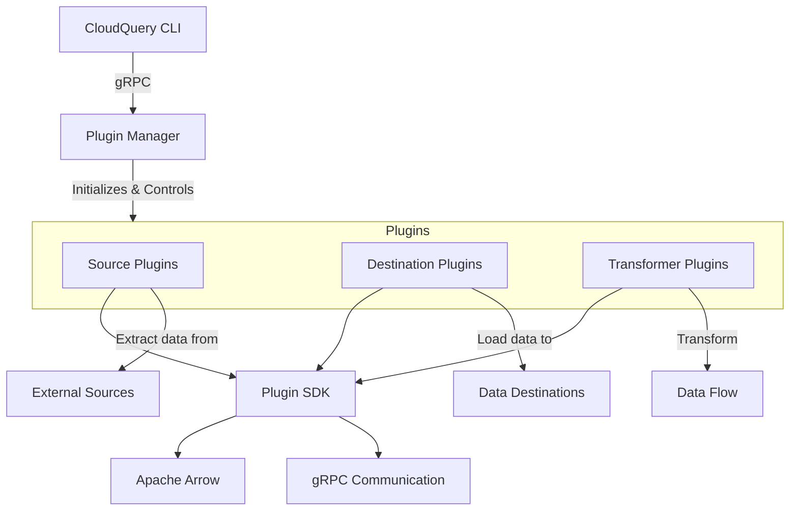
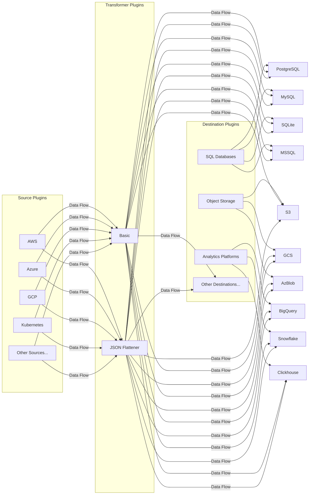
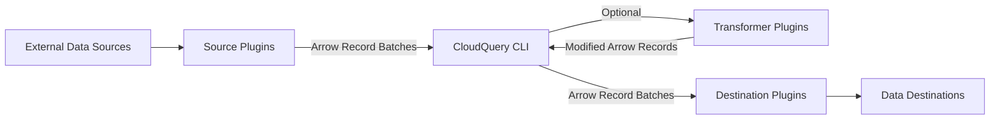
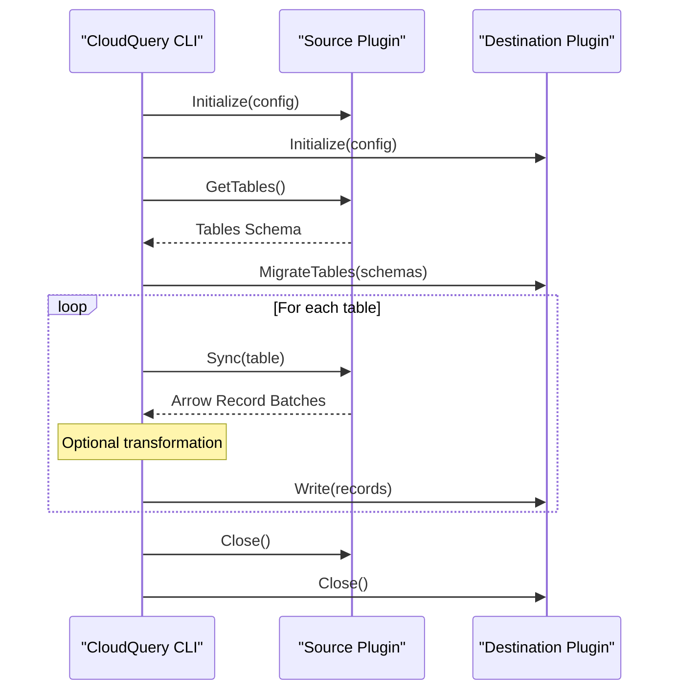

# Plugin System

<details>
<summary>Relevant source files</summary>

The following files were used as context for generating this wiki page:

- [.gitattributes](https://github.com/cloudquery/cloudquery/blob/5064c039/.gitattributes)
- [cli/go.mod](https://github.com/cloudquery/cloudquery/blob/5064c039/cli/go.mod)
- [cli/go.sum](https://github.com/cloudquery/cloudquery/blob/5064c039/cli/go.sum)
- [plugins/destination/azblob/go.mod](https://github.com/cloudquery/cloudquery/blob/5064c039/plugins/destination/azblob/go.mod)
- [plugins/destination/azblob/go.sum](https://github.com/cloudquery/cloudquery/blob/5064c039/plugins/destination/azblob/go.sum)
- [plugins/destination/bigquery/go.mod](https://github.com/cloudquery/cloudquery/blob/5064c039/plugins/destination/bigquery/go.mod)
- [plugins/destination/bigquery/go.sum](https://github.com/cloudquery/cloudquery/blob/5064c039/plugins/destination/bigquery/go.sum)
- [plugins/destination/clickhouse/go.mod](https://github.com/cloudquery/cloudquery/blob/5064c039/plugins/destination/clickhouse/go.mod)
- [plugins/destination/clickhouse/go.sum](https://github.com/cloudquery/cloudquery/blob/5064c039/plugins/destination/clickhouse/go.sum)
- [plugins/destination/duckdb/go.mod](https://github.com/cloudquery/cloudquery/blob/5064c039/plugins/destination/duckdb/go.mod)
- [plugins/destination/duckdb/go.sum](https://github.com/cloudquery/cloudquery/blob/5064c039/plugins/destination/duckdb/go.sum)
- [plugins/destination/elasticsearch/go.mod](https://github.com/cloudquery/cloudquery/blob/5064c039/plugins/destination/elasticsearch/go.mod)
- [plugins/destination/elasticsearch/go.sum](https://github.com/cloudquery/cloudquery/blob/5064c039/plugins/destination/elasticsearch/go.sum)
- [plugins/destination/file/go.mod](https://github.com/cloudquery/cloudquery/blob/5064c039/plugins/destination/file/go.mod)
- [plugins/destination/file/go.sum](https://github.com/cloudquery/cloudquery/blob/5064c039/plugins/destination/file/go.sum)
- [plugins/destination/firehose/go.mod](https://github.com/cloudquery/cloudquery/blob/5064c039/plugins/destination/firehose/go.mod)
- [plugins/destination/firehose/go.sum](https://github.com/cloudquery/cloudquery/blob/5064c039/plugins/destination/firehose/go.sum)
- [plugins/destination/gcs/go.mod](https://github.com/cloudquery/cloudquery/blob/5064c039/plugins/destination/gcs/go.mod)
- [plugins/destination/gcs/go.sum](https://github.com/cloudquery/cloudquery/blob/5064c039/plugins/destination/gcs/go.sum)
- [plugins/destination/gremlin/go.mod](https://github.com/cloudquery/cloudquery/blob/5064c039/plugins/destination/gremlin/go.mod)
- [plugins/destination/gremlin/go.sum](https://github.com/cloudquery/cloudquery/blob/5064c039/plugins/destination/gremlin/go.sum)
- [plugins/destination/kafka/go.mod](https://github.com/cloudquery/cloudquery/blob/5064c039/plugins/destination/kafka/go.mod)
- [plugins/destination/kafka/go.sum](https://github.com/cloudquery/cloudquery/blob/5064c039/plugins/destination/kafka/go.sum)
- [plugins/destination/meilisearch/go.mod](https://github.com/cloudquery/cloudquery/blob/5064c039/plugins/destination/meilisearch/go.mod)
- [plugins/destination/meilisearch/go.sum](https://github.com/cloudquery/cloudquery/blob/5064c039/plugins/destination/meilisearch/go.sum)
- [plugins/destination/mongodb/go.mod](https://github.com/cloudquery/cloudquery/blob/5064c039/plugins/destination/mongodb/go.mod)
- [plugins/destination/mongodb/go.sum](https://github.com/cloudquery/cloudquery/blob/5064c039/plugins/destination/mongodb/go.sum)
- [plugins/destination/mssql/go.mod](https://github.com/cloudquery/cloudquery/blob/5064c039/plugins/destination/mssql/go.mod)
- [plugins/destination/mssql/go.sum](https://github.com/cloudquery/cloudquery/blob/5064c039/plugins/destination/mssql/go.sum)
- [plugins/destination/mysql/go.mod](https://github.com/cloudquery/cloudquery/blob/5064c039/plugins/destination/mysql/go.mod)
- [plugins/destination/mysql/go.sum](https://github.com/cloudquery/cloudquery/blob/5064c039/plugins/destination/mysql/go.sum)
- [plugins/destination/neo4j/go.mod](https://github.com/cloudquery/cloudquery/blob/5064c039/plugins/destination/neo4j/go.mod)
- [plugins/destination/neo4j/go.sum](https://github.com/cloudquery/cloudquery/blob/5064c039/plugins/destination/neo4j/go.sum)
- [plugins/destination/postgresql/go.mod](https://github.com/cloudquery/cloudquery/blob/5064c039/plugins/destination/postgresql/go.mod)
- [plugins/destination/postgresql/go.sum](https://github.com/cloudquery/cloudquery/blob/5064c039/plugins/destination/postgresql/go.sum)
- [plugins/destination/s3/go.mod](https://github.com/cloudquery/cloudquery/blob/5064c039/plugins/destination/s3/go.mod)
- [plugins/destination/s3/go.sum](https://github.com/cloudquery/cloudquery/blob/5064c039/plugins/destination/s3/go.sum)
- [plugins/destination/snowflake/go.mod](https://github.com/cloudquery/cloudquery/blob/5064c039/plugins/destination/snowflake/go.mod)
- [plugins/destination/snowflake/go.sum](https://github.com/cloudquery/cloudquery/blob/5064c039/plugins/destination/snowflake/go.sum)
- [plugins/destination/sqlite/go.mod](https://github.com/cloudquery/cloudquery/blob/5064c039/plugins/destination/sqlite/go.mod)
- [plugins/destination/sqlite/go.sum](https://github.com/cloudquery/cloudquery/blob/5064c039/plugins/destination/sqlite/go.sum)
- [plugins/destination/test/go.mod](https://github.com/cloudquery/cloudquery/blob/5064c039/plugins/destination/test/go.mod)
- [plugins/destination/test/go.sum](https://github.com/cloudquery/cloudquery/blob/5064c039/plugins/destination/test/go.sum)
- [plugins/source/hackernews/go.mod](https://github.com/cloudquery/cloudquery/blob/5064c039/plugins/source/hackernews/go.mod)
- [plugins/source/hackernews/go.sum](https://github.com/cloudquery/cloudquery/blob/5064c039/plugins/source/hackernews/go.sum)
- [plugins/source/test/go.mod](https://github.com/cloudquery/cloudquery/blob/5064c039/plugins/source/test/go.mod)
- [plugins/source/test/go.sum](https://github.com/cloudquery/cloudquery/blob/5064c039/plugins/source/test/go.sum)
- [scaffold/sourcetpl/templates/source/go.mod.tpl](https://github.com/cloudquery/cloudquery/blob/5064c039/scaffold/sourcetpl/templates/source/go.mod.tpl)

</details>


CloudQuery's Plugin System is the core architectural component that provides extensibility and modularity for data integration. This system allows CloudQuery to support a wide variety of data sources and destinations without modifying the core application code. The plugin architecture enables users to extract data from different services, transform it as needed, and load it into various target systems.

For information about implementing specific plugin types, see [Source Plugins](#3.1), [Destination Plugins](#3.2), and [Plugin Development](#6).

## Architecture Overview

The CloudQuery plugin system follows a client-server architecture where the CLI acts as the client and plugins operate as separate processes that act as servers.



This architecture provides several benefits:

1. **Process Isolation**: Each plugin runs as a separate process with its own memory space
2. **Independent Versioning**: Plugins can evolve independently of the core CLI
3. **Language Flexibility**: Plugins can be written in any language that supports gRPC
4. **Scalability**: Different plugins can be allocated resources based on their specific needs

Sources: cli/go.mod, plugins/destination/s3/go.mod, plugins/destination/firehose/go.mod

## Plugin Types

CloudQuery supports three primary plugin types, each serving a specific role in the data integration pipeline:

### Source Plugins

Source plugins extract data from external services and convert it to the CloudQuery data model. They are responsible for:
- Connecting to source systems
- Authenticating with proper credentials
- Extracting data from APIs or databases
- Converting data to Apache Arrow format
- Defining schemas for the extracted resources

Examples include AWS, Azure, GCP, Kubernetes, Airtable, HackerNews, and many others.

### Destination Plugins

Destination plugins receive data and load it into target systems. They handle:
- Schema creation and migration
- Data writing and formatting
- Optimizing for the specific target system
- Managing batched operations

Examples include PostgreSQL, MySQL, BigQuery, Snowflake, S3, GCS, Kafka, and others.

### Transformer Plugins

Transformer plugins modify data between extraction and loading. They can:
- Modify data structure
- Filter or enrich data
- Convert between formats
- Apply business logic

Examples include the Basic transformer and JSON Flattener.



Sources: plugins/destination/s3/go.mod, plugins/destination/bigquery/go.mod, plugins/destination/snowflake/go.mod

## Plugin SDK

The Plugin SDK serves as the foundation for all CloudQuery plugins. It provides the interfaces, utilities, and communication mechanisms that plugins must implement.

Key components of the SDK include:

1. **Plugin Interfaces**: Core interfaces that define plugin behavior
2. **Arrow Integration**: Tools for working with Apache Arrow format
3. **gRPC Implementation**: Client and server implementations for plugin communication
4. **Logging and Error Handling**: Standardized logging and error reporting mechanisms

All plugins depend on the SDK as shown in their go.mod files:

```
github.com/cloudquery/plugin-sdk/v4 v4.77.0
```

The SDK abstracts away the complexity of plugin communication, allowing plugin developers to focus on the specific implementation details of their plugins.

Sources: plugins/destination/s3/go.mod:14, plugins/destination/firehose/go.mod:12, plugins/destination/gcs/go.mod:10

## Data Flow

Data flows through the CloudQuery system using Apache Arrow as the standardized format for data exchange. This ensures efficiency and consistency across the entire pipeline.



Apache Arrow provides several advantages:

1. **Columnar Memory Format**: Efficient memory layout for analytical operations
2. **Zero-Copy Reading**: Minimizes memory usage during data transfers
3. **Cross-Language Compatibility**: Same memory format across programming languages
4. **Built-in Compression**: Reduces memory footprint for large datasets

Sources: plugins/destination/s3/go.mod:6, plugins/destination/firehose/go.mod:6, plugins/destination/gcs/go.mod:7

## Plugin Lifecycle

The typical lifecycle of plugins during a CloudQuery sync operation follows these stages:



1. **Initialization**: Plugins are initialized with their configuration
2. **Table Discovery**: Source plugins report available tables and their schemas
3. **Migration**: Destination plugins create or update necessary schemas
4. **Synchronization**: Data is extracted, optionally transformed, and loaded
5. **Termination**: Plugins are gracefully shut down

Sources: cli/go.mod, plugins/destination/s3/go.mod, plugins/destination/firehose/go.mod

## Plugin Communication

Plugins communicate with the CloudQuery CLI using a combination of technologies:

1. **gRPC**: For command and control operations
2. **Protocol Buffers**: For interface definitions (via `plugin-pb-go`)
3. **Apache Arrow**: For efficient data exchange

The communication protocol is defined in the `plugin-pb-go` package, which is a dependency for both the CLI and all plugins:

```
github.com/cloudquery/plugin-pb-go v1.26.9
```

This standardized communication layer ensures that all plugins can interact with the CLI regardless of their implementation language or details.

Sources: cli/go.mod:11, plugins/destination/s3/go.mod:51

## Plugin Management

CloudQuery provides several mechanisms for managing plugins:

1. **CloudQuery Hub**: Central repository for official and community plugins
2. **CLI Commands**: Tools for installing, updating, and managing plugins
3. **Configuration**: YAML-based configuration for plugin behavior

Plugin configuration is typically defined in YAML files that specify the plugin path, version, and configuration options:

```yaml
kind: source
spec:
  name: aws
  path: cloudquery/aws
  version: v18.0.0
  tables: ["aws_s3_buckets", "aws_ec2_instances"]
  destinations: ["postgresql"]
```

The CloudQuery CLI handles plugin installation, verification, and lifecycle management based on this configuration.

Sources: cli/go.mod

## Summary

CloudQuery's plugin system provides a flexible, extensible architecture for data integration. By using standardized interfaces through the Plugin SDK, consistent data representation with Apache Arrow, and efficient communication via gRPC, the system enables a wide variety of data sources and destinations to be supported while maintaining a clean separation of concerns.

The modular design allows the plugin ecosystem to grow independently, with new plugins being developed without requiring changes to the core CloudQuery codebase.