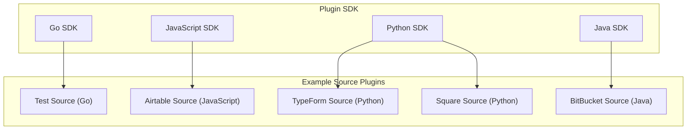
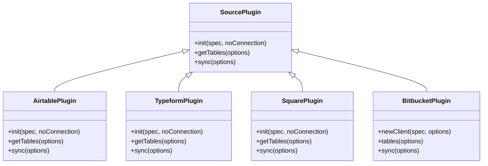
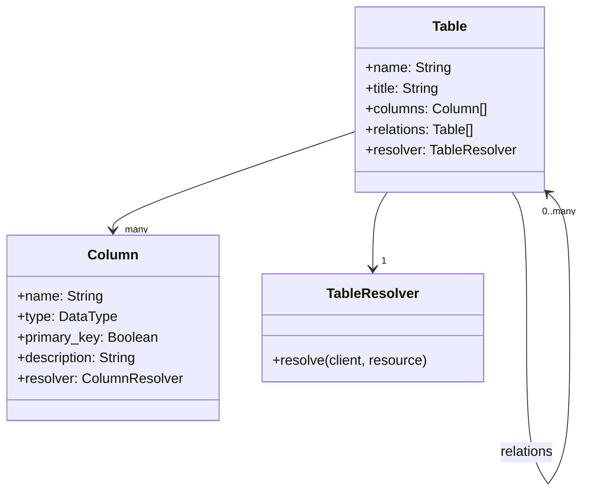
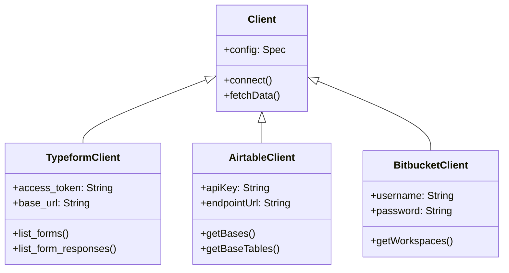
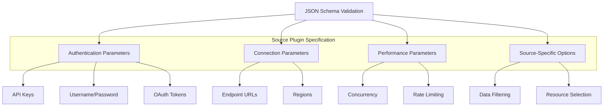
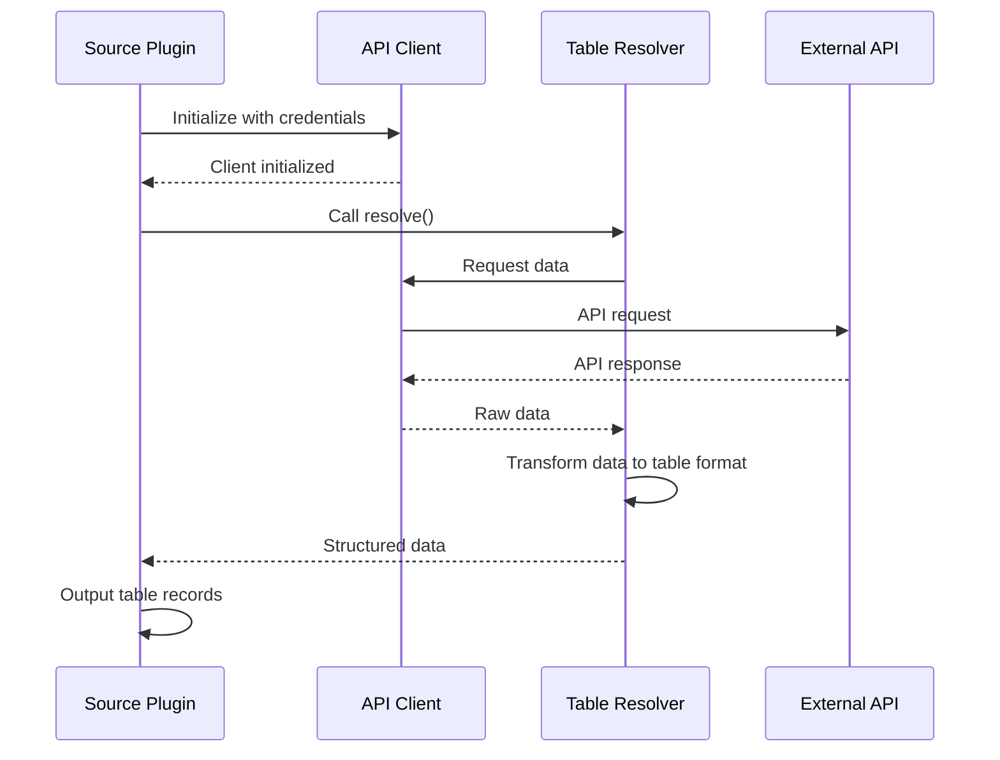
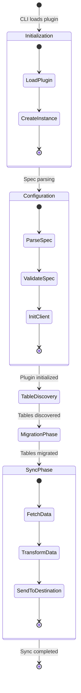
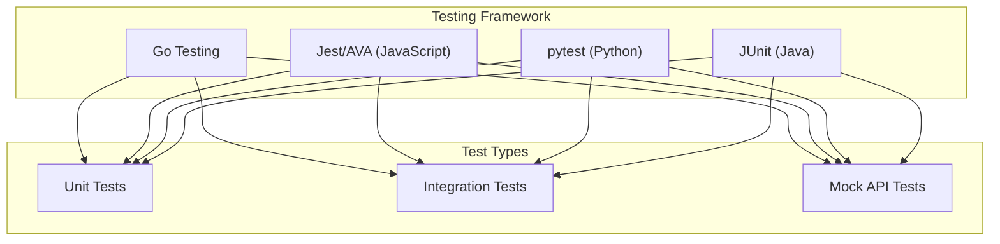
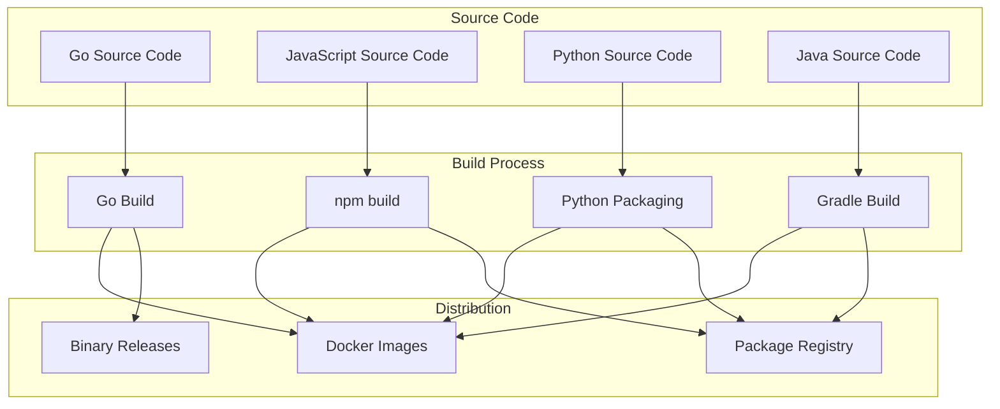

# Source Plugins

<details>
<summary>Relevant source files</summary>

The following files were used as context for generating this wiki page:

- [.gitattributes](https://github.com/cloudquery/cloudquery/blob/5064c039/.gitattributes)
- [.github/workflows/auto_sort_files.yml](https://github.com/cloudquery/cloudquery/blob/5064c039/.github/workflows/auto_sort_files.yml)
- [.github/workflows/source_airtable.yml](https://github.com/cloudquery/cloudquery/blob/5064c039/.github/workflows/source_airtable.yml)
- [.github/workflows/source_square.yml](https://github.com/cloudquery/cloudquery/blob/5064c039/.github/workflows/source_square.yml)
- [plugins/destination/sqlite-python/requirements.txt](https://github.com/cloudquery/cloudquery/blob/5064c039/plugins/destination/sqlite-python/requirements.txt)
- [plugins/source/airtable/.dockerignore](https://github.com/cloudquery/cloudquery/blob/5064c039/plugins/source/airtable/.dockerignore)
- [plugins/source/airtable/.eslintrc](https://github.com/cloudquery/cloudquery/blob/5064c039/plugins/source/airtable/.eslintrc)
- [plugins/source/airtable/.gitignore](https://github.com/cloudquery/cloudquery/blob/5064c039/plugins/source/airtable/.gitignore)
- [plugins/source/airtable/.prettierrc](https://github.com/cloudquery/cloudquery/blob/5064c039/plugins/source/airtable/.prettierrc)
- [plugins/source/airtable/CHANGELOG.md](https://github.com/cloudquery/cloudquery/blob/5064c039/plugins/source/airtable/CHANGELOG.md)
- [plugins/source/airtable/Dockerfile](https://github.com/cloudquery/cloudquery/blob/5064c039/plugins/source/airtable/Dockerfile)
- [plugins/source/airtable/LICENSE](https://github.com/cloudquery/cloudquery/blob/5064c039/plugins/source/airtable/LICENSE)
- [plugins/source/airtable/README.md](https://github.com/cloudquery/cloudquery/blob/5064c039/plugins/source/airtable/README.md)
- [plugins/source/airtable/docs/_authentication.md](https://github.com/cloudquery/cloudquery/blob/5064c039/plugins/source/airtable/docs/_authentication.md)
- [plugins/source/airtable/package-lock.json](https://github.com/cloudquery/cloudquery/blob/5064c039/plugins/source/airtable/package-lock.json)
- [plugins/source/airtable/package.json](https://github.com/cloudquery/cloudquery/blob/5064c039/plugins/source/airtable/package.json)
- [plugins/source/airtable/src/airtable.ts](https://github.com/cloudquery/cloudquery/blob/5064c039/plugins/source/airtable/src/airtable.ts)
- [plugins/source/airtable/src/main.ts](https://github.com/cloudquery/cloudquery/blob/5064c039/plugins/source/airtable/src/main.ts)
- [plugins/source/airtable/src/plugin.ts](https://github.com/cloudquery/cloudquery/blob/5064c039/plugins/source/airtable/src/plugin.ts)
- [plugins/source/airtable/src/spec.ts](https://github.com/cloudquery/cloudquery/blob/5064c039/plugins/source/airtable/src/spec.ts)
- [plugins/source/airtable/src/tables.ts](https://github.com/cloudquery/cloudquery/blob/5064c039/plugins/source/airtable/src/tables.ts)
- [plugins/source/airtable/tsconfig.json](https://github.com/cloudquery/cloudquery/blob/5064c039/plugins/source/airtable/tsconfig.json)
- [plugins/source/bitbucket/Dockerfile](https://github.com/cloudquery/cloudquery/blob/5064c039/plugins/source/bitbucket/Dockerfile)
- [plugins/source/bitbucket/Makefile](https://github.com/cloudquery/cloudquery/blob/5064c039/plugins/source/bitbucket/Makefile)
- [plugins/source/bitbucket/app/build.gradle](https://github.com/cloudquery/cloudquery/blob/5064c039/plugins/source/bitbucket/app/build.gradle)
- [plugins/source/bitbucket/app/src/main/java/bitbucket/BitbucketPlugin.java](https://github.com/cloudquery/cloudquery/blob/5064c039/plugins/source/bitbucket/app/src/main/java/bitbucket/BitbucketPlugin.java)
- [plugins/source/bitbucket/app/src/main/java/bitbucket/client/configuration/Spec.java](https://github.com/cloudquery/cloudquery/blob/5064c039/plugins/source/bitbucket/app/src/main/java/bitbucket/client/configuration/Spec.java)
- [plugins/source/bitbucket/gradle/wrapper/gradle-wrapper.jar](https://github.com/cloudquery/cloudquery/blob/5064c039/plugins/source/bitbucket/gradle/wrapper/gradle-wrapper.jar)
- [plugins/source/bitbucket/gradle/wrapper/gradle-wrapper.properties](https://github.com/cloudquery/cloudquery/blob/5064c039/plugins/source/bitbucket/gradle/wrapper/gradle-wrapper.properties)
- [plugins/source/bitbucket/gradlew](https://github.com/cloudquery/cloudquery/blob/5064c039/plugins/source/bitbucket/gradlew)
- [plugins/source/bitbucket/gradlew.bat](https://github.com/cloudquery/cloudquery/blob/5064c039/plugins/source/bitbucket/gradlew.bat)
- [plugins/source/bitbucket/testdata/config.yml](https://github.com/cloudquery/cloudquery/blob/5064c039/plugins/source/bitbucket/testdata/config.yml)
- [plugins/source/square/Makefile](https://github.com/cloudquery/cloudquery/blob/5064c039/plugins/source/square/Makefile)
- [plugins/source/square/plugin/plugin.py](https://github.com/cloudquery/cloudquery/blob/5064c039/plugins/source/square/plugin/plugin.py)
- [plugins/source/square/requirements.txt](https://github.com/cloudquery/cloudquery/blob/5064c039/plugins/source/square/requirements.txt)
- [plugins/source/square/testdata/config.yml](https://github.com/cloudquery/cloudquery/blob/5064c039/plugins/source/square/testdata/config.yml)
- [plugins/source/test/.goreleaser.yaml](https://github.com/cloudquery/cloudquery/blob/5064c039/plugins/source/test/.goreleaser.yaml)
- [plugins/source/test/CHANGELOG.md](https://github.com/cloudquery/cloudquery/blob/5064c039/plugins/source/test/CHANGELOG.md)
- [plugins/source/test/Dockerfile.goreleaser](https://github.com/cloudquery/cloudquery/blob/5064c039/plugins/source/test/Dockerfile.goreleaser)
- [plugins/source/test/Makefile](https://github.com/cloudquery/cloudquery/blob/5064c039/plugins/source/test/Makefile)
- [plugins/source/test/client/client.go](https://github.com/cloudquery/cloudquery/blob/5064c039/plugins/source/test/client/client.go)
- [plugins/source/test/client/spec/gen/main.go](https://github.com/cloudquery/cloudquery/blob/5064c039/plugins/source/test/client/spec/gen/main.go)
- [plugins/source/test/client/spec_test.go](https://github.com/cloudquery/cloudquery/blob/5064c039/plugins/source/test/client/spec_test.go)
- [plugins/source/test/docs/tables/README.md](https://github.com/cloudquery/cloudquery/blob/5064c039/plugins/source/test/docs/tables/README.md)
- [plugins/source/test/docs/tables/test_paid_table.md](https://github.com/cloudquery/cloudquery/blob/5064c039/plugins/source/test/docs/tables/test_paid_table.md)
- [plugins/source/test/docs/tables/test_some_table.md](https://github.com/cloudquery/cloudquery/blob/5064c039/plugins/source/test/docs/tables/test_some_table.md)
- [plugins/source/test/docs/tables/test_testdata_table.md](https://github.com/cloudquery/cloudquery/blob/5064c039/plugins/source/test/docs/tables/test_testdata_table.md)
- [plugins/source/test/main.go](https://github.com/cloudquery/cloudquery/blob/5064c039/plugins/source/test/main.go)
- [plugins/source/test/resources/plugin/plugin.go](https://github.com/cloudquery/cloudquery/blob/5064c039/plugins/source/test/resources/plugin/plugin.go)
- [plugins/source/test/resources/services/testdata.go](https://github.com/cloudquery/cloudquery/blob/5064c039/plugins/source/test/resources/services/testdata.go)
- [plugins/source/typeform/CHANGELOG.md](https://github.com/cloudquery/cloudquery/blob/5064c039/plugins/source/typeform/CHANGELOG.md)
- [plugins/source/typeform/Makefile](https://github.com/cloudquery/cloudquery/blob/5064c039/plugins/source/typeform/Makefile)
- [plugins/source/typeform/plugin/plugin.py](https://github.com/cloudquery/cloudquery/blob/5064c039/plugins/source/typeform/plugin/plugin.py)
- [plugins/source/typeform/plugin/tables/form_responses.py](https://github.com/cloudquery/cloudquery/blob/5064c039/plugins/source/typeform/plugin/tables/form_responses.py)
- [plugins/source/typeform/plugin/tables/forms.py](https://github.com/cloudquery/cloudquery/blob/5064c039/plugins/source/typeform/plugin/tables/forms.py)
- [plugins/source/typeform/plugin/typeform/client.py](https://github.com/cloudquery/cloudquery/blob/5064c039/plugins/source/typeform/plugin/typeform/client.py)
- [plugins/source/typeform/requirements.txt](https://github.com/cloudquery/cloudquery/blob/5064c039/plugins/source/typeform/requirements.txt)
- [plugins/source/typeform/testdata/config.yml](https://github.com/cloudquery/cloudquery/blob/5064c039/plugins/source/typeform/testdata/config.yml)
- [plugins/source/typeform/tests/tables/test_forms.py](https://github.com/cloudquery/cloudquery/blob/5064c039/plugins/source/typeform/tests/tables/test_forms.py)
- [plugins/source/typeform/tests/typeform/test_client.py](https://github.com/cloudquery/cloudquery/blob/5064c039/plugins/source/typeform/tests/typeform/test_client.py)

</details>


Source plugins are a core component of the CloudQuery data integration platform that extract data from various external sources. They serve as the "E" in CloudQuery's ETL (Extract, Transform, Load) process, enabling users to extract data from different APIs, services, and platforms for subsequent transformation and loading into various destinations.

This page explains the architecture, components, and implementation of source plugins in CloudQuery. For information about destination plugins, which handle loading data into target systems, see [Destination Plugins](#3.2).

## Architecture

Source plugins connect to external services, extract data, and convert it into a standardized format using CloudQuery's SDK. This architecture follows a modular design pattern where plugins can be developed independently and used interchangeably.

```mermaid
flowchart TD
    subgraph "CloudQuery Core"
        CLI["CloudQuery CLI"]
        SDK["Plugin SDK"]
    end
    
    subgraph "Source Plugins"
        AWS["AWS Source Plugin"]
        Azure["Azure Source Plugin"]
        GCP["GCP Source Plugin"] 
        k8s["Kubernetes Source Plugin"]
        Airtable["Airtable Source Plugin"]
        TypeForm["TypeForm Source Plugin"]
        XKCD["XKCD Source Plugin"]
        Square["Square Source Plugin"]
        BitBucket["BitBucket Source Plugin"]
        CustomPlugins["...Other Sources"]
    end
    
    subgraph "External Data Sources"
        AWSServices["AWS Services"]
        AzureServices["Azure Services"]
        GCPServices["GCP Services"]
        K8sServices["Kubernetes Clusters"]
        AirtableAPI["Airtable API"]
        TypeFormAPI["TypeForm API"]
        XKCDAPI["XKCD API"]
        SquareAPI["Square API"]
        BitBucketAPI["BitBucket API"]
        OtherAPIs["Other APIs"]
    end
    
    CLI --> SDK
    
    AWS & Azure & GCP & k8s & Airtable & TypeForm & XKCD & Square & BitBucket & CustomPlugins --> SDK
    
    AWS --> AWSServices
    Azure --> AzureServices
    GCP --> GCPServices
    k8s --> K8sServices
    Airtable --> AirtableAPI
    TypeForm --> TypeFormAPI
    XKCD --> XKCDAPI
    Square --> SquareAPI
    BitBucket --> BitBucketAPI
    CustomPlugins --> OtherAPIs
```



Sources: 
- [plugins/source/test/resources/plugin/plugin.go](https://github.com/cloudquery/cloudquery/blob/5064c039/plugins/source/test/resources/plugin/plugin.go)
- [plugins/source/airtable/src/plugin.ts](https://github.com/cloudquery/cloudquery/blob/5064c039/plugins/source/airtable/src/plugin.ts)
- [plugins/source/typeform/plugin/plugin.py](https://github.com/cloudquery/cloudquery/blob/5064c039/plugins/source/typeform/plugin/plugin.py)
- [plugins/source/square/plugin/plugin.py](https://github.com/cloudquery/cloudquery/blob/5064c039/plugins/source/square/plugin/plugin.py)
- [plugins/source/bitbucket/app/src/main/java/bitbucket/BitbucketPlugin.java](https://github.com/cloudquery/cloudquery/blob/5064c039/plugins/source/bitbucket/app/src/main/java/bitbucket/BitbucketPlugin.java)

## Multi-Language Support

CloudQuery source plugins can be implemented in multiple programming languages, making it easy for developers to create plugins using their preferred language. Currently supported languages include:



Sources:
- [plugins/source/test/Makefile](https://github.com/cloudquery/cloudquery/blob/5064c039/plugins/source/test/Makefile)
- [plugins/source/airtable/package.json](https://github.com/cloudquery/cloudquery/blob/5064c039/plugins/source/airtable/package.json)
- [plugins/source/typeform/requirements.txt](https://github.com/cloudquery/cloudquery/blob/5064c039/plugins/source/typeform/requirements.txt)
- [plugins/source/square/requirements.txt](https://github.com/cloudquery/cloudquery/blob/5064c039/plugins/source/square/requirements.txt)
- [plugins/source/bitbucket/app/build.gradle](https://github.com/cloudquery/cloudquery/blob/5064c039/plugins/source/bitbucket/app/build.gradle)

## Key Components of Source Plugins

All source plugins share a similar structure regardless of the implementation language. The common components include:

### 1. Plugin Interface

Each source plugin must implement a standard interface that includes methods for initialization, table definitions, and data synchronization:



Sources:
- [plugins/source/typeform/plugin/plugin.py](https://github.com/cloudquery/cloudquery/blob/5064c039/plugins/source/typeform/plugin/plugin.py)
- [plugins/source/airtable/src/plugin.ts](https://github.com/cloudquery/cloudquery/blob/5064c039/plugins/source/airtable/src/plugin.ts)
- [plugins/source/square/plugin/plugin.py](https://github.com/cloudquery/cloudquery/blob/5064c039/plugins/source/square/plugin/plugin.py)
- [plugins/source/bitbucket/app/src/main/java/bitbucket/BitbucketPlugin.java](https://github.com/cloudquery/cloudquery/blob/5064c039/plugins/source/bitbucket/app/src/main/java/bitbucket/BitbucketPlugin.java)

### 2. Table Definitions

Source plugins define tables that represent the data they extract. Each table includes columns with types, primary keys, and optional relationships to other tables:



Sources:
- [plugins/source/typeform/plugin/tables/forms.py](https://github.com/cloudquery/cloudquery/blob/5064c039/plugins/source/typeform/plugin/tables/forms.py)
- [plugins/source/test/docs/tables/test_some_table.md](https://github.com/cloudquery/cloudquery/blob/5064c039/plugins/source/test/docs/tables/test_some_table.md)
- [plugins/source/test/docs/tables/test_testdata_table.md](https://github.com/cloudquery/cloudquery/blob/5064c039/plugins/source/test/docs/tables/test_testdata_table.md)

### 3. Clients

Each source plugin implements a client that handles authentication and API communication with the external data source:



Sources:
- [plugins/source/typeform/plugin/typeform/client.py](https://github.com/cloudquery/cloudquery/blob/5064c039/plugins/source/typeform/plugin/typeform/client.py)
- [plugins/source/airtable/src/tables.ts](https://github.com/cloudquery/cloudquery/blob/5064c039/plugins/source/airtable/src/tables.ts)
- [plugins/source/client/client.go](https://github.com/cloudquery/cloudquery/blob/5064c039/plugins/source/client/client.go)

### 4. Specifications

Source plugins define a specification schema that describes the configuration options needed to connect to the external data source:



Sources:
- [plugins/source/airtable/src/spec.ts](https://github.com/cloudquery/cloudquery/blob/5064c039/plugins/source/airtable/src/spec.ts)
- [plugins/source/bitbucket/app/src/main/java/bitbucket/client/configuration/Spec.java](https://github.com/cloudquery/cloudquery/blob/5064c039/plugins/source/bitbucket/app/src/main/java/bitbucket/client/configuration/Spec.java)

### 5. Resolvers

Resolvers are functions that extract data from the source and transform it into the CloudQuery table format:



Sources:
- [plugins/source/typeform/plugin/tables/form_responses.py](https://github.com/cloudquery/cloudquery/blob/5064c039/plugins/source/typeform/plugin/tables/form_responses.py) 
- [plugins/source/test/resources/services/testdata.go](https://github.com/cloudquery/cloudquery/blob/5064c039/plugins/source/test/resources/services/testdata.go)

## Plugin Lifecycle

A source plugin follows a specific lifecycle during execution:



Sources:
- [plugins/source/typeform/plugin/plugin.py](https://github.com/cloudquery/cloudquery/blob/5064c039/plugins/source/typeform/plugin/plugin.py)
- [plugins/source/airtable/src/plugin.ts](https://github.com/cloudquery/cloudquery/blob/5064c039/plugins/source/airtable/src/plugin.ts)
- [plugins/source/square/plugin/plugin.py](https://github.com/cloudquery/cloudquery/blob/5064c039/plugins/source/square/plugin/plugin.py)
- [plugins/source/bitbucket/app/src/main/java/bitbucket/BitbucketPlugin.java](https://github.com/cloudquery/cloudquery/blob/5064c039/plugins/source/bitbucket/app/src/main/java/bitbucket/BitbucketPlugin.java)

## Implementation Examples

### Go Implementation

Go-based source plugins are implemented using the CloudQuery Plugin SDK. They define tables, implement resolvers, and handle data extraction through a client interface.

Example from the Test plugin:

```go
// Plugin interface
func Plugin() *plugin.Plugin {
    return plugin.NewPlugin(
        Name,
        Version,
        Configure,
        plugin.WithKind(Kind),
        plugin.WithTeam(Team),
        plugin.WithJSONSchema(client.JSONSchema),
        plugin.WithConnectionTester(TestConnection),
    )
}
```

Sources:
- [plugins/source/test/resources/plugin/plugin.go](https://github.com/cloudquery/cloudquery/blob/5064c039/plugins/source/test/resources/plugin/plugin.go)
- [plugins/source/test/main.go](https://github.com/cloudquery/cloudquery/blob/5064c039/plugins/source/test/main.go)

### JavaScript/TypeScript Implementation

JavaScript/TypeScript plugins use the JavaScript SDK to implement the plugin interface:

```typescript
// Airtable plugin creation
export const newAirtablePlugin = () => {
  const pluginClient = {
    // implementation of plugin interface
  };

  pluginClient.plugin = newPlugin('airtable', version, newClient, {
    kind: 'source',
    team: 'cloudquery',
    jsonSchema: JSON_SCHEMA,
  });
  return pluginClient.plugin;
};
```

Sources:
- [plugins/source/airtable/src/plugin.ts](https://github.com/cloudquery/cloudquery/blob/5064c039/plugins/source/airtable/src/plugin.ts)
- [plugins/source/airtable/src/main.ts](https://github.com/cloudquery/cloudquery/blob/5064c039/plugins/source/airtable/src/main.ts)

### Python Implementation

Python-based plugins extend the Plugin base class:

```python
# Typeform plugin implementation
class TypeformPlugin(plugin.Plugin):
    def __init__(self) -> None:
        super().__init__(
            PLUGIN_NAME,
            PLUGIN_VERSION,
            opts=plugin.plugin.Options(
                team="cloudquery", kind="source", json_schema=Spec.json_schema()
            ),
        )
        # plugin implementation
```

Sources:
- [plugins/source/typeform/plugin/plugin.py](https://github.com/cloudquery/cloudquery/blob/5064c039/plugins/source/typeform/plugin/plugin.py)
- [plugins/source/square/plugin/plugin.py](https://github.com/cloudquery/cloudquery/blob/5064c039/plugins/source/square/plugin/plugin.py)

### Java Implementation

Java plugins extend the Plugin base class from the Java SDK:

```java
// Bitbucket plugin implementation
public class BitbucketPlugin extends Plugin {
  public static final String PLUGIN_VERSION = "0.0.1";

  private Spec spec;
  private List<Table> allTables;

  public BitbucketPlugin() {
    super("bitbucket", PLUGIN_VERSION);
    this.setJsonSchema(Spec.jsonSchema);
    this.setTeam("cloudquery");
    this.setKind(PluginKind.Source);
  }
  
  // plugin implementation
}
```

Sources:
- [plugins/source/bitbucket/app/src/main/java/bitbucket/BitbucketPlugin.java](https://github.com/cloudquery/cloudquery/blob/5064c039/plugins/source/bitbucket/app/src/main/java/bitbucket/BitbucketPlugin.java)

## Testing Source Plugins

CloudQuery provides testing frameworks for each supported language to facilitate source plugin testing:

### Unit Testing

All source plugins include unit tests for verifying functionality:



Sources:
- [plugins/source/typeform/tests/tables/test_forms.py](https://github.com/cloudquery/cloudquery/blob/5064c039/plugins/source/typeform/tests/tables/test_forms.py)
- [plugins/source/typeform/tests/typeform/test_client.py](https://github.com/cloudquery/cloudquery/blob/5064c039/plugins/source/typeform/tests/typeform/test_client.py)
- [plugins/source/test/client/spec_test.go](https://github.com/cloudquery/cloudquery/blob/5064c039/plugins/source/test/client/spec_test.go)

## Building and Packaging

Source plugins are built and packaged as Docker images or standalone binaries for distribution:



Sources:
- [plugins/source/test/.goreleaser.yaml](https://github.com/cloudquery/cloudquery/blob/5064c039/plugins/source/test/.goreleaser.yaml)
- [plugins/source/test/Dockerfile.goreleaser](https://github.com/cloudquery/cloudquery/blob/5064c039/plugins/source/test/Dockerfile.goreleaser)
- [plugins/source/airtable/Dockerfile](https://github.com/cloudquery/cloudquery/blob/5064c039/plugins/source/airtable/Dockerfile)
- [plugins/source/bitbucket/Dockerfile](https://github.com/cloudquery/cloudquery/blob/5064c039/plugins/source/bitbucket/Dockerfile)

## Conclusion

Source plugins serve as the data extraction component of CloudQuery, enabling users to fetch data from various external services. The modular architecture and multi-language support make it easy to develop new source plugins or extend existing ones to meet specific needs.