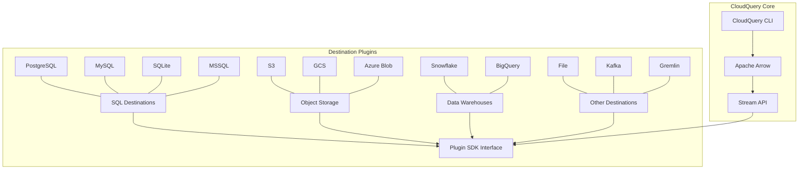
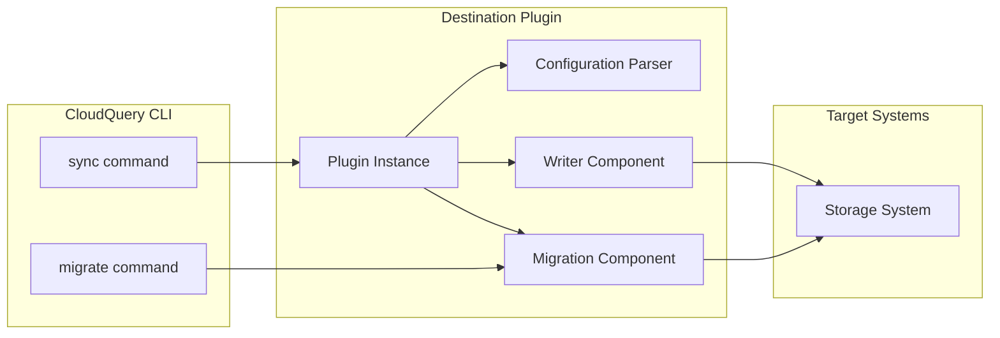
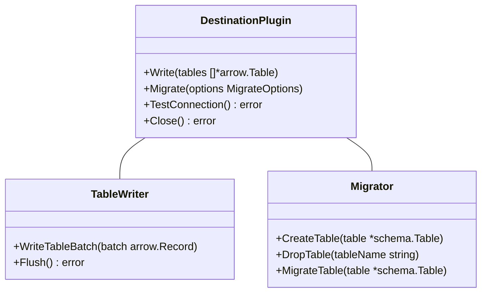
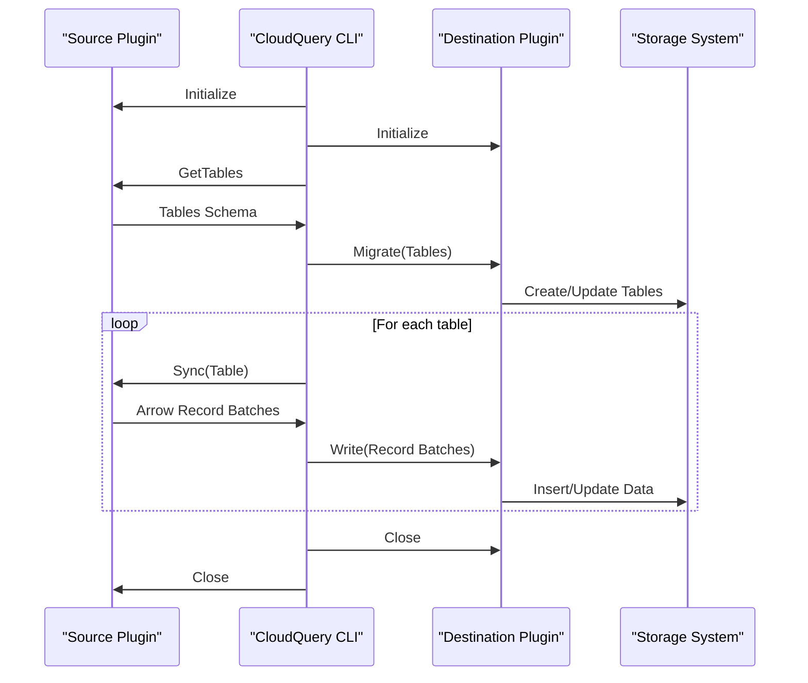
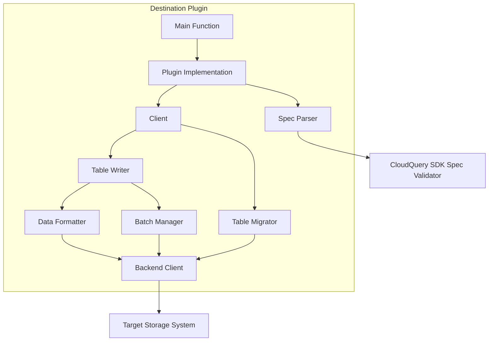

# Destination Plugins

<details>
<summary>Relevant source files</summary>

The following files were used as context for generating this wiki page:

- [plugins/destination/azblob/docs/_configuration.md](https://github.com/cloudquery/cloudquery/blob/5064c039/plugins/destination/azblob/docs/_configuration.md)
- [plugins/destination/azblob/docs/overview.md](https://github.com/cloudquery/cloudquery/blob/5064c039/plugins/destination/azblob/docs/overview.md)
- [plugins/destination/azblob/go.mod](https://github.com/cloudquery/cloudquery/blob/5064c039/plugins/destination/azblob/go.mod)
- [plugins/destination/azblob/go.sum](https://github.com/cloudquery/cloudquery/blob/5064c039/plugins/destination/azblob/go.sum)
- [plugins/destination/bigquery/go.mod](https://github.com/cloudquery/cloudquery/blob/5064c039/plugins/destination/bigquery/go.mod)
- [plugins/destination/bigquery/go.sum](https://github.com/cloudquery/cloudquery/blob/5064c039/plugins/destination/bigquery/go.sum)
- [plugins/destination/duckdb/go.mod](https://github.com/cloudquery/cloudquery/blob/5064c039/plugins/destination/duckdb/go.mod)
- [plugins/destination/duckdb/go.sum](https://github.com/cloudquery/cloudquery/blob/5064c039/plugins/destination/duckdb/go.sum)
- [plugins/destination/file/docs/_configuration.md](https://github.com/cloudquery/cloudquery/blob/5064c039/plugins/destination/file/docs/_configuration.md)
- [plugins/destination/file/docs/overview.md](https://github.com/cloudquery/cloudquery/blob/5064c039/plugins/destination/file/docs/overview.md)
- [plugins/destination/file/go.mod](https://github.com/cloudquery/cloudquery/blob/5064c039/plugins/destination/file/go.mod)
- [plugins/destination/file/go.sum](https://github.com/cloudquery/cloudquery/blob/5064c039/plugins/destination/file/go.sum)
- [plugins/destination/firehose/go.mod](https://github.com/cloudquery/cloudquery/blob/5064c039/plugins/destination/firehose/go.mod)
- [plugins/destination/firehose/go.sum](https://github.com/cloudquery/cloudquery/blob/5064c039/plugins/destination/firehose/go.sum)
- [plugins/destination/gcs/docs/_configuration.md](https://github.com/cloudquery/cloudquery/blob/5064c039/plugins/destination/gcs/docs/_configuration.md)
- [plugins/destination/gcs/docs/overview.md](https://github.com/cloudquery/cloudquery/blob/5064c039/plugins/destination/gcs/docs/overview.md)
- [plugins/destination/gcs/go.mod](https://github.com/cloudquery/cloudquery/blob/5064c039/plugins/destination/gcs/go.mod)
- [plugins/destination/gcs/go.sum](https://github.com/cloudquery/cloudquery/blob/5064c039/plugins/destination/gcs/go.sum)
- [plugins/destination/gremlin/go.mod](https://github.com/cloudquery/cloudquery/blob/5064c039/plugins/destination/gremlin/go.mod)
- [plugins/destination/gremlin/go.sum](https://github.com/cloudquery/cloudquery/blob/5064c039/plugins/destination/gremlin/go.sum)
- [plugins/destination/kafka/client/spec/schema.json](https://github.com/cloudquery/cloudquery/blob/5064c039/plugins/destination/kafka/client/spec/schema.json)
- [plugins/destination/kafka/client/spec/schema_test.go](https://github.com/cloudquery/cloudquery/blob/5064c039/plugins/destination/kafka/client/spec/schema_test.go)
- [plugins/destination/kafka/client/spec/spec.go](https://github.com/cloudquery/cloudquery/blob/5064c039/plugins/destination/kafka/client/spec/spec.go)
- [plugins/destination/kafka/docs/_configuration.md](https://github.com/cloudquery/cloudquery/blob/5064c039/plugins/destination/kafka/docs/_configuration.md)
- [plugins/destination/kafka/docs/overview.md](https://github.com/cloudquery/cloudquery/blob/5064c039/plugins/destination/kafka/docs/overview.md)
- [plugins/destination/kafka/go.mod](https://github.com/cloudquery/cloudquery/blob/5064c039/plugins/destination/kafka/go.mod)
- [plugins/destination/kafka/go.sum](https://github.com/cloudquery/cloudquery/blob/5064c039/plugins/destination/kafka/go.sum)
- [plugins/destination/meilisearch/go.mod](https://github.com/cloudquery/cloudquery/blob/5064c039/plugins/destination/meilisearch/go.mod)
- [plugins/destination/meilisearch/go.sum](https://github.com/cloudquery/cloudquery/blob/5064c039/plugins/destination/meilisearch/go.sum)
- [plugins/destination/mongodb/go.mod](https://github.com/cloudquery/cloudquery/blob/5064c039/plugins/destination/mongodb/go.mod)
- [plugins/destination/mongodb/go.sum](https://github.com/cloudquery/cloudquery/blob/5064c039/plugins/destination/mongodb/go.sum)
- [plugins/destination/mssql/go.mod](https://github.com/cloudquery/cloudquery/blob/5064c039/plugins/destination/mssql/go.mod)
- [plugins/destination/mssql/go.sum](https://github.com/cloudquery/cloudquery/blob/5064c039/plugins/destination/mssql/go.sum)
- [plugins/destination/neo4j/go.mod](https://github.com/cloudquery/cloudquery/blob/5064c039/plugins/destination/neo4j/go.mod)
- [plugins/destination/neo4j/go.sum](https://github.com/cloudquery/cloudquery/blob/5064c039/plugins/destination/neo4j/go.sum)
- [plugins/destination/postgresql/client/client.go](https://github.com/cloudquery/cloudquery/blob/5064c039/plugins/destination/postgresql/client/client.go)
- [plugins/destination/postgresql/client/client_test.go](https://github.com/cloudquery/cloudquery/blob/5064c039/plugins/destination/postgresql/client/client_test.go)
- [plugins/destination/postgresql/client/connection_tester.go](https://github.com/cloudquery/cloudquery/blob/5064c039/plugins/destination/postgresql/client/connection_tester.go)
- [plugins/destination/postgresql/client/connection_tester_test.go](https://github.com/cloudquery/cloudquery/blob/5064c039/plugins/destination/postgresql/client/connection_tester_test.go)
- [plugins/destination/postgresql/client/delete.go](https://github.com/cloudquery/cloudquery/blob/5064c039/plugins/destination/postgresql/client/delete.go)
- [plugins/destination/postgresql/client/delete_test.go](https://github.com/cloudquery/cloudquery/blob/5064c039/plugins/destination/postgresql/client/delete_test.go)
- [plugins/destination/postgresql/client/insert.go](https://github.com/cloudquery/cloudquery/blob/5064c039/plugins/destination/postgresql/client/insert.go)
- [plugins/destination/postgresql/client/list_tables.go](https://github.com/cloudquery/cloudquery/blob/5064c039/plugins/destination/postgresql/client/list_tables.go)
- [plugins/destination/postgresql/client/messages.go](https://github.com/cloudquery/cloudquery/blob/5064c039/plugins/destination/postgresql/client/messages.go)
- [plugins/destination/postgresql/client/migrate.go](https://github.com/cloudquery/cloudquery/blob/5064c039/plugins/destination/postgresql/client/migrate.go)
- [plugins/destination/postgresql/client/read.go](https://github.com/cloudquery/cloudquery/blob/5064c039/plugins/destination/postgresql/client/read.go)
- [plugins/destination/postgresql/client/transformer.go](https://github.com/cloudquery/cloudquery/blob/5064c039/plugins/destination/postgresql/client/transformer.go)
- [plugins/destination/postgresql/client/types.go](https://github.com/cloudquery/cloudquery/blob/5064c039/plugins/destination/postgresql/client/types.go)
- [plugins/destination/postgresql/go.mod](https://github.com/cloudquery/cloudquery/blob/5064c039/plugins/destination/postgresql/go.mod)
- [plugins/destination/postgresql/go.sum](https://github.com/cloudquery/cloudquery/blob/5064c039/plugins/destination/postgresql/go.sum)
- [plugins/destination/postgresql/main.go](https://github.com/cloudquery/cloudquery/blob/5064c039/plugins/destination/postgresql/main.go)
- [plugins/destination/postgresql/pgarrow/to_arrow.go](https://github.com/cloudquery/cloudquery/blob/5064c039/plugins/destination/postgresql/pgarrow/to_arrow.go)
- [plugins/destination/postgresql/pgarrow/to_arrow_test.go](https://github.com/cloudquery/cloudquery/blob/5064c039/plugins/destination/postgresql/pgarrow/to_arrow_test.go)
- [plugins/destination/postgresql/pgarrow/to_pg.go](https://github.com/cloudquery/cloudquery/blob/5064c039/plugins/destination/postgresql/pgarrow/to_pg.go)
- [plugins/destination/postgresql/pgarrow/to_pg_test.go](https://github.com/cloudquery/cloudquery/blob/5064c039/plugins/destination/postgresql/pgarrow/to_pg_test.go)
- [plugins/destination/s3/Makefile](https://github.com/cloudquery/cloudquery/blob/5064c039/plugins/destination/s3/Makefile)
- [plugins/destination/s3/client/client.go](https://github.com/cloudquery/cloudquery/blob/5064c039/plugins/destination/s3/client/client.go)
- [plugins/destination/s3/client/client_test.go](https://github.com/cloudquery/cloudquery/blob/5064c039/plugins/destination/s3/client/client_test.go)
- [plugins/destination/s3/client/read.go](https://github.com/cloudquery/cloudquery/blob/5064c039/plugins/destination/s3/client/read.go)
- [plugins/destination/s3/client/spec/gen/main.go](https://github.com/cloudquery/cloudquery/blob/5064c039/plugins/destination/s3/client/spec/gen/main.go)
- [plugins/destination/s3/client/spec/schema.go](https://github.com/cloudquery/cloudquery/blob/5064c039/plugins/destination/s3/client/spec/schema.go)
- [plugins/destination/s3/client/spec/schema.json](https://github.com/cloudquery/cloudquery/blob/5064c039/plugins/destination/s3/client/spec/schema.json)
- [plugins/destination/s3/client/spec/schema_test.go](https://github.com/cloudquery/cloudquery/blob/5064c039/plugins/destination/s3/client/spec/schema_test.go)
- [plugins/destination/s3/client/spec/spec.go](https://github.com/cloudquery/cloudquery/blob/5064c039/plugins/destination/s3/client/spec/spec.go)
- [plugins/destination/s3/client/spec/spec_test.go](https://github.com/cloudquery/cloudquery/blob/5064c039/plugins/destination/s3/client/spec/spec_test.go)
- [plugins/destination/s3/client/write.go](https://github.com/cloudquery/cloudquery/blob/5064c039/plugins/destination/s3/client/write.go)
- [plugins/destination/s3/client/write_test.go](https://github.com/cloudquery/cloudquery/blob/5064c039/plugins/destination/s3/client/write_test.go)
- [plugins/destination/s3/docs/_configuration.md](https://github.com/cloudquery/cloudquery/blob/5064c039/plugins/destination/s3/docs/_configuration.md)
- [plugins/destination/s3/docs/overview.md](https://github.com/cloudquery/cloudquery/blob/5064c039/plugins/destination/s3/docs/overview.md)
- [plugins/destination/s3/go.mod](https://github.com/cloudquery/cloudquery/blob/5064c039/plugins/destination/s3/go.mod)
- [plugins/destination/s3/go.sum](https://github.com/cloudquery/cloudquery/blob/5064c039/plugins/destination/s3/go.sum)
- [plugins/destination/s3/main.go](https://github.com/cloudquery/cloudquery/blob/5064c039/plugins/destination/s3/main.go)
- [plugins/destination/snowflake/go.mod](https://github.com/cloudquery/cloudquery/blob/5064c039/plugins/destination/snowflake/go.mod)
- [plugins/destination/snowflake/go.sum](https://github.com/cloudquery/cloudquery/blob/5064c039/plugins/destination/snowflake/go.sum)
- [plugins/destination/sqlite/go.mod](https://github.com/cloudquery/cloudquery/blob/5064c039/plugins/destination/sqlite/go.mod)
- [plugins/destination/sqlite/go.sum](https://github.com/cloudquery/cloudquery/blob/5064c039/plugins/destination/sqlite/go.sum)
- [plugins/destination/test/go.mod](https://github.com/cloudquery/cloudquery/blob/5064c039/plugins/destination/test/go.mod)
- [plugins/destination/test/go.sum](https://github.com/cloudquery/cloudquery/blob/5064c039/plugins/destination/test/go.sum)
- [plugins/source/hackernews/go.mod](https://github.com/cloudquery/cloudquery/blob/5064c039/plugins/source/hackernews/go.mod)
- [plugins/source/hackernews/go.sum](https://github.com/cloudquery/cloudquery/blob/5064c039/plugins/source/hackernews/go.sum)

</details>


## Purpose and Scope

Destination plugins in CloudQuery are responsible for loading data extracted by source plugins into various storage and analytics systems. This document details how destination plugins work within the CloudQuery architecture, their common interfaces, available destination options, and configuration patterns. For information about source plugins, see [Source Plugins](#3.1).

## Architecture Overview

Destination plugins are modular components in CloudQuery's plugin architecture that implement a standardized interface for consuming data from the CloudQuery core. They utilize Apache Arrow for high-performance data transfer and support various data formats and storage systems.



Sources: [plugins/destination/s3/go.mod:1-111](https://github.com/cloudquery/cloudquery/blob/5064c039/plugins/destination/s3/go.mod#L1-L111), [plugins/destination/firehose/go.mod:1-97](https://github.com/cloudquery/cloudquery/blob/5064c039/plugins/destination/firehose/go.mod#L1-L97), [plugins/destination/gcs/go.mod:1-133](https://github.com/cloudquery/cloudquery/blob/5064c039/plugins/destination/gcs/go.mod#L1-L133)

## Plugin Architecture

Destination plugins follow a common architecture pattern that enables them to receive data from the CloudQuery CLI and write it to various backends. All destination plugins implement a standardized interface defined by the CloudQuery Plugin SDK.



Sources: [plugins/destination/s3/go.mod:5-21](https://github.com/cloudquery/cloudquery/blob/5064c039/plugins/destination/s3/go.mod#L5-L21), [plugins/destination/firehose/go.mod:5-16](https://github.com/cloudquery/cloudquery/blob/5064c039/plugins/destination/firehose/go.mod#L5-L16), [plugins/destination/gcs/go.mod:5-18](https://github.com/cloudquery/cloudquery/blob/5064c039/plugins/destination/gcs/go.mod#L5-L18)

## Common Interfaces

All destination plugins implement a common set of interfaces for interacting with the CloudQuery CLI. These interfaces enable operations such as writing data, managing schemas, handling migrations, and testing connections.



Sources: [plugins/destination/s3/go.mod:12-14](https://github.com/cloudquery/cloudquery/blob/5064c039/plugins/destination/s3/go.mod#L12-L14), [plugins/destination/firehose/go.mod:12](https://github.com/cloudquery/cloudquery/blob/5064c039/plugins/destination/firehose/go.mod#L12), [plugins/destination/gcs/go.mod:9-10](https://github.com/cloudquery/cloudquery/blob/5064c039/plugins/destination/gcs/go.mod#L9-L10)

## Available Destination Plugins

CloudQuery provides a wide range of destination plugins to write data to various systems:

| Category | Plugins |
|----------|---------|
| SQL Databases | PostgreSQL, MySQL, SQLite, MSSQL, DuckDB |
| Object Storage | S3, GCS (Google Cloud Storage), Azure Blob Storage |
| Data Warehouses | Snowflake, BigQuery |
| Message Systems | Kafka, Firehose |
| Files | File (local file system) |
| Graph Databases | Gremlin, Neo4j |
| Search & Analytics | Elasticsearch, Clickhouse, Meilisearch, MongoDB |

Sources: [plugins/destination/s3/go.mod](https://github.com/cloudquery/cloudquery/blob/5064c039/plugins/destination/s3/go.mod), [plugins/destination/firehose/go.mod](https://github.com/cloudquery/cloudquery/blob/5064c039/plugins/destination/firehose/go.mod), [plugins/destination/gcs/go.mod](https://github.com/cloudquery/cloudquery/blob/5064c039/plugins/destination/gcs/go.mod), [plugins/destination/snowflake/go.mod](https://github.com/cloudquery/cloudquery/blob/5064c039/plugins/destination/snowflake/go.mod), [plugins/destination/bigquery/go.mod](https://github.com/cloudquery/cloudquery/blob/5064c039/plugins/destination/bigquery/go.mod), [plugins/destination/gremlin/go.mod](https://github.com/cloudquery/cloudquery/blob/5064c039/plugins/destination/gremlin/go.mod)

## Implementation Details

Destination plugins rely on common libraries and dependencies to handle data conversion, transport, and storage. Key components include:

1. **Apache Arrow**: Used for high-performance data representation and interchange
2. **CloudQuery Plugin SDK**: Provides the core interfaces and utilities for plugin development
3. **CloudQuery Filetypes**: For plugins that need to handle various file formats (Parquet, JSON, CSV, etc.)
4. **Client Libraries**: Each plugin incorporates client libraries specific to its target system

### Common Dependencies

Most destination plugins share these core dependencies:

```
github.com/apache/arrow-go/v18
github.com/cloudquery/plugin-sdk/v4
github.com/cloudquery/codegen
github.com/rs/zerolog (for logging)
```

Sources: [plugins/destination/s3/go.mod:5-21](https://github.com/cloudquery/cloudquery/blob/5064c039/plugins/destination/s3/go.mod#L5-L21), [plugins/destination/firehose/go.mod:5-16](https://github.com/cloudquery/cloudquery/blob/5064c039/plugins/destination/firehose/go.mod#L5-L16), [plugins/destination/gcs/go.mod:5-18](https://github.com/cloudquery/cloudquery/blob/5064c039/plugins/destination/gcs/go.mod#L5-L18)

## Data Flow Process

The following diagram illustrates the flow of data from source plugins through the CloudQuery CLI to destination plugins:



Sources: [plugins/destination/s3/go.mod](https://github.com/cloudquery/cloudquery/blob/5064c039/plugins/destination/s3/go.mod), [plugins/destination/firehose/go.mod](https://github.com/cloudquery/cloudquery/blob/5064c039/plugins/destination/firehose/go.mod), [plugins/destination/gcs/go.mod](https://github.com/cloudquery/cloudquery/blob/5064c039/plugins/destination/gcs/go.mod)

## Configuration

Each destination plugin has its own configuration structure, but follows a common pattern. Configuration is provided via YAML files that specify the destination plugin type, parameters specific to the plugin, tables to include or exclude, and write mode.

Example configuration structure:

```yaml
kind: destination
spec:
  name: "plugin-name"
  path: "cloudquery/plugin-name"
  version: "v1.0.0"
  spec:
    # Plugin-specific configuration parameters
    connection_string: "..."
    # Common parameters
    batch_size: 10000
    batch_size_bytes: 5242880 # 5 MiB
```

Sources: [plugins/destination/s3/go.mod](https://github.com/cloudquery/cloudquery/blob/5064c039/plugins/destination/s3/go.mod), [plugins/destination/firehose/go.mod](https://github.com/cloudquery/cloudquery/blob/5064c039/plugins/destination/firehose/go.mod), [plugins/destination/gcs/go.mod](https://github.com/cloudquery/cloudquery/blob/5064c039/plugins/destination/gcs/go.mod)

## Plugin SDK Integration

Destination plugins are built on top of the CloudQuery Plugin SDK, which provides common functionality for all plugins. The following diagram illustrates how a typical destination plugin is structured:



Sources: [plugins/destination/s3/go.mod:12-14](https://github.com/cloudquery/cloudquery/blob/5064c039/plugins/destination/s3/go.mod#L12-L14), [plugins/destination/bigquery/go.mod:5-14](https://github.com/cloudquery/cloudquery/blob/5064c039/plugins/destination/bigquery/go.mod#L5-L14), [plugins/destination/snowflake/go.mod:5-14](https://github.com/cloudquery/cloudquery/blob/5064c039/plugins/destination/snowflake/go.mod#L5-L14)

## Examples of Specific Plugins

### S3 Destination Plugin

The S3 destination plugin writes data to Amazon S3 in various formats (Parquet, JSON, CSV). It uses AWS SDK for communication with S3 and the CloudQuery filetypes library for format handling.

Key dependencies:
- AWS SDK v2 for S3 operations
- CloudQuery filetypes for format handling
- Plugin SDK for general plugin functionality

Sources: [plugins/destination/s3/go.mod:5-21](https://github.com/cloudquery/cloudquery/blob/5064c039/plugins/destination/s3/go.mod#L5-L21)

### BigQuery Destination Plugin

The BigQuery destination plugin writes data directly to Google BigQuery tables. It uses the Google Cloud BigQuery Go client library for communication with the BigQuery service.

Key dependencies:
- Google Cloud BigQuery client
- Plugin SDK for general plugin functionality

Sources: [plugins/destination/bigquery/go.mod:5-14](https://github.com/cloudquery/cloudquery/blob/5064c039/plugins/destination/bigquery/go.mod#L5-L14)

### Snowflake Destination Plugin

The Snowflake destination plugin writes data to Snowflake data warehouse. It uses the official Snowflake Go driver for communication.

Key dependencies:
- Snowflake Go driver
- Plugin SDK for general plugin functionality

Sources: [plugins/destination/snowflake/go.mod:5-14](https://github.com/cloudquery/cloudquery/blob/5064c039/plugins/destination/snowflake/go.mod#L5-L14)

## Plugin Development

Creating new destination plugins involves implementing the standard interfaces defined by the CloudQuery Plugin SDK. This ensures interoperability with the CloudQuery ecosystem.

Key interfaces to implement include:
- `plugin.Plugin` - The main plugin interface
- `plugin.NewDestination` - Factory function for creating destination instances
- Write and migration methods for handling data and schema changes

Sources: [plugins/destination/s3/go.mod](https://github.com/cloudquery/cloudquery/blob/5064c039/plugins/destination/s3/go.mod), [plugins/destination/firehose/go.mod](https://github.com/cloudquery/cloudquery/blob/5064c039/plugins/destination/firehose/go.mod), [plugins/destination/gcs/go.mod](https://github.com/cloudquery/cloudquery/blob/5064c039/plugins/destination/gcs/go.mod)

## Summary