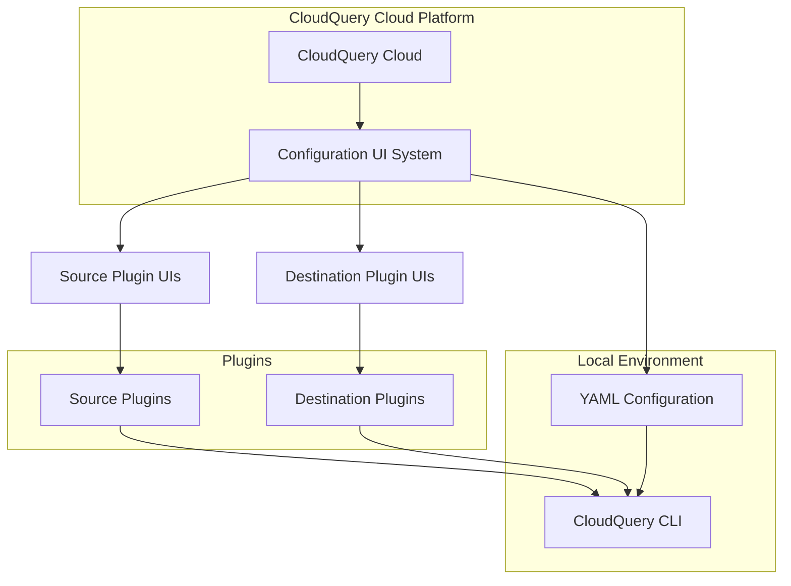
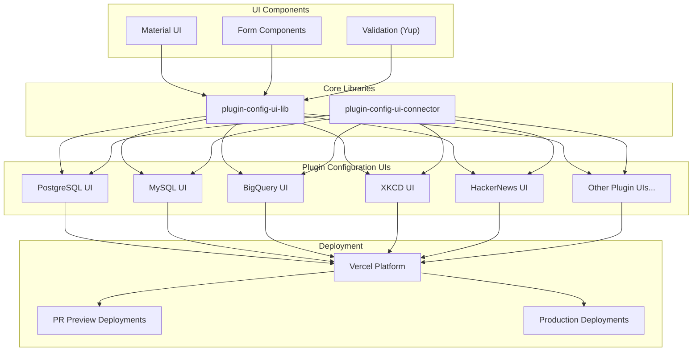
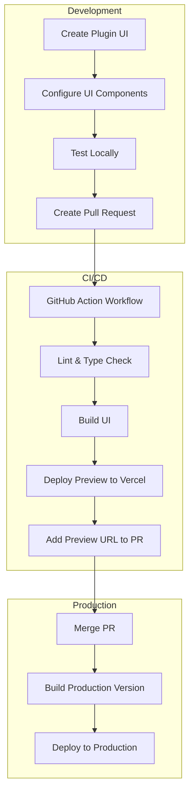
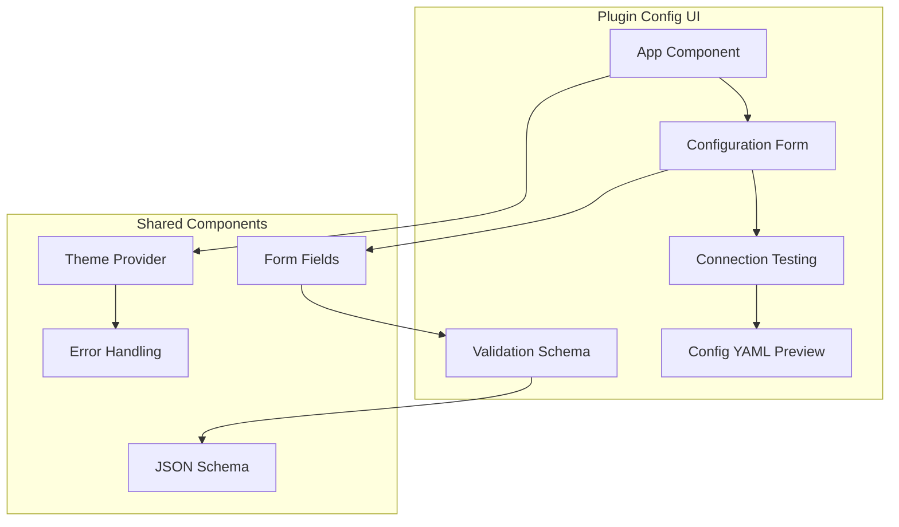

# Configuration UI

<details>
<summary>Relevant source files</summary>

The following files were used as context for generating this wiki page:

- [.github/workflows/dest_azblob.yml](https://github.com/cloudquery/cloudquery/blob/5064c039/.github/workflows/dest_azblob.yml)
- [.github/workflows/dest_bigquery.yml](https://github.com/cloudquery/cloudquery/blob/5064c039/.github/workflows/dest_bigquery.yml)
- [.github/workflows/dest_clickhouse.yml](https://github.com/cloudquery/cloudquery/blob/5064c039/.github/workflows/dest_clickhouse.yml)
- [.github/workflows/dest_duckdb.yml](https://github.com/cloudquery/cloudquery/blob/5064c039/.github/workflows/dest_duckdb.yml)
- [.github/workflows/dest_elasticsearch.yml](https://github.com/cloudquery/cloudquery/blob/5064c039/.github/workflows/dest_elasticsearch.yml)
- [.github/workflows/dest_file.yml](https://github.com/cloudquery/cloudquery/blob/5064c039/.github/workflows/dest_file.yml)
- [.github/workflows/dest_firehose.yml](https://github.com/cloudquery/cloudquery/blob/5064c039/.github/workflows/dest_firehose.yml)
- [.github/workflows/dest_gcs.yml](https://github.com/cloudquery/cloudquery/blob/5064c039/.github/workflows/dest_gcs.yml)
- [.github/workflows/dest_gremlin.yml](https://github.com/cloudquery/cloudquery/blob/5064c039/.github/workflows/dest_gremlin.yml)
- [.github/workflows/dest_kafka.yml](https://github.com/cloudquery/cloudquery/blob/5064c039/.github/workflows/dest_kafka.yml)
- [.github/workflows/dest_meilisearch.yml](https://github.com/cloudquery/cloudquery/blob/5064c039/.github/workflows/dest_meilisearch.yml)
- [.github/workflows/dest_mongodb.yml](https://github.com/cloudquery/cloudquery/blob/5064c039/.github/workflows/dest_mongodb.yml)
- [.github/workflows/dest_mssql.yml](https://github.com/cloudquery/cloudquery/blob/5064c039/.github/workflows/dest_mssql.yml)
- [.github/workflows/dest_mysql.yml](https://github.com/cloudquery/cloudquery/blob/5064c039/.github/workflows/dest_mysql.yml)
- [.github/workflows/dest_postgresql.yml](https://github.com/cloudquery/cloudquery/blob/5064c039/.github/workflows/dest_postgresql.yml)
- [.github/workflows/dest_s3.yml](https://github.com/cloudquery/cloudquery/blob/5064c039/.github/workflows/dest_s3.yml)
- [plugins/destination/bigquery/cloud-config-ui/package-lock.json](https://github.com/cloudquery/cloudquery/blob/5064c039/plugins/destination/bigquery/cloud-config-ui/package-lock.json)
- [plugins/destination/bigquery/cloud-config-ui/package.json](https://github.com/cloudquery/cloudquery/blob/5064c039/plugins/destination/bigquery/cloud-config-ui/package.json)
- [plugins/destination/clickhouse/cloud-config-ui/package-lock.json](https://github.com/cloudquery/cloudquery/blob/5064c039/plugins/destination/clickhouse/cloud-config-ui/package-lock.json)
- [plugins/destination/clickhouse/cloud-config-ui/package.json](https://github.com/cloudquery/cloudquery/blob/5064c039/plugins/destination/clickhouse/cloud-config-ui/package.json)
- [plugins/destination/mysql/cloud-config-ui/package-lock.json](https://github.com/cloudquery/cloudquery/blob/5064c039/plugins/destination/mysql/cloud-config-ui/package-lock.json)
- [plugins/destination/mysql/cloud-config-ui/package.json](https://github.com/cloudquery/cloudquery/blob/5064c039/plugins/destination/mysql/cloud-config-ui/package.json)
- [plugins/destination/postgresql/cloud-config-ui/package-lock.json](https://github.com/cloudquery/cloudquery/blob/5064c039/plugins/destination/postgresql/cloud-config-ui/package-lock.json)
- [plugins/destination/postgresql/cloud-config-ui/package.json](https://github.com/cloudquery/cloudquery/blob/5064c039/plugins/destination/postgresql/cloud-config-ui/package.json)
- [plugins/destination/s3/cloud-config-ui/package-lock.json](https://github.com/cloudquery/cloudquery/blob/5064c039/plugins/destination/s3/cloud-config-ui/package-lock.json)
- [plugins/destination/s3/cloud-config-ui/package.json](https://github.com/cloudquery/cloudquery/blob/5064c039/plugins/destination/s3/cloud-config-ui/package.json)
- [plugins/destination/s3/cloud-config-ui/src/hooks/useConfig.tsx](https://github.com/cloudquery/cloudquery/blob/5064c039/plugins/destination/s3/cloud-config-ui/src/hooks/useConfig.tsx)
- [plugins/destination/s3/cloud-config-ui/src/utils/authSubmitGuard.ts](https://github.com/cloudquery/cloudquery/blob/5064c039/plugins/destination/s3/cloud-config-ui/src/utils/authSubmitGuard.ts)
- [plugins/source/hackernews/cloud-config-ui/package-lock.json](https://github.com/cloudquery/cloudquery/blob/5064c039/plugins/source/hackernews/cloud-config-ui/package-lock.json)
- [plugins/source/hackernews/cloud-config-ui/package.json](https://github.com/cloudquery/cloudquery/blob/5064c039/plugins/source/hackernews/cloud-config-ui/package.json)
- [plugins/source/xkcd/cloud-config-ui/package-lock.json](https://github.com/cloudquery/cloudquery/blob/5064c039/plugins/source/xkcd/cloud-config-ui/package-lock.json)
- [plugins/source/xkcd/cloud-config-ui/package.json](https://github.com/cloudquery/cloudquery/blob/5064c039/plugins/source/xkcd/cloud-config-ui/package.json)

</details>


The Configuration UI system in CloudQuery provides web-based interfaces for configuring source and destination plugins. This document explains the architecture, components, and development workflow for these configuration interfaces. For information about the plugin system itself, see [Plugin System](#3).

## Overview

CloudQuery's Configuration UI system enables users to configure plugins through web interfaces rather than manually editing YAML files. Each source and destination plugin has its own dedicated configuration UI that is built with React and shares common libraries for consistent functionality and appearance.

The Configuration UIs provide:
- User-friendly forms for setting plugin parameters
- Validation of configuration inputs
- Preview functionality to test connections
- Generation of CloudQuery YAML configuration



Sources:
- plugins/destination/postgresql/cloud-config-ui/package.json
- plugins/source/xkcd/cloud-config-ui/package.json
- plugins/source/hackernews/cloud-config-ui/package.json

## Architecture

The Configuration UI system follows a modular architecture where each plugin has its own dedicated configuration UI built on shared libraries. These UIs are deployed as standalone web applications that integrate with the CloudQuery platform.



Sources:
- plugins/destination/postgresql/cloud-config-ui/package.json
- plugins/destination/mysql/cloud-config-ui/package.json
- plugins/destination/bigquery/cloud-config-ui/package-lock.json
- plugins/source/xkcd/cloud-config-ui/package.json
- plugins/source/hackernews/cloud-config-ui/package.json
- .github/workflows/dest_postgresql.yml
- .github/workflows/dest_mysql.yml
- .github/workflows/dest_bigquery.yml

## Shared UI Libraries

The Configuration UI system relies on two main shared libraries:

1. **plugin-config-ui-lib**: Core UI components, hooks, and utilities for building plugin configuration interfaces
2. **plugin-config-ui-connector**: Handles communication between the UI and CloudQuery platform

These libraries ensure consistency across all plugin configuration UIs and reduce duplicate code.

### Dependencies

Each Configuration UI typically uses the following key dependencies:

| Dependency | Purpose |
|------------|---------|
| @cloudquery/plugin-config-ui-lib | Core UI components and utilities |
| @cloudquery/plugin-config-ui-connector | Platform communication |
| @mui/material, @mui/icons-material | UI component framework |
| react, react-dom | Frontend framework |
| typescript | Type safety |
| yup | Form validation |

Sources:
- plugins/destination/postgresql/cloud-config-ui/package.json
- plugins/source/xkcd/cloud-config-ui/package.json
- plugins/source/hackernews/cloud-config-ui/package.json
- plugins/destination/mysql/cloud-config-ui/package.json

## Development and Deployment Workflow

Each plugin's Configuration UI follows a standard development and deployment workflow:



The workflow files show that for each plugin, a CI/CD pipeline is triggered on pull requests to:
1. Lint and test the plugin's code
2. Build the Configuration UI
3. Deploy a preview version to Vercel
4. Add the preview URL as a comment on the PR

Sources:
- .github/workflows/dest_postgresql.yml
- .github/workflows/dest_mysql.yml
- .github/workflows/dest_bigquery.yml
- .github/workflows/dest_clickhouse.yml
- plugins/destination/postgresql/cloud-config-ui/package.json

## Plugin-Specific Configuration UIs

### Structure of a Plugin Configuration UI

Each plugin's Configuration UI follows a similar structure:



Each Configuration UI contains:
- Form components specific to the plugin's configuration options
- Validation schemas using Yup
- Connection testing functionality
- YAML configuration preview

Sources:
- plugins/destination/postgresql/cloud-config-ui/package.json
- plugins/source/xkcd/cloud-config-ui/package.json
- plugins/source/hackernews/cloud-config-ui/package.json
- plugins/destination/mysql/cloud-config-ui/package.json
- plugins/destination/clickhouse/cloud-config-ui/package-lock.json

### Example: Configuration UIs for Different Plugin Types

#### Source Plugins UI Examples

Source plugin Configuration UIs like HackerNews and XKCD provide interfaces for:
- Setting API endpoints 
- Configuring request parameters
- Setting up tables to sync
- Configuring concurrency and rate limiting

#### Destination Plugins UI Examples

Destination plugin Configuration UIs like PostgreSQL, MySQL, and BigQuery provide interfaces for:
- Database connection details
- Authentication settings
- Migration options
- Batch size and performance tuning
- Schema and table configuration

Sources:
- plugins/source/xkcd/cloud-config-ui/package.json
- plugins/source/hackernews/cloud-config-ui/package.json
- plugins/destination/postgresql/cloud-config-ui/package.json
- plugins/destination/mysql/cloud-config-ui/package.json
- plugins/destination/bigquery/cloud-config-ui/package-lock.json

## Testing

The Configuration UI system includes both unit tests and end-to-end tests using Playwright. The package.json files show scripts for:

- Unit testing with React Testing Library
- End-to-end testing with Playwright
- Mock testing using environment variables (REACT_APP_USE_CLOUD_APP_MOCK)

```
npm run test       # Run unit tests
npm run test:e2e   # Run end-to-end tests with Playwright
npm run dev:test:e2e # Run end-to-end tests with mocked backend
```

Sources:
- plugins/destination/postgresql/cloud-config-ui/package.json
- plugins/source/xkcd/cloud-config-ui/package.json
- plugins/destination/mysql/cloud-config-ui/package.json

## Deployment

The Configuration UIs are deployed to Vercel through GitHub Actions workflows. Each plugin has its own workflow that:

1. Builds the plugin's Configuration UI
2. Deploys to Vercel with plugin-specific environment variables
3. Sets up aliases for PR preview deployments
4. Comments on PRs with the preview URL

For production deployments, merged PRs trigger the deployment of the Configuration UI to the production environment.

Sources:
- .github/workflows/dest_postgresql.yml
- .github/workflows/dest_mysql.yml
- .github/workflows/dest_bigquery.yml
- .github/workflows/dest_clickhouse.yml

## Summary