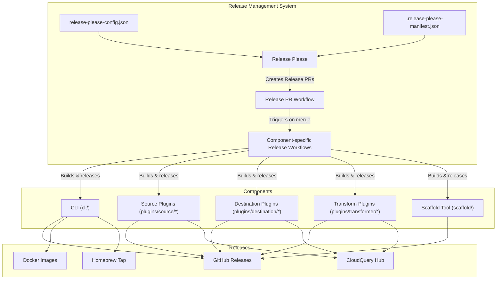
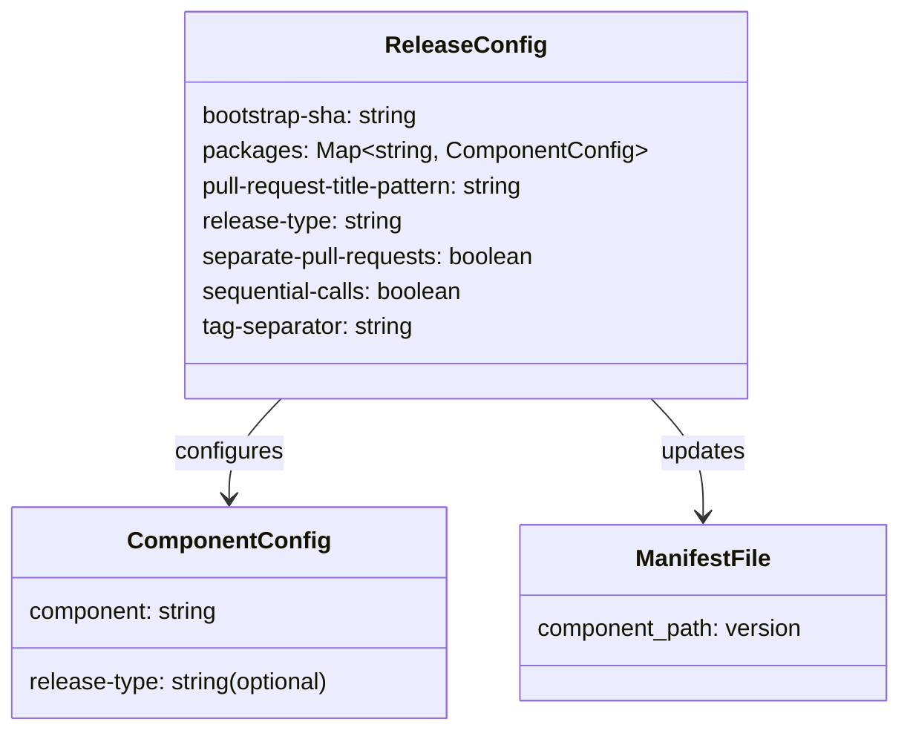
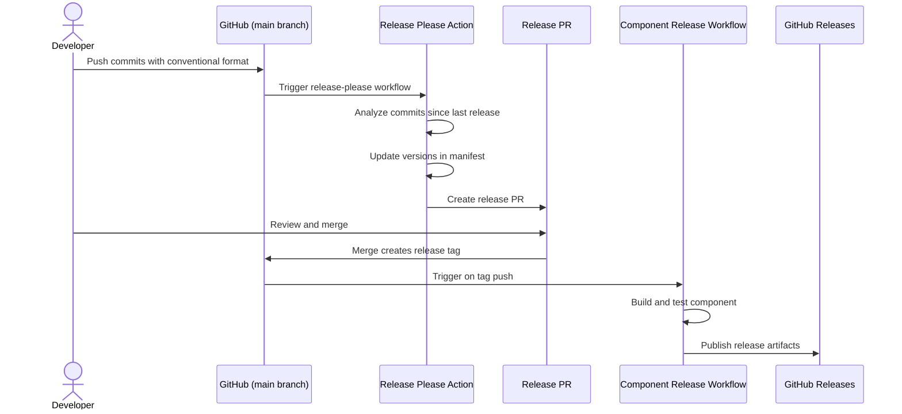
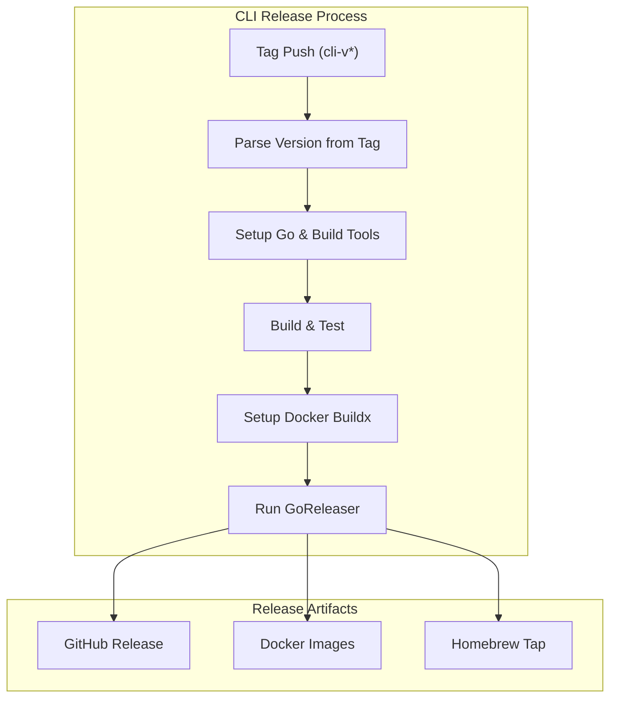
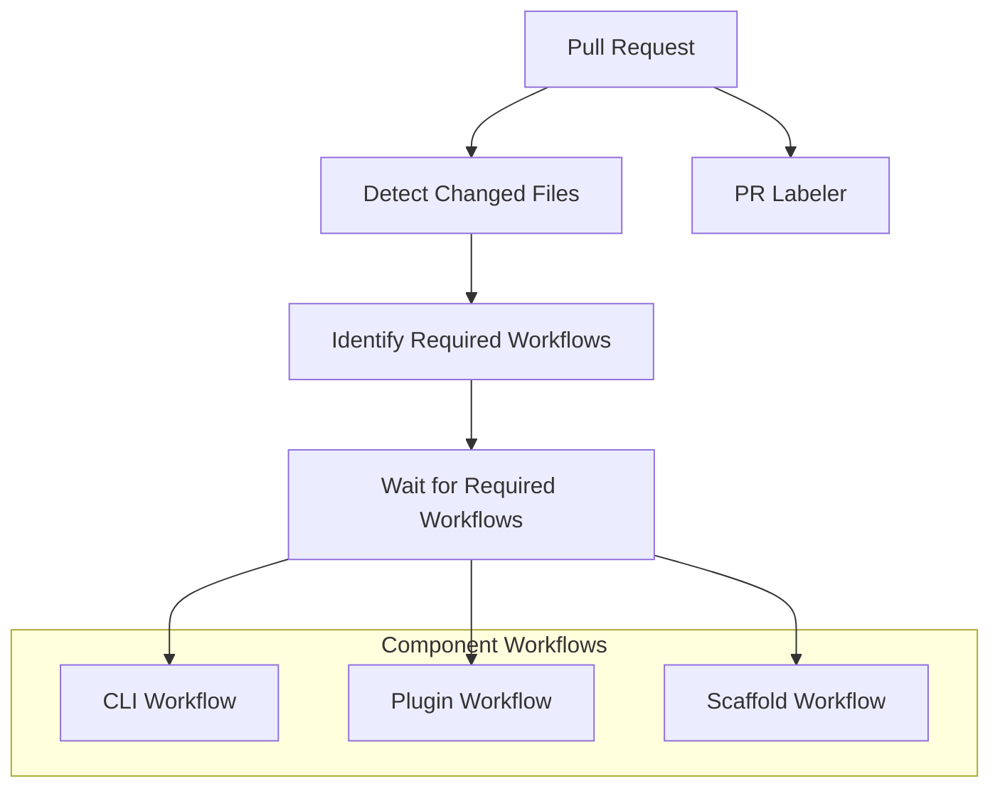
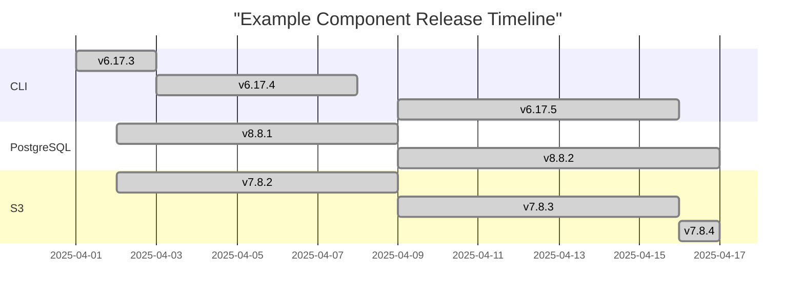

# Release Management

<details>
<summary>Relevant source files</summary>

The following files were used as context for generating this wiki page:

- [.github/pr_labeler.yml](https://github.com/cloudquery/cloudquery/blob/5064c039/.github/pr_labeler.yml)
- [.github/workflows/changed_files.yml](https://github.com/cloudquery/cloudquery/blob/5064c039/.github/workflows/changed_files.yml)
- [.github/workflows/cli.yml](https://github.com/cloudquery/cloudquery/blob/5064c039/.github/workflows/cli.yml)
- [.github/workflows/release_cli.yml](https://github.com/cloudquery/cloudquery/blob/5064c039/.github/workflows/release_cli.yml)
- [.github/workflows/release_pr.yml](https://github.com/cloudquery/cloudquery/blob/5064c039/.github/workflows/release_pr.yml)
- [.github/workflows/release_scaffold.yml](https://github.com/cloudquery/cloudquery/blob/5064c039/.github/workflows/release_scaffold.yml)
- [.github/workflows/scaffold.yml](https://github.com/cloudquery/cloudquery/blob/5064c039/.github/workflows/scaffold.yml)
- [.github/workflows/wait_for_required_workflows.yml](https://github.com/cloudquery/cloudquery/blob/5064c039/.github/workflows/wait_for_required_workflows.yml)
- [.release-please-manifest.json](https://github.com/cloudquery/cloudquery/blob/5064c039/.release-please-manifest.json)
- [cli/CHANGELOG.md](https://github.com/cloudquery/cloudquery/blob/5064c039/cli/CHANGELOG.md)
- [plugins/destination/bigquery/CHANGELOG.md](https://github.com/cloudquery/cloudquery/blob/5064c039/plugins/destination/bigquery/CHANGELOG.md)
- [plugins/destination/duckdb/CHANGELOG.md](https://github.com/cloudquery/cloudquery/blob/5064c039/plugins/destination/duckdb/CHANGELOG.md)
- [plugins/destination/firehose/CHANGELOG.md](https://github.com/cloudquery/cloudquery/blob/5064c039/plugins/destination/firehose/CHANGELOG.md)
- [plugins/destination/gremlin/CHANGELOG.md](https://github.com/cloudquery/cloudquery/blob/5064c039/plugins/destination/gremlin/CHANGELOG.md)
- [plugins/destination/postgresql/CHANGELOG.md](https://github.com/cloudquery/cloudquery/blob/5064c039/plugins/destination/postgresql/CHANGELOG.md)
- [plugins/destination/s3/CHANGELOG.md](https://github.com/cloudquery/cloudquery/blob/5064c039/plugins/destination/s3/CHANGELOG.md)
- [plugins/destination/snowflake/CHANGELOG.md](https://github.com/cloudquery/cloudquery/blob/5064c039/plugins/destination/snowflake/CHANGELOG.md)
- [plugins/destination/sqlite/CHANGELOG.md](https://github.com/cloudquery/cloudquery/blob/5064c039/plugins/destination/sqlite/CHANGELOG.md)
- [release-please-config.json](https://github.com/cloudquery/cloudquery/blob/5064c039/release-please-config.json)
- [scaffold/go.mod](https://github.com/cloudquery/cloudquery/blob/5064c039/scaffold/go.mod)
- [scaffold/go.sum](https://github.com/cloudquery/cloudquery/blob/5064c039/scaffold/go.sum)
- [scaffold/sourcetpl/templates/source/resources/services/table.go.tpl](https://github.com/cloudquery/cloudquery/blob/5064c039/scaffold/sourcetpl/templates/source/resources/services/table.go.tpl)
- [scripts/workflows/wait_for_required_workflows.js](https://github.com/cloudquery/cloudquery/blob/5064c039/scripts/workflows/wait_for_required_workflows.js)

</details>


This document explains how CloudQuery manages releases, versioning, and changelogs across its various components. It covers the automation processes built around GitHub Actions and release tooling that maintain consistent versioning across the CloudQuery ecosystem.

## Overview of CloudQuery Release Architecture

CloudQuery uses a monorepo approach with independent versioning for each component. The project maintains separate versioning for:

- CLI application
- Source plugins (AWS, Azure, GCP, etc.)
- Destination plugins (PostgreSQL, Snowflake, S3, etc.)
- Transformer plugins

Each component follows semantic versioning and has its own independent release cycle.



Sources:
- [release-please-config.json](https://github.com/cloudquery/cloudquery/blob/5064c039/release-please-config.json)
- [.release-please-manifest.json](https://github.com/cloudquery/cloudquery/blob/5064c039/.release-please-manifest.json)
- [.github/workflows/release_pr.yml](https://github.com/cloudquery/cloudquery/blob/5064c039/.github/workflows/release_pr.yml)
- [.github/workflows/release_cli.yml](https://github.com/cloudquery/cloudquery/blob/5064c039/.github/workflows/release_cli.yml)

## Version Tracking System

CloudQuery uses the release-please tool to track versions and generate release pull requests. Two primary files manage this process:

1. `.release-please-manifest.json` - Maintains the current version of each component
2. `release-please-config.json` - Configures how each component is versioned and released

### Release Please Manifest

The `.release-please-manifest.json` file tracks the current version of every component in the CloudQuery ecosystem. When changes are made to a component, this file is updated as part of the release process.

Example of version tracking in the manifest:

```
{
  "cli": "6.17.5",
  "plugins/source/aws": "22.19.2",
  "plugins/source/azure": "10.3.0",
  "plugins/destination/postgresql": "8.8.3",
  "plugins/destination/s3": "7.8.4",
  ...
}
```

### Release Configuration

The `release-please-config.json` file defines how releases are managed, including:

- Which components to track
- Release type for each component (primarily Go, with a few Python components)
- Pull request title pattern
- Release separation settings



Sources:
- [release-please-config.json](https://github.com/cloudquery/cloudquery/blob/5064c039/release-please-config.json)
- [.release-please-manifest.json](https://github.com/cloudquery/cloudquery/blob/5064c039/.release-please-manifest.json)

## Release Process

The release process is fully automated through GitHub Actions workflows. When changes are pushed to the main branch, the following sequence of events occurs:

1. The release-please action identifies components with new changes
2. Release PRs are created for each component with changes
3. When a release PR is merged, component-specific release workflows are triggered
4. Release workflows build, test, and publish the component

### Release PR Workflow

The release PR workflow is triggered on pushes to the main branch. It uses the release-please action to create release PRs based on conventional commits in the repository.



Sources:
- [.github/workflows/release_pr.yml](https://github.com/cloudquery/cloudquery/blob/5064c039/.github/workflows/release_pr.yml)
- [.github/workflows/wait_for_required_workflows.yml](https://github.com/cloudquery/cloudquery/blob/5064c039/.github/workflows/wait_for_required_workflows.yml)

### Component-Specific Release Workflows

Each component has its own release workflow that is triggered when a release tag is pushed. The tag format follows the pattern `{component}-v{version}` (e.g., `cli-v6.17.5`).

#### CLI Release Process

The CLI release workflow builds the CLI for multiple platforms and publishes:
- GitHub release with binary artifacts
- Docker images
- Homebrew formula update



Sources:
- [.github/workflows/release_cli.yml](https://github.com/cloudquery/cloudquery/blob/5064c039/.github/workflows/release_cli.yml)
- [cli/CHANGELOG.md](https://github.com/cloudquery/cloudquery/blob/5064c039/cli/CHANGELOG.md)

#### Plugin Release Process

Plugin release workflows follow a similar pattern to the CLI but are specific to each plugin type. The general flow is:

1. Tag push triggers the workflow
2. Build and test the plugin
3. Publish the plugin to GitHub Releases
4. Publish the plugin to CloudQuery Hub

Sources:
- [.github/workflows/release_scaffold.yml](https://github.com/cloudquery/cloudquery/blob/5064c039/.github/workflows/release_scaffold.yml)
- [plugins/destination/postgresql/CHANGELOG.md](https://github.com/cloudquery/cloudquery/blob/5064c039/plugins/destination/postgresql/CHANGELOG.md)
- [plugins/destination/s3/CHANGELOG.md](https://github.com/cloudquery/cloudquery/blob/5064c039/plugins/destination/s3/CHANGELOG.md)

## Validation and Coordination

To ensure quality and consistency, CloudQuery implements validation workflows:

1. Required workflow checks - ensure all necessary tests pass before allowing a release
2. PR labeling - automatically label PRs by affected component
3. Change detection - detect which components have been modified



Sources:
- [.github/workflows/wait_for_required_workflows.yml](https://github.com/cloudquery/cloudquery/blob/5064c039/.github/workflows/wait_for_required_workflows.yml)
- [scripts/workflows/wait_for_required_workflows.js](https://github.com/cloudquery/cloudquery/blob/5064c039/scripts/workflows/wait_for_required_workflows.js)
- [.github/pr_labeler.yml](https://github.com/cloudquery/cloudquery/blob/5064c039/.github/pr_labeler.yml)

## Changelog Management

CloudQuery maintains a CHANGELOG.md file for each component using the Keep a Changelog format and adhering to Semantic Versioning.

Changelogs are automatically updated as part of the release process:

1. Release Please collects conventional commits since the last release
2. Changes are categorized (features, bug fixes, etc.)
3. A new changelog entry is created with the version and date
4. The entry is included in the release PR

Example changelog format from the CLI:

```
## [6.17.5] (2025-04-09)

### Bug Fixes

* **deps:** Update Google Golang modules (#20538)
* **deps:** Update module github.com/cloudquery/codegen to v0.3.26 (#20537)
* **deps:** Update module github.com/cloudquery/plugin-sdk/v4 to v4.77.0 (#20528)
```

Sources:
- [cli/CHANGELOG.md](https://github.com/cloudquery/cloudquery/blob/5064c039/cli/CHANGELOG.md)
- [plugins/destination/postgresql/CHANGELOG.md](https://github.com/cloudquery/cloudquery/blob/5064c039/plugins/destination/postgresql/CHANGELOG.md)
- [plugins/destination/snowflake/CHANGELOG.md](https://github.com/cloudquery/cloudquery/blob/5064c039/plugins/destination/snowflake/CHANGELOG.md)

## Component Versioning and Release Cadence

Each component in CloudQuery follows semantic versioning (`MAJOR.MINOR.PATCH`) independently:

- **MAJOR**: Incompatible API changes
- **MINOR**: Backward-compatible new functionality
- **PATCH**: Backward-compatible bug fixes

Components are released as changes accumulate, rather than on a fixed schedule. This approach allows for quick bug fixes while maintaining a stable ecosystem.



Sources:
- [cli/CHANGELOG.md](https://github.com/cloudquery/cloudquery/blob/5064c039/cli/CHANGELOG.md)
- [plugins/destination/postgresql/CHANGELOG.md](https://github.com/cloudquery/cloudquery/blob/5064c039/plugins/destination/postgresql/CHANGELOG.md)