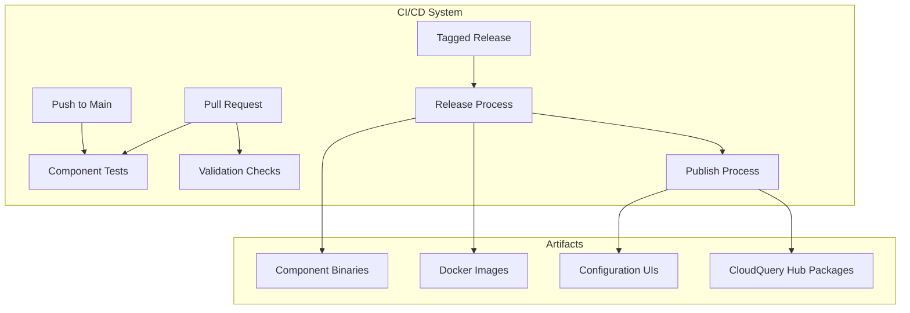
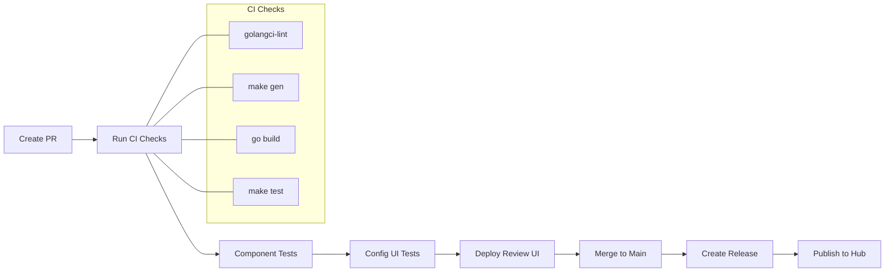
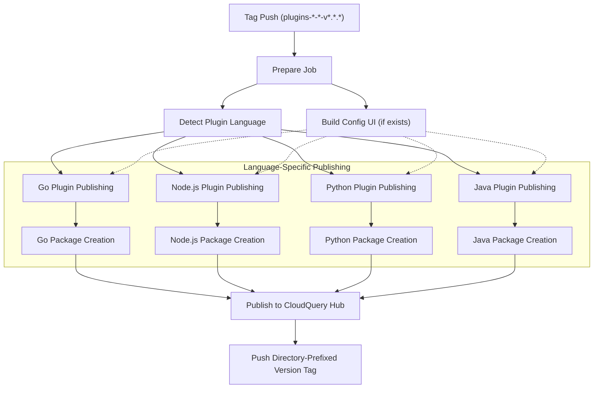
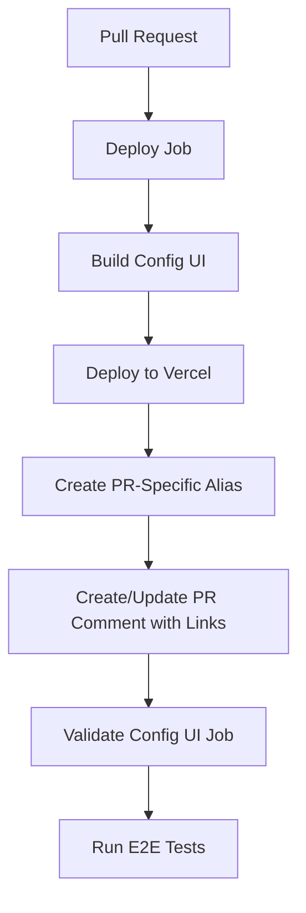
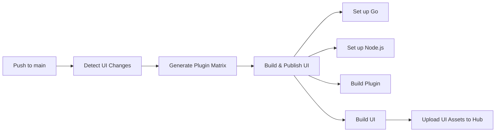
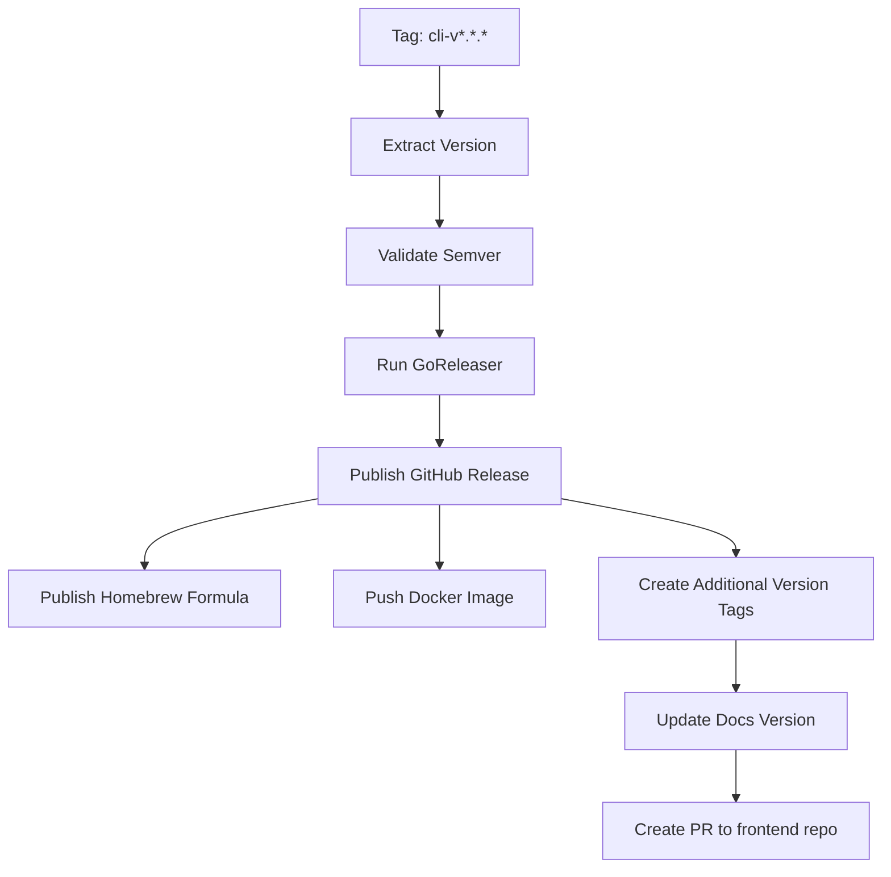
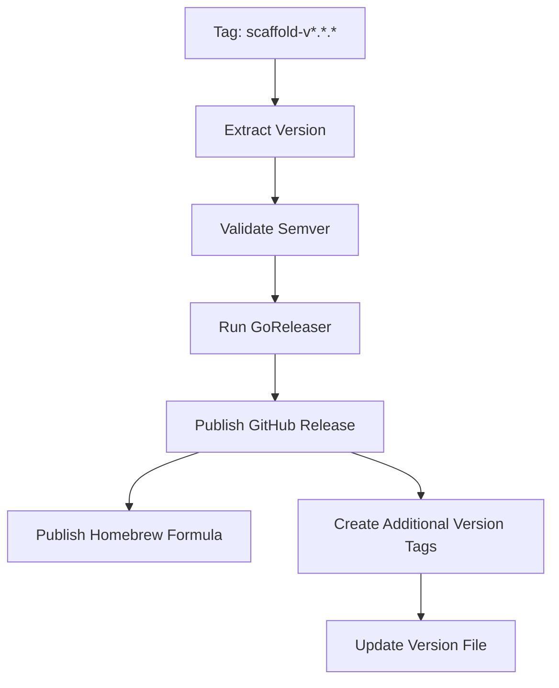
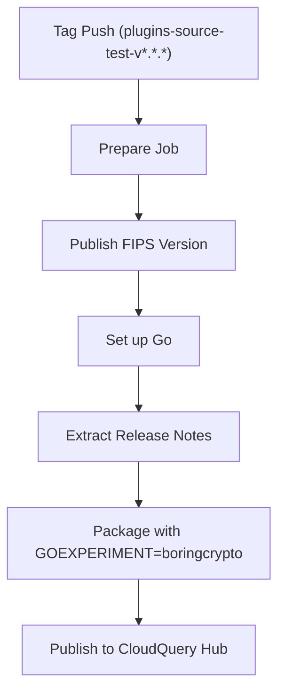
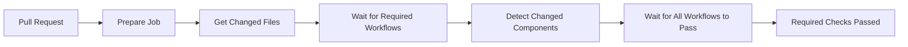
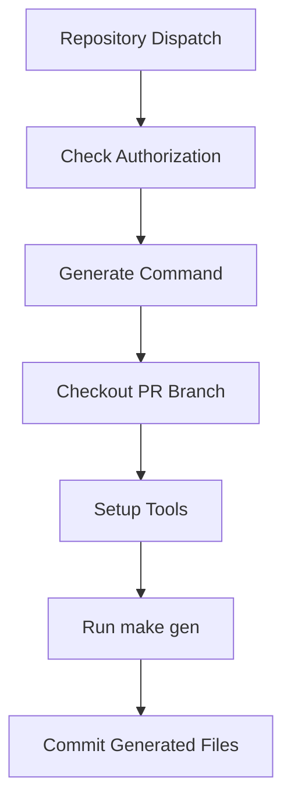

# CI/CD Pipelines

Relevant source files

The following files were used as context for generating this wiki page:

- [.github/workflows/changed_files.yml](https://github.com/cloudquery/cloudquery/blob/5064c039/.github/workflows/changed_files.yml)
- [.github/workflows/cli.yml](https://github.com/cloudquery/cloudquery/blob/5064c039/.github/workflows/cli.yml)
- [.github/workflows/dest_azblob.yml](https://github.com/cloudquery/cloudquery/blob/5064c039/.github/workflows/dest_azblob.yml)
- [.github/workflows/dest_bigquery.yml](https://github.com/cloudquery/cloudquery/blob/5064c039/.github/workflows/dest_bigquery.yml)
- [.github/workflows/dest_clickhouse.yml](https://github.com/cloudquery/cloudquery/blob/5064c039/.github/workflows/dest_clickhouse.yml)
- [.github/workflows/dest_duckdb.yml](https://github.com/cloudquery/cloudquery/blob/5064c039/.github/workflows/dest_duckdb.yml)
- [.github/workflows/dest_elasticsearch.yml](https://github.com/cloudquery/cloudquery/blob/5064c039/.github/workflows/dest_elasticsearch.yml)
- [.github/workflows/dest_file.yml](https://github.com/cloudquery/cloudquery/blob/5064c039/.github/workflows/dest_file.yml)
- [.github/workflows/dest_firehose.yml](https://github.com/cloudquery/cloudquery/blob/5064c039/.github/workflows/dest_firehose.yml)
- [.github/workflows/dest_gcs.yml](https://github.com/cloudquery/cloudquery/blob/5064c039/.github/workflows/dest_gcs.yml)
- [.github/workflows/dest_gremlin.yml](https://github.com/cloudquery/cloudquery/blob/5064c039/.github/workflows/dest_gremlin.yml)
- [.github/workflows/dest_kafka.yml](https://github.com/cloudquery/cloudquery/blob/5064c039/.github/workflows/dest_kafka.yml)
- [.github/workflows/dest_meilisearch.yml](https://github.com/cloudquery/cloudquery/blob/5064c039/.github/workflows/dest_meilisearch.yml)
- [.github/workflows/dest_mongodb.yml](https://github.com/cloudquery/cloudquery/blob/5064c039/.github/workflows/dest_mongodb.yml)
- [.github/workflows/dest_mssql.yml](https://github.com/cloudquery/cloudquery/blob/5064c039/.github/workflows/dest_mssql.yml)
- [.github/workflows/dest_mysql.yml](https://github.com/cloudquery/cloudquery/blob/5064c039/.github/workflows/dest_mysql.yml)
- [.github/workflows/dest_postgresql.yml](https://github.com/cloudquery/cloudquery/blob/5064c039/.github/workflows/dest_postgresql.yml)
- [.github/workflows/dest_s3.yml](https://github.com/cloudquery/cloudquery/blob/5064c039/.github/workflows/dest_s3.yml)
- [.github/workflows/manual_commands_triggers.yml](https://github.com/cloudquery/cloudquery/blob/5064c039/.github/workflows/manual_commands_triggers.yml)
- [.github/workflows/publish_plugin_to_hub.yml](https://github.com/cloudquery/cloudquery/blob/5064c039/.github/workflows/publish_plugin_to_hub.yml)
- [.github/workflows/publish_plugin_to_hub_duckdb.yml](https://github.com/cloudquery/cloudquery/blob/5064c039/.github/workflows/publish_plugin_to_hub_duckdb.yml)
- [.github/workflows/publish_plugin_to_hub_fips.yml](https://github.com/cloudquery/cloudquery/blob/5064c039/.github/workflows/publish_plugin_to_hub_fips.yml)
- [.github/workflows/publish_plugin_to_hub_snowflake.yml](https://github.com/cloudquery/cloudquery/blob/5064c039/.github/workflows/publish_plugin_to_hub_snowflake.yml)
- [.github/workflows/publish_plugin_to_hub_sqlite.yml](https://github.com/cloudquery/cloudquery/blob/5064c039/.github/workflows/publish_plugin_to_hub_sqlite.yml)
- [.github/workflows/publish_ui_dir.yml](https://github.com/cloudquery/cloudquery/blob/5064c039/.github/workflows/publish_ui_dir.yml)
- [.github/workflows/release_cli.yml](https://github.com/cloudquery/cloudquery/blob/5064c039/.github/workflows/release_cli.yml)
- [.github/workflows/release_scaffold.yml](https://github.com/cloudquery/cloudquery/blob/5064c039/.github/workflows/release_scaffold.yml)
- [.github/workflows/scaffold.yml](https://github.com/cloudquery/cloudquery/blob/5064c039/.github/workflows/scaffold.yml)
- [.github/workflows/source_hackernews.yml](https://github.com/cloudquery/cloudquery/blob/5064c039/.github/workflows/source_hackernews.yml)
- [.github/workflows/source_test.yml](https://github.com/cloudquery/cloudquery/blob/5064c039/.github/workflows/source_test.yml)
- [.github/workflows/source_xkcd.yml](https://github.com/cloudquery/cloudquery/blob/5064c039/.github/workflows/source_xkcd.yml)
- [.github/workflows/wait_for_required_workflows.yml](https://github.com/cloudquery/cloudquery/blob/5064c039/.github/workflows/wait_for_required_workflows.yml)
- [go.mod](https://github.com/cloudquery/cloudquery/blob/5064c039/go.mod)
- [go.sum](https://github.com/cloudquery/cloudquery/blob/5064c039/go.sum)
- [scaffold/go.mod](https://github.com/cloudquery/cloudquery/blob/5064c039/scaffold/go.mod)
- [scaffold/go.sum](https://github.com/cloudquery/cloudquery/blob/5064c039/scaffold/go.sum)
- [scaffold/sourcetpl/templates/source/resources/services/table.go.tpl](https://github.com/cloudquery/cloudquery/blob/5064c039/scaffold/sourcetpl/templates/source/resources/services/table.go.tpl)
- [scripts/workflows/wait_for_required_workflows.js](https://github.com/cloudquery/cloudquery/blob/5064c039/scripts/workflows/wait_for_required_workflows.js)

This document describes the continuous integration and deployment workflows used in the CloudQuery repository. It covers how code changes are tested, built, and released as CloudQuery components, including the CLI, plugins, and configuration UIs.

## Overview

CloudQuery utilizes GitHub Actions for all CI/CD workflows, with specialized pipelines for different component types (CLI, source plugins, destination plugins, etc.). These pipelines ensure code quality through automated testing and linting, facilitate versioned releases, and automate the publishing process to CloudQuery Hub.

Sources:
- [.github/workflows/publish_plugin_to_hub.yml](https://github.com/cloudquery/cloudquery/blob/5064c039/.github/workflows/publish_plugin_to_hub.yml)
- [.github/workflows/wait_for_required_workflows.yml](https://github.com/cloudquery/cloudquery/blob/5064c039/.github/workflows/wait_for_required_workflows.yml)
- [.github/workflows/cli.yml](https://github.com/cloudquery/cloudquery/blob/5064c039/.github/workflows/cli.yml)

## Workflow Types

The repository contains several types of workflows that serve different purposes in the development lifecycle:

### 1. Component Workflows

These workflows are triggered by pull requests or pushes to specific paths in the repository, and they run tests and validation for individual components.

| Workflow Type | Example | Purpose |
|---------------|---------|---------|
| Source Plugin | `source_hackernews.yml` | Tests and validates source plugins |
| Destination Plugin | `dest_postgresql.yml` | Tests and validates destination plugins |
| CLI | `cli.yml` | Tests and validates the CLI across multiple platforms |
| Scaffold | `scaffold.yml` | Tests and validates the scaffold tool |

### 2. Release Workflows

These workflows are triggered by tags and handle the release of components, including publishing to GitHub releases and CloudQuery Hub.

| Workflow Type | Example | Purpose |
|---------------|---------|---------|
| CLI Release | `release_cli.yml` | Releases CLI binaries |
| Plugin Publish | `publish_plugin_to_hub.yml` | Publishes plugins to CloudQuery Hub |
| Scaffold Release | `release_scaffold.yml` | Releases the scaffold tool |

### 3. Integration Workflows

These workflows coordinate across multiple components to ensure the entire system works together properly.

| Workflow Type | Example | Purpose |
|---------------|---------|---------|
| Required Workflows Check | `wait_for_required_workflows.yml` | Ensures all required workflows pass for a PR |
| Configuration UI | `publish_ui_dir.yml` | Publishes configuration UIs for plugins |

Sources:
- [.github/workflows/source_hackernews.yml](https://github.com/cloudquery/cloudquery/blob/5064c039/.github/workflows/source_hackernews.yml)
- [.github/workflows/dest_postgresql.yml](https://github.com/cloudquery/cloudquery/blob/5064c039/.github/workflows/dest_postgresql.yml)
- [.github/workflows/cli.yml](https://github.com/cloudquery/cloudquery/blob/5064c039/.github/workflows/cli.yml)
- [.github/workflows/wait_for_required_workflows.yml](https://github.com/cloudquery/cloudquery/blob/5064c039/.github/workflows/wait_for_required_workflows.yml)
- [.github/workflows/publish_plugin_to_hub.yml](https://github.com/cloudquery/cloudquery/blob/5064c039/.github/workflows/publish_plugin_to_hub.yml)
- [.github/workflows/publish_ui_dir.yml](https://github.com/cloudquery/cloudquery/blob/5064c039/.github/workflows/publish_ui_dir.yml)

## Plugin Development Workflow

When working on CloudQuery plugins, the CI/CD pipeline follows these stages:

Sources:
- [.github/workflows/source_hackernews.yml](https://github.com/cloudquery/cloudquery/blob/5064c039/.github/workflows/source_hackernews.yml)
- [.github/workflows/source_test.yml](https://github.com/cloudquery/cloudquery/blob/5064c039/.github/workflows/source_test.yml)
- [.github/workflows/source_xkcd.yml](https://github.com/cloudquery/cloudquery/blob/5064c039/.github/workflows/source_xkcd.yml)

## Plugin Publishing Process

CloudQuery plugins are published to the CloudQuery Hub through a standardized process. The workflow is triggered when a tag matching a specific pattern (e.g., `plugins-source-hackernews-v1.0.0`) is pushed to the repository.

The workflow handles several key steps:

1. **Preparation**: Extracts the plugin type, name, and version from the tag
2. **Language Detection**: Determines which language the plugin is built with
3. **Config UI Building**: If the plugin has a configuration UI, it's built and included
4. **Package Creation**: Creates the plugin package with appropriate metadata
5. **Publishing**: Uploads the plugin to CloudQuery Hub
6. **Tagging**: Creates additional tags for easier versioning reference

Sources:
- [.github/workflows/publish_plugin_to_hub.yml:1-100](https://github.com/cloudquery/cloudquery/blob/5064c039/.github/workflows/publish_plugin_to_hub.yml#L1-L100)
- [.github/workflows/publish_plugin_to_hub.yml:160-180](https://github.com/cloudquery/cloudquery/blob/5064c039/.github/workflows/publish_plugin_to_hub.yml#L160-L180)
- [.github/workflows/publish_plugin_to_hub.yml:430-524](https://github.com/cloudquery/cloudquery/blob/5064c039/.github/workflows/publish_plugin_to_hub.yml#L430-L524)

## Configuration UI Deployment

Many CloudQuery plugins include web-based configuration UIs to simplify setup. These UIs are built and deployed using a specialized workflow:

### Development Deployment

During pull request development, a preview instance of the configuration UI is deployed to Vercel for testing:

### Production Deployment

When changes to configuration UIs are merged to main, the UIs are published to CloudQuery Hub:

Sources:
- [.github/workflows/source_hackernews.yml:59-141](https://github.com/cloudquery/cloudquery/blob/5064c039/.github/workflows/source_hackernews.yml#L59-L141)
- [.github/workflows/source_xkcd.yml:107-176](https://github.com/cloudquery/cloudquery/blob/5064c039/.github/workflows/source_xkcd.yml#L107-L176)
- [.github/workflows/publish_ui_dir.yml](https://github.com/cloudquery/cloudquery/blob/5064c039/.github/workflows/publish_ui_dir.yml)

## Release Management

CloudQuery uses a systematic approach to releasing components with semantic versioning:

### CLI Release

### Scaffold Release

Both the CLI and scaffold tool are released using GoReleaser, which handles:
- Building binaries for multiple platforms
- Creating GitHub releases
- Publishing to Homebrew
- Creating Docker images (for CLI)
- Updating documentation versions

Sources:
- [.github/workflows/release_cli.yml](https://github.com/cloudquery/cloudquery/blob/5064c039/.github/workflows/release_cli.yml)
- [.github/workflows/release_scaffold.yml](https://github.com/cloudquery/cloudquery/blob/5064c039/.github/workflows/release_scaffold.yml)

## FIPS Compliance

The repository includes specialized workflows for building and releasing FIPS-compliant versions of plugins, particularly the test source plugin:

The FIPS-compliant builds use Go's `boringcrypto` experiment to ensure cryptographic operations use FIPS-approved algorithms.

Sources:
- [.github/workflows/publish_plugin_to_hub_fips.yml](https://github.com/cloudquery/cloudquery/blob/5064c039/.github/workflows/publish_plugin_to_hub_fips.yml)
- [.github/workflows/source_test.yml:58-102](https://github.com/cloudquery/cloudquery/blob/5064c039/.github/workflows/source_test.yml#L58-L102)

## Special-Case Plugins

Some plugins require specialized publishing workflows due to their unique requirements:

### DuckDB, SQLite, and Snowflake

These destination plugins have dedicated publishing workflows that handle their specific build requirements. The workflows follow a similar pattern to the standard plugin publishing, but with customizations for each plugin type.

Sources:
- [.github/workflows/publish_plugin_to_hub_duckdb.yml](https://github.com/cloudquery/cloudquery/blob/5064c039/.github/workflows/publish_plugin_to_hub_duckdb.yml)
- [.github/workflows/publish_plugin_to_hub_sqlite.yml](https://github.com/cloudquery/cloudquery/blob/5064c039/.github/workflows/publish_plugin_to_hub_sqlite.yml)
- [.github/workflows/publish_plugin_to_hub_snowflake.yml](https://github.com/cloudquery/cloudquery/blob/5064c039/.github/workflows/publish_plugin_to_hub_snowflake.yml)

## Required Workflows Check

To ensure all necessary checks pass before a PR can be merged, CloudQuery implements a workflow that checks the status of all required component workflows:

This workflow:
1. Determines which components were modified in the PR
2. Identifies which workflows must pass based on those components
3. Waits for those workflows to complete successfully
4. Fails if any required workflow fails

Sources:
- [.github/workflows/wait_for_required_workflows.yml](https://github.com/cloudquery/cloudquery/blob/5064c039/.github/workflows/wait_for_required_workflows.yml)
- [scripts/workflows/wait_for_required_workflows.js](https://github.com/cloudquery/cloudquery/blob/5064c039/scripts/workflows/wait_for_required_workflows.js)

## Manual Commands Trigger

CloudQuery includes a workflow that allows maintainers to trigger certain operations (like code generation) through PR comments:

This allows for easier maintenance of generated code, as maintainers can trigger regeneration without having to clone the repository locally.

Sources: