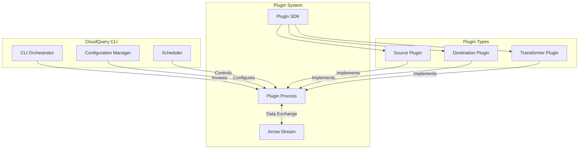
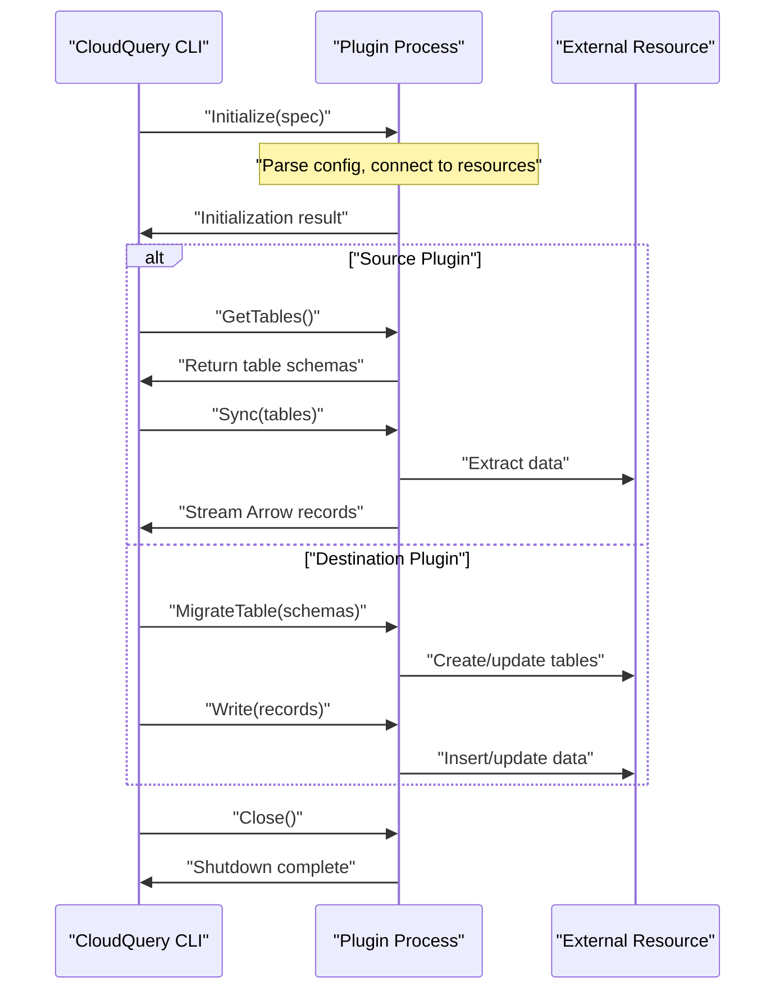
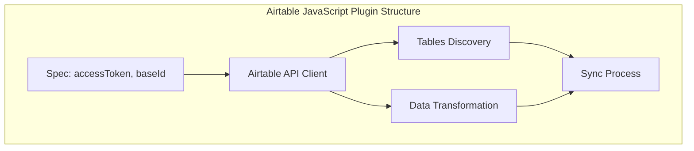
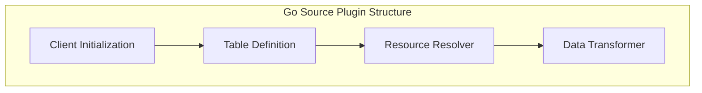
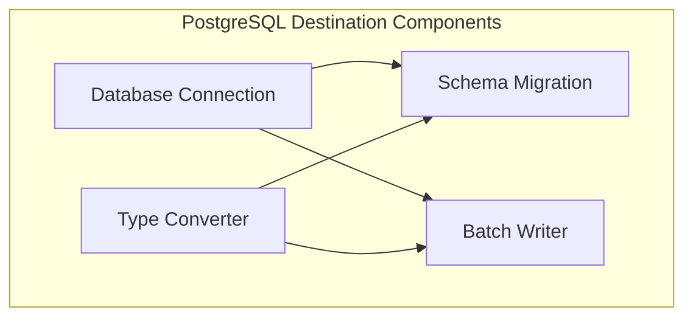
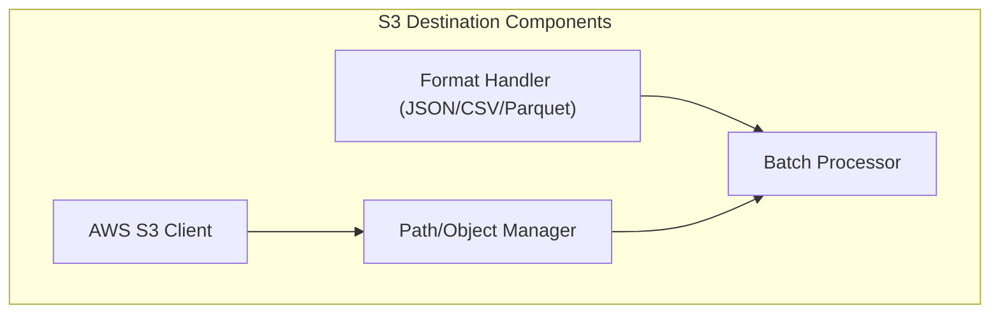
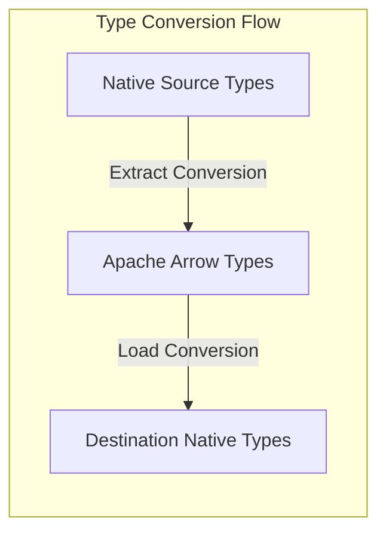
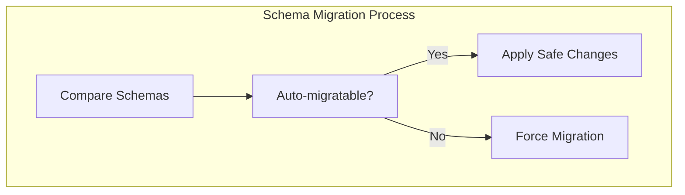

# Plugin Development

<details>
<summary>Relevant source files</summary>

The following files were used as context for generating this wiki page:

- [.github/workflows/auto_sort_files.yml](https://github.com/cloudquery/cloudquery/blob/5064c039/.github/workflows/auto_sort_files.yml)
- [.github/workflows/source_airtable.yml](https://github.com/cloudquery/cloudquery/blob/5064c039/.github/workflows/source_airtable.yml)
- [plugins/destination/azblob/docs/_configuration.md](https://github.com/cloudquery/cloudquery/blob/5064c039/plugins/destination/azblob/docs/_configuration.md)
- [plugins/destination/azblob/docs/overview.md](https://github.com/cloudquery/cloudquery/blob/5064c039/plugins/destination/azblob/docs/overview.md)
- [plugins/destination/file/docs/_configuration.md](https://github.com/cloudquery/cloudquery/blob/5064c039/plugins/destination/file/docs/_configuration.md)
- [plugins/destination/file/docs/overview.md](https://github.com/cloudquery/cloudquery/blob/5064c039/plugins/destination/file/docs/overview.md)
- [plugins/destination/gcs/docs/_configuration.md](https://github.com/cloudquery/cloudquery/blob/5064c039/plugins/destination/gcs/docs/_configuration.md)
- [plugins/destination/gcs/docs/overview.md](https://github.com/cloudquery/cloudquery/blob/5064c039/plugins/destination/gcs/docs/overview.md)
- [plugins/destination/kafka/client/spec/schema.json](https://github.com/cloudquery/cloudquery/blob/5064c039/plugins/destination/kafka/client/spec/schema.json)
- [plugins/destination/kafka/client/spec/schema_test.go](https://github.com/cloudquery/cloudquery/blob/5064c039/plugins/destination/kafka/client/spec/schema_test.go)
- [plugins/destination/kafka/client/spec/spec.go](https://github.com/cloudquery/cloudquery/blob/5064c039/plugins/destination/kafka/client/spec/spec.go)
- [plugins/destination/kafka/docs/_configuration.md](https://github.com/cloudquery/cloudquery/blob/5064c039/plugins/destination/kafka/docs/_configuration.md)
- [plugins/destination/kafka/docs/overview.md](https://github.com/cloudquery/cloudquery/blob/5064c039/plugins/destination/kafka/docs/overview.md)
- [plugins/destination/postgresql/client/client.go](https://github.com/cloudquery/cloudquery/blob/5064c039/plugins/destination/postgresql/client/client.go)
- [plugins/destination/postgresql/client/client_test.go](https://github.com/cloudquery/cloudquery/blob/5064c039/plugins/destination/postgresql/client/client_test.go)
- [plugins/destination/postgresql/client/connection_tester.go](https://github.com/cloudquery/cloudquery/blob/5064c039/plugins/destination/postgresql/client/connection_tester.go)
- [plugins/destination/postgresql/client/connection_tester_test.go](https://github.com/cloudquery/cloudquery/blob/5064c039/plugins/destination/postgresql/client/connection_tester_test.go)
- [plugins/destination/postgresql/client/delete.go](https://github.com/cloudquery/cloudquery/blob/5064c039/plugins/destination/postgresql/client/delete.go)
- [plugins/destination/postgresql/client/delete_test.go](https://github.com/cloudquery/cloudquery/blob/5064c039/plugins/destination/postgresql/client/delete_test.go)
- [plugins/destination/postgresql/client/insert.go](https://github.com/cloudquery/cloudquery/blob/5064c039/plugins/destination/postgresql/client/insert.go)
- [plugins/destination/postgresql/client/list_tables.go](https://github.com/cloudquery/cloudquery/blob/5064c039/plugins/destination/postgresql/client/list_tables.go)
- [plugins/destination/postgresql/client/messages.go](https://github.com/cloudquery/cloudquery/blob/5064c039/plugins/destination/postgresql/client/messages.go)
- [plugins/destination/postgresql/client/migrate.go](https://github.com/cloudquery/cloudquery/blob/5064c039/plugins/destination/postgresql/client/migrate.go)
- [plugins/destination/postgresql/client/read.go](https://github.com/cloudquery/cloudquery/blob/5064c039/plugins/destination/postgresql/client/read.go)
- [plugins/destination/postgresql/client/transformer.go](https://github.com/cloudquery/cloudquery/blob/5064c039/plugins/destination/postgresql/client/transformer.go)
- [plugins/destination/postgresql/client/types.go](https://github.com/cloudquery/cloudquery/blob/5064c039/plugins/destination/postgresql/client/types.go)
- [plugins/destination/postgresql/main.go](https://github.com/cloudquery/cloudquery/blob/5064c039/plugins/destination/postgresql/main.go)
- [plugins/destination/postgresql/pgarrow/to_arrow.go](https://github.com/cloudquery/cloudquery/blob/5064c039/plugins/destination/postgresql/pgarrow/to_arrow.go)
- [plugins/destination/postgresql/pgarrow/to_arrow_test.go](https://github.com/cloudquery/cloudquery/blob/5064c039/plugins/destination/postgresql/pgarrow/to_arrow_test.go)
- [plugins/destination/postgresql/pgarrow/to_pg.go](https://github.com/cloudquery/cloudquery/blob/5064c039/plugins/destination/postgresql/pgarrow/to_pg.go)
- [plugins/destination/postgresql/pgarrow/to_pg_test.go](https://github.com/cloudquery/cloudquery/blob/5064c039/plugins/destination/postgresql/pgarrow/to_pg_test.go)
- [plugins/destination/s3/Makefile](https://github.com/cloudquery/cloudquery/blob/5064c039/plugins/destination/s3/Makefile)
- [plugins/destination/s3/client/client.go](https://github.com/cloudquery/cloudquery/blob/5064c039/plugins/destination/s3/client/client.go)
- [plugins/destination/s3/client/client_test.go](https://github.com/cloudquery/cloudquery/blob/5064c039/plugins/destination/s3/client/client_test.go)
- [plugins/destination/s3/client/read.go](https://github.com/cloudquery/cloudquery/blob/5064c039/plugins/destination/s3/client/read.go)
- [plugins/destination/s3/client/spec/gen/main.go](https://github.com/cloudquery/cloudquery/blob/5064c039/plugins/destination/s3/client/spec/gen/main.go)
- [plugins/destination/s3/client/spec/schema.go](https://github.com/cloudquery/cloudquery/blob/5064c039/plugins/destination/s3/client/spec/schema.go)
- [plugins/destination/s3/client/spec/schema.json](https://github.com/cloudquery/cloudquery/blob/5064c039/plugins/destination/s3/client/spec/schema.json)
- [plugins/destination/s3/client/spec/schema_test.go](https://github.com/cloudquery/cloudquery/blob/5064c039/plugins/destination/s3/client/spec/schema_test.go)
- [plugins/destination/s3/client/spec/spec.go](https://github.com/cloudquery/cloudquery/blob/5064c039/plugins/destination/s3/client/spec/spec.go)
- [plugins/destination/s3/client/spec/spec_test.go](https://github.com/cloudquery/cloudquery/blob/5064c039/plugins/destination/s3/client/spec/spec_test.go)
- [plugins/destination/s3/client/write.go](https://github.com/cloudquery/cloudquery/blob/5064c039/plugins/destination/s3/client/write.go)
- [plugins/destination/s3/client/write_test.go](https://github.com/cloudquery/cloudquery/blob/5064c039/plugins/destination/s3/client/write_test.go)
- [plugins/destination/s3/docs/_configuration.md](https://github.com/cloudquery/cloudquery/blob/5064c039/plugins/destination/s3/docs/_configuration.md)
- [plugins/destination/s3/docs/overview.md](https://github.com/cloudquery/cloudquery/blob/5064c039/plugins/destination/s3/docs/overview.md)
- [plugins/destination/s3/main.go](https://github.com/cloudquery/cloudquery/blob/5064c039/plugins/destination/s3/main.go)
- [plugins/source/airtable/.dockerignore](https://github.com/cloudquery/cloudquery/blob/5064c039/plugins/source/airtable/.dockerignore)
- [plugins/source/airtable/.eslintrc](https://github.com/cloudquery/cloudquery/blob/5064c039/plugins/source/airtable/.eslintrc)
- [plugins/source/airtable/.gitignore](https://github.com/cloudquery/cloudquery/blob/5064c039/plugins/source/airtable/.gitignore)
- [plugins/source/airtable/.prettierrc](https://github.com/cloudquery/cloudquery/blob/5064c039/plugins/source/airtable/.prettierrc)
- [plugins/source/airtable/CHANGELOG.md](https://github.com/cloudquery/cloudquery/blob/5064c039/plugins/source/airtable/CHANGELOG.md)
- [plugins/source/airtable/Dockerfile](https://github.com/cloudquery/cloudquery/blob/5064c039/plugins/source/airtable/Dockerfile)
- [plugins/source/airtable/LICENSE](https://github.com/cloudquery/cloudquery/blob/5064c039/plugins/source/airtable/LICENSE)
- [plugins/source/airtable/README.md](https://github.com/cloudquery/cloudquery/blob/5064c039/plugins/source/airtable/README.md)
- [plugins/source/airtable/docs/_authentication.md](https://github.com/cloudquery/cloudquery/blob/5064c039/plugins/source/airtable/docs/_authentication.md)
- [plugins/source/airtable/package-lock.json](https://github.com/cloudquery/cloudquery/blob/5064c039/plugins/source/airtable/package-lock.json)
- [plugins/source/airtable/package.json](https://github.com/cloudquery/cloudquery/blob/5064c039/plugins/source/airtable/package.json)
- [plugins/source/airtable/src/airtable.ts](https://github.com/cloudquery/cloudquery/blob/5064c039/plugins/source/airtable/src/airtable.ts)
- [plugins/source/airtable/src/main.ts](https://github.com/cloudquery/cloudquery/blob/5064c039/plugins/source/airtable/src/main.ts)
- [plugins/source/airtable/src/plugin.ts](https://github.com/cloudquery/cloudquery/blob/5064c039/plugins/source/airtable/src/plugin.ts)
- [plugins/source/airtable/src/spec.ts](https://github.com/cloudquery/cloudquery/blob/5064c039/plugins/source/airtable/src/spec.ts)
- [plugins/source/airtable/src/tables.ts](https://github.com/cloudquery/cloudquery/blob/5064c039/plugins/source/airtable/src/tables.ts)
- [plugins/source/airtable/tsconfig.json](https://github.com/cloudquery/cloudquery/blob/5064c039/plugins/source/airtable/tsconfig.json)
- [plugins/source/test/.goreleaser.yaml](https://github.com/cloudquery/cloudquery/blob/5064c039/plugins/source/test/.goreleaser.yaml)
- [plugins/source/test/CHANGELOG.md](https://github.com/cloudquery/cloudquery/blob/5064c039/plugins/source/test/CHANGELOG.md)
- [plugins/source/test/Dockerfile.goreleaser](https://github.com/cloudquery/cloudquery/blob/5064c039/plugins/source/test/Dockerfile.goreleaser)
- [plugins/source/test/Makefile](https://github.com/cloudquery/cloudquery/blob/5064c039/plugins/source/test/Makefile)
- [plugins/source/test/client/client.go](https://github.com/cloudquery/cloudquery/blob/5064c039/plugins/source/test/client/client.go)
- [plugins/source/test/client/spec/gen/main.go](https://github.com/cloudquery/cloudquery/blob/5064c039/plugins/source/test/client/spec/gen/main.go)
- [plugins/source/test/client/spec_test.go](https://github.com/cloudquery/cloudquery/blob/5064c039/plugins/source/test/client/spec_test.go)
- [plugins/source/test/docs/tables/README.md](https://github.com/cloudquery/cloudquery/blob/5064c039/plugins/source/test/docs/tables/README.md)
- [plugins/source/test/docs/tables/test_paid_table.md](https://github.com/cloudquery/cloudquery/blob/5064c039/plugins/source/test/docs/tables/test_paid_table.md)
- [plugins/source/test/docs/tables/test_some_table.md](https://github.com/cloudquery/cloudquery/blob/5064c039/plugins/source/test/docs/tables/test_some_table.md)
- [plugins/source/test/docs/tables/test_testdata_table.md](https://github.com/cloudquery/cloudquery/blob/5064c039/plugins/source/test/docs/tables/test_testdata_table.md)
- [plugins/source/test/main.go](https://github.com/cloudquery/cloudquery/blob/5064c039/plugins/source/test/main.go)
- [plugins/source/test/resources/plugin/plugin.go](https://github.com/cloudquery/cloudquery/blob/5064c039/plugins/source/test/resources/plugin/plugin.go)
- [plugins/source/test/resources/services/testdata.go](https://github.com/cloudquery/cloudquery/blob/5064c039/plugins/source/test/resources/services/testdata.go)

</details>


This page provides a comprehensive guide to developing plugins for CloudQuery. CloudQuery's extensibility is built on its plugin architecture, allowing developers to create custom source plugins (for extracting data), destination plugins (for loading data), and transformer plugins (for modifying data during the pipeline process). For information about using existing plugins, see the CLI documentation and plugin reference pages.

## Architecture Overview

CloudQuery's plugin system is designed around a modular architecture where plugins communicate with the core CloudQuery CLI using a standardized protocol based on Apache Arrow and gRPC.



Sources:
- [plugins/source/test/resources/services/testdata.go](https://github.com/cloudquery/cloudquery/blob/5064c039/plugins/source/test/resources/services/testdata.go)
- [plugins/source/airtable/src/plugin.ts](https://github.com/cloudquery/cloudquery/blob/5064c039/plugins/source/airtable/src/plugin.ts)
- [plugins/destination/postgresql/client/client.go](https://github.com/cloudquery/cloudquery/blob/5064c039/plugins/destination/postgresql/client/client.go)
- [plugins/destination/s3/client/client.go](https://github.com/cloudquery/cloudquery/blob/5064c039/plugins/destination/s3/client/client.go)

## Plugin Lifecycle

Understanding the plugin lifecycle is essential for plugin development:



Sources:
- [plugins/destination/postgresql/client/client.go:62-145](https://github.com/cloudquery/cloudquery/blob/5064c039/plugins/destination/postgresql/client/client.go#L62-L145)
- [plugins/destination/s3/client/client.go:31-145](https://github.com/cloudquery/cloudquery/blob/5064c039/plugins/destination/s3/client/client.go#L31-L145)
- [plugins/source/airtable/src/plugin.ts](https://github.com/cloudquery/cloudquery/blob/5064c039/plugins/source/airtable/src/plugin.ts)

## Plugin SDK

The CloudQuery Plugin SDK is available in both Go and JavaScript, providing the necessary interfaces and utilities for developing plugins. The SDK handles serialization, communication, error handling, and other common plugin tasks.

### Core Components

```mermaid
classDiagram
    class "plugin.Client" {
        +Initialize(ctx, spec, options)
        +Close(ctx)
    }
    
    class "plugin.Source" {
        +GetTables(ctx)
        +Sync(ctx, options)
    }
    
    class "plugin.Destination" {
        +Write(ctx, messages)
        +MigrateTable(ctx, table)
    }
    
    class "schema.Table" {
        +Name string
        +Columns []Column
        +Relations []Table
    }
    
    class "message.WriteMessage" {
        +WriteMigrateTable
        +WriteInsert
        +WriteDelete
    }
    
    "plugin.Client" <|-- "plugin.Source" : extends
    "plugin.Client" <|-- "plugin.Destination" : extends
    "plugin.Source" --> "schema.Table" : returns
    "plugin.Destination" --> "message.WriteMessage" : consumes
```

Sources:
- [plugins/destination/postgresql/client/client.go:30-45](https://github.com/cloudquery/cloudquery/blob/5064c039/plugins/destination/postgresql/client/client.go#L30-L45)
- [plugins/destination/s3/client/client.go:31-45](https://github.com/cloudquery/cloudquery/blob/5064c039/plugins/destination/s3/client/client.go#L31-L45)
- [plugins/source/test/resources/services/testdata.go](https://github.com/cloudquery/cloudquery/blob/5064c039/plugins/source/test/resources/services/testdata.go)

## Developing Source Plugins

Source plugins extract data from external systems and convert it to CloudQuery's schema format.

### Key Interfaces

A source plugin must implement these primary interfaces:

1. `Initialize`: Set up the plugin with the provided configuration
2. `GetTables`: Return the schema for tables this source provides
3. `Sync`: Extract data and convert it to Arrow records
4. `Close`: Clean up resources

### Implementation Steps

1. Define your plugin's configuration spec with JSON schema validation
2. Create a client that connects to your data source
3. Define table schemas that model the data you'll extract
4. Implement resolvers that fetch and transform the data
5. Handle pagination and error scenarios

### Example: JavaScript Source Plugin

The Airtable source plugin demonstrates a JavaScript implementation:



Sources:
- [plugins/source/airtable/package.json:77-87](https://github.com/cloudquery/cloudquery/blob/5064c039/plugins/source/airtable/package.json#L77-L87)
- [plugins/source/airtable/src/plugin.ts](https://github.com/cloudquery/cloudquery/blob/5064c039/plugins/source/airtable/src/plugin.ts)

### Example: Go Source Plugin

The Test source plugin provides a template for Go implementation:



Sources:
- [plugins/source/test/resources/services/testdata.go](https://github.com/cloudquery/cloudquery/blob/5064c039/plugins/source/test/resources/services/testdata.go)
- [plugins/source/test/CHANGELOG.md](https://github.com/cloudquery/cloudquery/blob/5064c039/plugins/source/test/CHANGELOG.md)

## Developing Destination Plugins

Destination plugins write data to external systems such as databases, object storage, or messaging platforms.

### Key Interfaces

A destination plugin must implement:

1. `Initialize`: Set up the plugin with the provided configuration
2. `Write`: Process and write records to the destination
3. `MigrateTable`: Handle schema creation and updates
4. `Close`: Clean up resources

### Implementation Patterns

CloudQuery provides two primary patterns for implementing destination plugins:

1. **MixedBatchWriter**: For destinations that require schema-first approaches (like SQL databases)
2. **StreamingBatchWriter**: For schema-less destinations (like S3, Kafka)

### Example: PostgreSQL Destination Plugin

The PostgreSQL destination demonstrates the MixedBatchWriter pattern:



Sources:
- [plugins/destination/postgresql/client/client.go:30-48](https://github.com/cloudquery/cloudquery/blob/5064c039/plugins/destination/postgresql/client/client.go#L30-L48)
- [plugins/destination/postgresql/client/migrate.go:18-461](https://github.com/cloudquery/cloudquery/blob/5064c039/plugins/destination/postgresql/client/migrate.go#L18-L461)
- [plugins/destination/postgresql/client/insert.go:16-223](https://github.com/cloudquery/cloudquery/blob/5064c039/plugins/destination/postgresql/client/insert.go#L16-L223)

### Example: S3 Destination Plugin

The S3 destination demonstrates the StreamingBatchWriter pattern:



Sources:
- [plugins/destination/s3/client/client.go:31-145](https://github.com/cloudquery/cloudquery/blob/5064c039/plugins/destination/s3/client/client.go#L31-L145) 
- [plugins/destination/s3/client/write.go:33-198](https://github.com/cloudquery/cloudquery/blob/5064c039/plugins/destination/s3/client/write.go#L33-L198)
- [plugins/destination/s3/client/spec/spec.go:32-131](https://github.com/cloudquery/cloudquery/blob/5064c039/plugins/destination/s3/client/spec/spec.go#L32-L131)

## Plugin Configuration

Proper configuration is crucial for plugin development. CloudQuery uses JSON schema for validation and provides robust configuration handling.

### Spec Definition

Each plugin should define a clear configuration spec with:

1. Required and optional parameters
2. Type definitions and validations
3. Default values
4. Clear documentation strings

### Example: S3 Destination Spec

The S3 destination plugin demonstrates comprehensive spec handling:

```
type Spec struct {
    // Core settings
    Bucket string
    Region string
    Path string
    
    // Format options
    Format string
    Compression string
    
    // Authentication
    LocalProfile string
    
    // Performance settings
    BatchSize int64
    BatchSizeBytes int64
    BatchTimeout *configtype.Duration
}
```

Sources:
- [plugins/destination/s3/client/spec/spec.go:32-131](https://github.com/cloudquery/cloudquery/blob/5064c039/plugins/destination/s3/client/spec/spec.go#L32-L131)
- [plugins/destination/s3/client/spec/schema.json:1-300](https://github.com/cloudquery/cloudquery/blob/5064c039/plugins/destination/s3/client/spec/schema.json#L1-L300)
- [plugins/destination/kafka/client/spec/spec.go:16-72](https://github.com/cloudquery/cloudquery/blob/5064c039/plugins/destination/kafka/client/spec/spec.go#L16-L72)

## Testing Your Plugin

CloudQuery provides testing utilities to ensure your plugin works correctly.

### Unit Testing

Test individual components including:
- Spec validation
- Data transformation logic
- Error handling

### Integration Testing

Test the complete plugin lifecycle:
- Initialization with valid/invalid configurations
- Table schema generation
- Data extraction/writing
- Proper cleanup

### Example: PostgreSQL Test Suite

```go
func TestPgPlugin(t *testing.T) {
    // Initialize plugin
    // Test migrations
    // Test write operations
    // Verify data integrity
}
```

Sources:
- [plugins/destination/postgresql/client/client_test.go:85-112](https://github.com/cloudquery/cloudquery/blob/5064c039/plugins/destination/postgresql/client/client_test.go#L85-L112)
- [plugins/destination/s3/client/client_test.go:27-50](https://github.com/cloudquery/cloudquery/blob/5064c039/plugins/destination/s3/client/client_test.go#L27-L50)
- [plugins/destination/s3/client/write_test.go:14-150](https://github.com/cloudquery/cloudquery/blob/5064c039/plugins/destination/s3/client/write_test.go#L14-L150)

## Documentation

Good documentation is essential for plugin usability.

### Required Documentation

1. **Overview**: Purpose and capabilities
2. **Configuration**: All available options with examples
3. **Examples**: Complete configuration examples
4. **Troubleshooting**: Common issues and solutions

Sources:
- [plugins/destination/s3/docs/overview.md:1-69](https://github.com/cloudquery/cloudquery/blob/5064c039/plugins/destination/s3/docs/overview.md#L1-L69)
- [plugins/destination/s3/docs/_configuration.md:1-54](https://github.com/cloudquery/cloudquery/blob/5064c039/plugins/destination/s3/docs/_configuration.md#L1-L54)
- [plugins/destination/kafka/docs/overview.md:1-43](https://github.com/cloudquery/cloudquery/blob/5064c039/plugins/destination/kafka/docs/overview.md#L1-L43)

## Publishing Your Plugin

To make your plugin available to the CloudQuery community:

1. Use semantic versioning (MAJOR.MINOR.PATCH)
2. Maintain a detailed CHANGELOG
3. Provide comprehensive documentation
4. Submit to the CloudQuery Hub if desired

Sources:
- [plugins/source/airtable/CHANGELOG.md:1-231](https://github.com/cloudquery/cloudquery/blob/5064c039/plugins/source/airtable/CHANGELOG.md#L1-L231)
- [plugins/source/test/CHANGELOG.md:1-350](https://github.com/cloudquery/cloudquery/blob/5064c039/plugins/source/test/CHANGELOG.md#L1-L350)

## Best Practices

1. **Error Handling**: Provide clear, actionable error messages
2. **Performance Optimization**: Implement efficient batching and concurrency
3. **Resource Management**: Properly close connections and free resources
4. **Type Handling**: Carefully handle data type conversions
5. **Testability**: Design plugins to be easily testable

Sources:
- [plugins/destination/postgresql/client/migrate.go:147-203](https://github.com/cloudquery/cloudquery/blob/5064c039/plugins/destination/postgresql/client/migrate.go#L147-L203)
- [plugins/destination/s3/client/write.go:33-76](https://github.com/cloudquery/cloudquery/blob/5064c039/plugins/destination/s3/client/write.go#L33-L76)
- [plugins/destination/postgresql/client/client.go:130-138](https://github.com/cloudquery/cloudquery/blob/5064c039/plugins/destination/postgresql/client/client.go#L130-L138)

## Advanced Topics

### Data Type Handling

CloudQuery uses Apache Arrow data types internally, requiring careful handling of type conversions:



Sources:
- [plugins/destination/postgresql/pgarrow/to_arrow.go:1-25](https://github.com/cloudquery/cloudquery/blob/5064c039/plugins/destination/postgresql/pgarrow/to_arrow.go#L1-L25)
- [plugins/destination/postgresql/client/transformer.go:1-18](https://github.com/cloudquery/cloudquery/blob/5064c039/plugins/destination/postgresql/client/transformer.go#L1-L18)

### Schema Migration

Handling schema changes is critical for destination plugins:



Sources:
- [plugins/destination/postgresql/client/migrate.go:18-146](https://github.com/cloudquery/cloudquery/blob/5064c039/plugins/destination/postgresql/client/migrate.go#L18-L146)
- [plugins/destination/postgresql/client/migrate.go:147-203](https://github.com/cloudquery/cloudquery/blob/5064c039/plugins/destination/postgresql/client/migrate.go#L147-L203)
- [plugins/destination/postgresql/client/list_tables.go:78-136](https://github.com/cloudquery/cloudquery/blob/5064c039/plugins/destination/postgresql/client/list_tables.go#L78-L136)

## Conclusion

Developing CloudQuery plugins allows you to extend the platform's capabilities to connect with any data source or destination. By following the patterns and interfaces provided by the Plugin SDK, you can create robust, performant plugins that integrate seamlessly with the CloudQuery ecosystem.

Remember that the best plugins provide clear configuration options, thorough documentation, comprehensive error handling, and excellent performance characteristics.5:["$","$L12",null,{"repoName":"cloudquery/cloudquery","hasConfig":false,"canSteer":true,"children":["$","$L13",null,{"wiki":{"metadata":{"repo_name":"cloudquery/cloudquery","commit_hash":"5064c039","generated_at":"2025-04-19T12:28:49.580346","config":null,"config_source":null},"pages":[{"page_plan":{"id":"1","title":"Overview"},"content":"$14"},{"page_plan":{"id":"2","title":"CLI"},"content":"$15"},{"page_plan":{"id":"2.1","title":"Commands"},"content":"$16"},{"page_plan":{"id":"2.2","title":"Analytics and Telemetry"},"content":"$17"},{"page_plan":{"id":"3","title":"Plugin System"},"content":"$18"},{"page_plan":{"id":"3.1","title":"Source Plugins"},"content":"$19"},{"page_plan":{"id":"3.2","title":"Destination Plugins"},"content":"$1a"},{"page_plan":{"id":"3.3","title":"Configuration UI"},"content":"$1b"},{"page_plan":{"id":"4","title":"Release Management"},"content":"$1c"},{"page_plan":{"id":"4.1","title":"CI/CD Pipelines"},"content":"$1d"},{"page_plan":{"id":"5","title":"Configuration"},"content":"$1e"},{"page_plan":{"id":"6","title":"Plugin Development"},"content":"$1f"}]},"children":["$","$L3",null,{"parallelRouterKey":"children","error":"$undefined","errorStyles":"$undefined","errorScripts":"$undefined","template":["$","$L4",null,{}],"templateStyles":"$undefined","templateScripts":"$undefined","notFound":"$undefined","forbidden":"$undefined","unauthorized":"$undefined"}]}]}]
10:[["$","title","0",{"children":"Plugin Development | cloudquery/cloudquery | DeepWiki"}],["$","meta","1",{"name":"description","content":"This page provides a comprehensive guide to developing plugins for CloudQuery. CloudQuery's extensibility is built on its plugin architecture, allowing developers to create custom source plugins (for "}],["$","meta","2",{"property":"og:title","content":"Plugin Development | cloudquery/cloudquery | DeepWiki"}],["$","meta","3",{"property":"og:description","content":"This page provides a comprehensive guide to developing plugins for CloudQuery. CloudQuery's extensibility is built on its plugin architecture, allowing developers to create custom source plugins (for "}],["$","meta","4",{"property":"og:url","content":"https://deepwiki.com/cloudquery/cloudquery/6-plugin-development"}],["$","meta","5",{"property":"og:site_name","content":"DeepWiki"}],["$","meta","6",{"property":"og:type","content":"website"}],["$","meta","7",{"name":"twitter:card","content":"summary"}],["$","meta","8",{"name":"twitter:title","content":"Plugin Development | cloudquery/cloudquery | DeepWiki"}],["$","meta","9",{"name":"twitter:description","content":"This page provides a comprehensive guide to developing plugins for CloudQuery. CloudQuery's extensibility is built on its plugin architecture, allowing developers to create custom source plugins (for "}],["$","link","10",{"rel":"icon","href":"/favicon.ico","type":"image/x-icon","sizes":"48x48"}],["$","link","11",{"rel":"icon","href":"/icon.png?66aaf51e0e68c818","type":"image/png","sizes":"16x16"}],["$","link","12",{"rel":"apple-touch-icon","href":"/apple-icon.png?a4f658907db0ab87","type":"image/png","sizes":"180x180"}]]