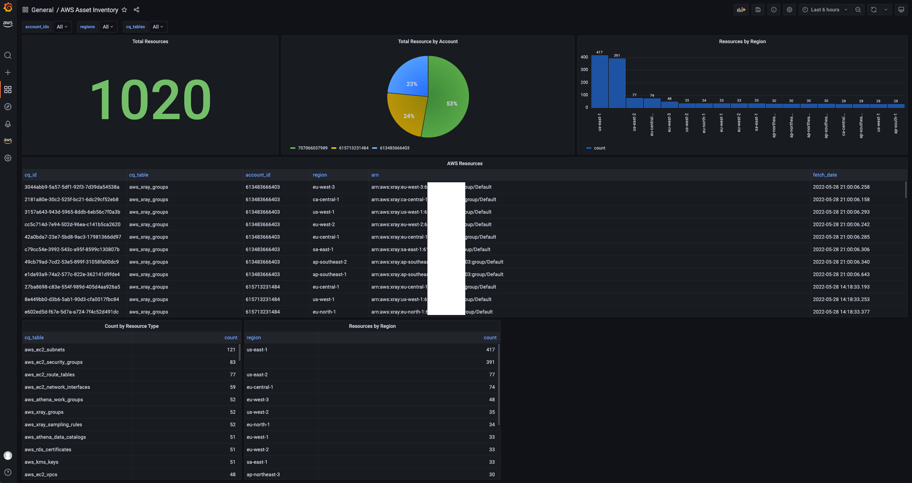
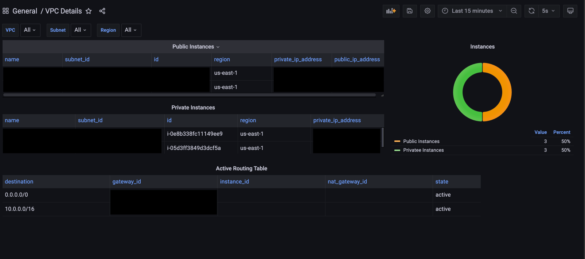
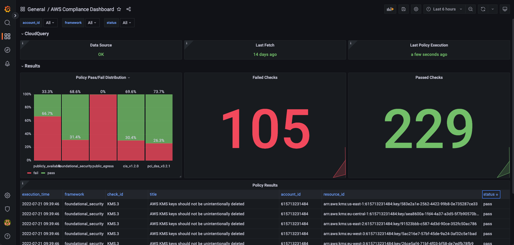

# AWS Dashboards

This directory contains pre-built dashboards. Currently those are available only for Grafana, but you can create them in any other BI platform:

Checkout those tutorials:
* [Building Open Source Cloud Asset Inventory with CloudQuery and Grafana](https://www.cloudquery.io/blog/open-source-cloud-asset-inventory-with-cloudquery-and-grafana)
* [Building Open Source Cloud Asset Inventory with CloudQuery and Apache Superset](https://www.cloudquery.io/blog/cloud-asset-inventory-cloudquery-apache-superset)
* [Building Open Source Cloud Asset Inventory with CloudQuery and AWS QuickSight](https://www.cloudquery.io/blog/cloud-asset-inventory-cloudquery-aws-quicksight)
* [Building Open Source Cloud Asset Inventory with Metabase](https://www.cloudquery.io/blog/cloud-asset-inventory-cloudquery-metabase)

## What's inside?

### AWS Asset Inventory

#### Installation

1. Execute [this query](../views/resources.sql) to add the `aws_resources` view.
2. Add the CloudQuery postgres database as a data source to Grafana (`Configuration -> Data Sources -> Add Data Source`)
3. Import [../dashboards/grafana/aws_asset_inventory.json](../dashboards/grafana/aws_asset_inventory.json) into Grafana (`Import -> Upload JSON File`).

### AWS EC2 Public/Private Instances

#### Installation

1. Add the CloudQuery postgres database as a data source to Grafana (`Configuration -> Data Sources -> Add Data Source`)
2. Import [../dashboards/grafana/aws_ec2_public_private.json](../dashboards/grafana/aws_ec2_public_private.json) into Grafana (`Import -> Upload JSON File`).

### AWS Compliance and CSPM (Cloud Security Posture Management) Dashboard

#### Installation

1. Execute one more of the AWS [policies](../policies_v1/).
2. Add the CloudQuery postgres database as a data source to Grafana (`Configuration -> Data Sources -> Add Data Source`)
3. Import [../dashboards/grafana/compliance.json](../dashboards/grafana/compliance.json) into Grafana (`Import -> Upload JSON File`).
